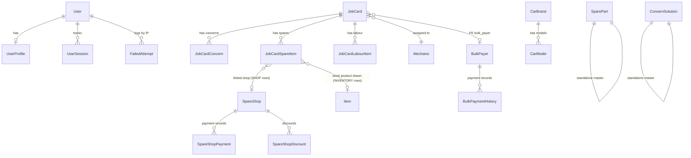
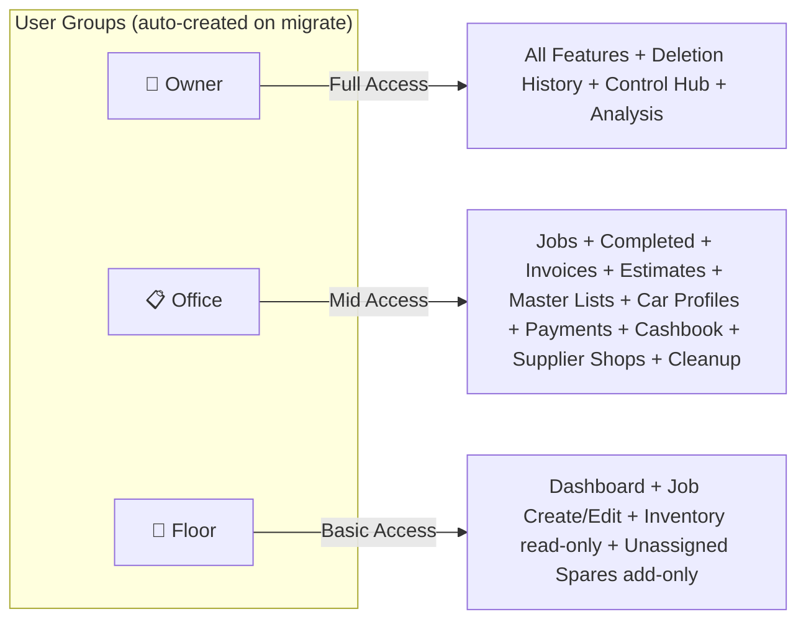
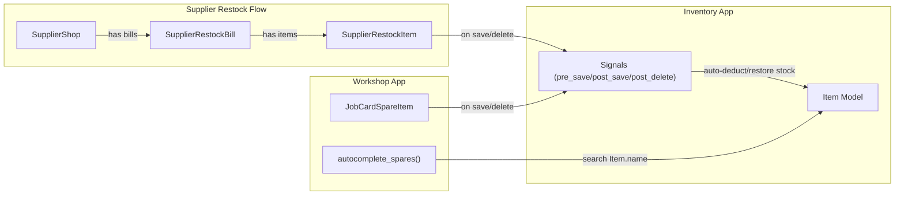
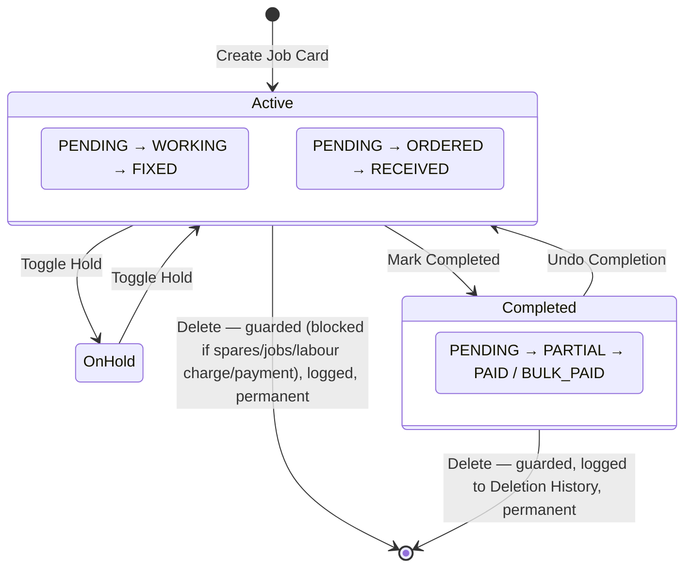

# 🏗️ WorkshopOS (Titan) — SUPER MASTER BLUEPRINT

> **Project**: WorkshopOS (Titan) · Django project package name `formulad_workshop`
> **Framework**: Django 5.2 · Python 3.13 · **PostgreSQL** in development *and* production (development on a local instance, production on Railway's own Postgres alongside the app; SQLite retained only for bulk dummy-data seeding and the test suite)
> **Apps**: `workshop` (core) + `inventory` (warehouse)
>
> **Every count in this file is re-derived from the code** — the suite built with
> Django's runner, routes walked from the resolver, files listed from disk.
>
> ⚠ **These numbers drift.** They have gone stale several times, always in the same
> way: a feature lands and the tables are not recounted. Before relying on one, run
> the counter — `DiscoverRunner(verbosity=0).build_suite(['workshop','inventory']).countTestCases()`
> for tests, `get_resolver()` walked recursively for routes, `find` for files.
> Grepping `def test_` undercounts, because it cannot see tests inherited from
> shared base classes.
>
> This is the **technical reference** doc — exact model/route/template/admin/test counts and structure. For workflow narrative see `OPERATIONAL_BLUEPRINT.md`; for mission, status, and roadmap see `TITAN_MASTER_HANDOVER.md`; for day-to-day coding conventions see `CLAUDE.md`.

---

## 1. HIGH-LEVEL ARCHITECTURE

```mermaid
graph TB
    subgraph DJANGO["Django Project: formulad_workshop"]
        SETTINGS["settings/ (base, dev, prod)"]
        ROOT_URLS["Root urls.py"]
    end

    subgraph WORKSHOP["Workshop App (Core)"]
        W_MODELS["models.py — 39 Models"]
        W_VIEWS["views/ — 23 Module Package"]
        W_ANALYSIS["analysis_views.py + analysis_engine.py — Owner Profit & Insights"]
        W_AUTH["auth_views.py — Auth Views"]
        W_MGMT["management_views.py — Management Views"]
        W_CASH["cashbook_views.py — 4 Cashbook Views"]
        W_CLEAN["cleanup_views.py — 5 Views"]
        W_URLS["urls.py — 146 URL Patterns"]
        W_FORMS["forms.py — 14 Forms + 6 Formsets"]
        W_DECO["decorators.py — 3 RBAC Guards"]
        W_MID["middleware.py — Session / NoStore / NoIndex"]
        W_TAGS["templatetags — 15 Filters"]
        W_ADMIN["admin.py — 10 Registered"]
        W_CMD["Commands — 15 management commands"]
        W_TPL["Templates — 101 HTML Files"]
    end

    subgraph INVENTORY["Inventory App (Warehouse + Supplier Shops)"]
        I_MODELS["models.py — 10 Models"]
        I_VIEWS["views.py + views_suppliers.py — 34 Views"]
        I_URLS["urls.py — 34 URL Patterns"]
        I_SIGNALS["signals.py — 13 Signal Handlers (4 groups)"]
        I_ADMIN["admin.py — 9 Registered"]
        I_TPL["Templates — 20 HTML Files"]
    end

    subgraph EXTERNAL["External Services"]
        MAIL["Password-reset codes — SMTP in dev, Resend HTTPS API in production"]
        WPUSH["Web Push — browser vendors' push services (CRITICAL events only)"]
    end

    ROOT_URLS -->|"/"|  W_URLS
    ROOT_URLS -->|"/inventory/"| I_URLS
    ROOT_URLS -->|"/admin/"| DJANGO_ADMIN["Django Admin"]

    I_SIGNALS -->|"Auto Stock Sync"| W_MODELS
    W_VIEWS -->|"Autocomplete API"| I_MODELS
    W_AUTH --> MAIL
    W_MODELS -->|"queue_push, on_commit"| WPUSH
```

> The application makes exactly **two** kinds of outbound network call — the
> password-reset email and Web Push — and both are optional: a deploy with no
> `RESEND_API_KEY` or no `VAPID_*` keys is valid, and neither sits on the request
> path (push hands off to a background thread via `transaction.on_commit`).

---

## 2. DATABASE MODELS — COMPLETE MAP

### Workshop App Models (39)



| # | Model | Key Fields | Purpose |
|---|-------|--------|---------|
| 1 | **UserProfile** | user (1:1→User), mobile_number (unique, nullable) | Alternative login identifier. Password-reset codes go to `User.email`, not here |
| 2 | **FailedAttempt** | ip_address (unique), failures, last_attempt | IP-based brute-force lockout |
| 3 | **UserSession** | user (FK→User), session_key (unique), ip, user_agent, last_activity | Live device monitoring & remote revoke |
| 4 | **Notification** | recipient (FK→User), event, severity, title, body, url, actor (FK→User), object_type, object_id, created_at, read_at | In-app feed behind the nav bell. **One row per recipient** (fan-out on write) so the unread count is one indexed query. **Deliberately no FK to its subject** — most events announce a deletion and a FK would cascade the notice away with it; `object_type`/`object_id` are a soft reference and `body` carries a frozen label. Catalogue and the single `notify()` entry point live in `workshop/notifications.py`. Read rows are swept after 14 days; unread are kept forever. |
| 5 | **PushSubscription** | user (FK→User), endpoint (unique), p256dh, auth, user_agent, created_at, last_success, failure_count | One browser's Web Push permission — **per device, not per user**, so revoking on a phone doesn't silence a laptop. `endpoint` is the push service's URL for that browser; a reinstall or permission reset yields a *new* one, which is why dead rows accumulate and are reaped (404/410 → deleted on sight, other errors after `MAX_FAILURES`). `p256dh`/`auth` are the browser's own public key material, not our secrets. Sending lives in `workshop/push.py`. |
| 6 | **AccountLockout** | user (1:1→User), failures, last_attempt | Per-account sign-in lockout: 5 failures / 15 min. The primary control; `FailedAttempt` (by IP, limit 20) is only a backstop. Counting solely by IP locked the whole workshop out whenever one person fumbled, since every device shares one connection. |
| 7 | **PasswordResetOTP** | user (FK→User), code_hash (SHA-256), created_at, expires_at, attempts, used_at, requested_ip | Emailed 6-digit reset code, Owners only. 10-min expiry, single use, 5 attempts, 60s resend cooldown, 3/hour — all counted per account **in the DB**, since a session counter is cleared with the cookies. The code itself is never stored. See CLAUDE.md for why this is a code and not Django's built-in reset link. |
| 8 | **Mechanic** | name (unique), role (Mechanic/Assistant Mechanic/Office Staff/General Helper, default Mechanic), is_active, created_at | Workshop staff roster ("Staff Registration" in the UI — model/table name kept for continuity, see CLAUDE.md). Only Mechanic/Assistant Mechanic roles are selectable as a Job Card's `lead_mechanic`. |
| 9 | **CarBrand** | name (unique), logo_image *(dormant — no form or page uses it)*, created_at | Master list for autocomplete |
| 10 | **CarModel** | brand (FK→CarBrand), name, created_at | Master list, unique_together(brand,name) |
| 11 | **SparePart** | name (unique), created_at | Master list for autocomplete |
| 12 | **ConcernSolution** | concern (text), created_at | Knowledge base for autocomplete |
| 13 | **SpareShop** | name (unique), phone, address, total_purchased_amount, total_paid_amount, **total_discount_amount**, **opening_balance**, is_trashed | Master list of spare parts suppliers. `opening_balance` (migration `0080`, default and `db_default` 0, CheckConstraint `>= 0`) is what the shop was owed on go-live day, typed on Legacy Data → Opening Balances exactly as typed; `update_totals()` adds it to the purchased side and the payment waterfall pays it first. `total_discount_amount` (migration `0086`, default and `db_default` 0) caches its `SpareShopDiscount` rows; the balance is purchased − paid − discounted, and `SPARE_SHOP_OWED` is that sum as a query expression |
| 14 | **JobCard** | bill_number, dates, vehicle info, **chassis_code**, **vin**, customer, **notes**, financials, status flags | **Core entity** — full lifecycle. `notes` (migration `0069_jobcard_notes`) is an internal line for the workshop, declared field-for-field like `Estimate.notes` and **never printed** on the invoice. `chassis_code` (the platform code, e.g. F30 — up to 20 characters) and `vin` (17) arrived with migration `0078_jobcard_estimate_chassis_code_vin`: both optional free text, tidied in `clean()`, refused only by the forms, never printed and never chased at settlement. Every rule is `workshop/vehicle_ids.py`. |
| 15 | **JobCardConcern** | job_card (FK), concern_text, status (PENDING/WORKING/FIXED) | Per-job concerns |
| 16 | **JobCardSpareItem** | job_card (FK), part name, qty, **source** (SHOP/INVENTORY), **item** (FK→inventory.Item, PROTECT), unit_price (cost/unit), **transport_cost** (SHOP rows, nullable), total_price (customer), **customer_rate** (customer price/unit, optional), shop (FK→SpareShop), order tracking, **original_vehicle_info** (free-text "Ordered For" note) | Per-job parts, both routes. `transport_cost` (migration `0087`, 2026-10-01) is what it cost to bring the part in, paid to anyone but the shop — never in a shop's balance (the ledgers read `SHOP_LINE_COST`), its own Profit line, Cash Tracking on the Received date, added at cost to the suggested customer price; `save()` clears it on an INVENTORY row. `source` records which route and is **never inferred** — added with `item`/`customer_rate` (migration `0060_jobcardspareitem_customer_rate_jobcardspareitem_item_and_more`). Ordering fields (status/ordered_date/received_date/shop) apply to SHOP rows only. `original_vehicle_info` (since migration 0039) names the car an UNASSIGNED purchase was bought for — stamped automatically when a spare is moved out of a job card, and typed by hand on the Unassigned Hub. Free text with no FK by design: a part is usually ordered before there is a job card to attach it to |
| 17 | **JobCardLabourItem** | job_card (FK), job_description, ~~amount~~ | What was done. A DESCRIPTION, not a price — the charge for all the work is `JobCard.labour_amount`. `amount` is dormant (the old per-line column, summed into the card by migration 0066, no longer written or read). |
| 17a | **JobCardPhoto** | **id (UUID pk)**, job_card (FK, null), spare (FK→JobCardSpareItem, null), taken_at, taken_by (FK→User), byte_size | A photograph of the car (`job_card` set) or of one part (`spare` set) — exactly one, enforced by `clean()`. Migration `0070_jobcard_photos`. The UUID **is** the storage key (derived by `photos.object_key`, never stored). Bytes live in Cloudflare R2 and never pass through Django. Nothing points AT this table: no column on JobCard, no money, no stock, nothing in `analysis_engine.py` or `invoice.py`. Limits 10 per car / 4 per spare, enforced in the view. |
| 17b | **OrphanedPhotoBlob** | storage_key (unique), created_at, attempts | Storage keys whose rows are gone, awaiting `sweep_photo_blobs`. Written in the same transaction as a photo delete so a key cannot be lost between the two — a DELETE to R2 is a network call and never runs on the request path. |
| 18 | **BulkPayer** | customer_name (unique), advance_balance, total_billed_amount, total_paid_amount, is_trashed, created_at — its cards point at it through `JobCard.bulk_payer`, a ForeignKey with `related_name='job_cards'` | Group for fleet/repeat customers. **UI label: "Fleet Account"** — cosmetic only, model/field/URL names unchanged |
| 19 | **BulkPaymentHistory** | bulk_payer (FK), amount, payment_method, **note**, jobs_affected, details (JSON: `{jobs, advance_used, advance_stored}`), is_trashed, **date**, created_at, **recorded_by** (FK→User, null — migration `0084`) | Audit trail for bulk payments, precise reversal. `date` (migration `0072`, backfilled from `created_at`) is the day the money moved, typed on the payment form; `note` (`0073`) says what a large receipt covered. Ordering `['-date', '-created_at']`. Cash Tracking reads fleet cash from these rows, one per payment |
| 20 | **SpareShopPayment** | shop (FK→SpareShop), amount, method, note, is_trashed, **date**, created_at, **recorded_by** (FK→User, null — migration `0084`) | Ledger payment record. `date` is the day the money MOVED — typed on the payment form, defaulting to today — and is what every date window on the shop page and its print sheet filters and orders by; `created_at` (`auto_now_add`) stays as the audit trail. Added by migration `0071`, which backfills existing rows from `created_at`. Ordering `['-date', '-created_at']`. |
| 20a | **SpareShopDiscount** | shop (FK→SpareShop, CASCADE, `related_name='discounts'`), amount, **date**, note, created_at, recorded_by (FK→User, null) | What a spare shop let the workshop off — **a payment with no cash** (migration `0086`, 2026-09-29). Settles the debt like a payment, is **profit on its date** ("Discounts from shops" in Turnover), is read by no cash figure and never touches a part's cost. Rules in `workshop/discounts.py`: never more than is owed, never forward, Office three days back at most. `save()`/`delete()` refresh `shop.update_totals()`. Ordering `['-date', '-created_at']`. CheckConstraint `amount > 0` |
| 21 | **CashbookEntry** | entry_type, category, amount, method, date | Daily expense & income ledger |
| 21a | **OwnerWithdrawal** | owner (FK→User, **PROTECT**), amount, payment_method, note, **date**, created_at, recorded_by (FK→User) | Cash an owner takes out for themselves. Migration `0075`. ⚠ **Not an expense** — it appears in exactly one figure in `analysis_engine.py`, `cash_position()`'s money-out list, and nowhere in `build_profit_report`; profit is what is available to take, so taking it cannot reduce it. Exists because the Cashbook was the likeliest place for this money to land and `cashbook_expense()` feeds the profit equation. `owner` is PROTECT — one of only two in the codebase — because the row's whole job is to say *which* owner took it. `date` is the day the cash moved, typed; `created_at` is the audit trail. CheckConstraint `amount > 0`. |
| 21b | **RentRate** | effective_from (**unique**, always the 1st), amount, note, created_at, set_by (FK→User) | What the premises cost per month, from a stated month onward. Migration `0076`. **Effective-dated, never edited in place** — a rent change is a new row, so a hike cannot rewrite what an earlier month cost. The figure is **absolute, not an increment**: a delta is a number the person must already know, so a mis-keyed `+5000` is silently ₹40,000 and a run of them makes the current rent unreadable. May be **backdated** (a hike agreed late and applied from an earlier month is ordinary, and refusing it would leave the books wrong for good) and may be **dated ahead** (a rate is not money; `rate_for()` applies it only once its month arrives). Owner-only, and every change raises `RENT_RATE_SET` at CRITICAL. `effective_from` is pinned to the 1st in `save()`. CheckConstraint `amount > 0`. |
| 21c | **RentDeposit** | amount, **date**, note, created_at, recorded_by (FK→User) | One handover of cash to the rent collector, who comes daily and keeps his own book. Migration `0076`. ⚠ **Not an expense** — what a month COST is the rent; this is how it gets PAID, the same split a supplier payment and a stock draw already have. **No payment method**, deliberately: it is always cash handed to a man with a book, and a select that can only say one thing is a field to leave out. `date` is the day the money moved, typed and back-dateable; `created_at` is the audit trail, is what `delete_window` measures, and is what Change History's **Back-dated** tab reads against `date`. **Editable** since 2026-09-24 (amount, date, note): Office within 24 hours of keying it, an owner after; inside the 24 hours an edit or delete is neither kept nor announced, the Cashbook's rule. CheckConstraint `amount > 0`. ⚠ **Read by `cash_position()` and by nothing else in the engine** — the same footprint `OwnerWithdrawal` has, and for the same reason: handing cash over is not a cost. What the month cost is the RATE. |
| 22 | **DeletionLog** | entity_type, entity_label, amount, snapshot (JSON), reason, deleted_by (FK→User), deleted_at | Read-only audit of every permanent deletion — the **Deletion History**. Written via `DeletionLog.record(...)` immediately before each hard-delete, inside the same atomic block. `entity_type` covers **sixteen** kinds: Job Card, Fleet / Spare-Shop / Supplier payments, Spare-Shop / Supplier discounts, Restock Bill, Cashbook Entry, Inventory Product, Salary Advance, Salary settlement, Unassigned Spare, Owner Withdrawal, Rent Deposit, Rent Rate and Master Data. No restore. |
| 22a | **EditLog** | entity_type, object_id, entity_label, changes (JSON: `[{field, kind, before, after}]`), edited_by (FK→User), edited_at | Read-only audit of every edit that moved money — the **Edited** tab of Change History. Migration `0083`. Written by `EditLog.record(...)`, which then raises `RECORD_CHANGED` / `OLD_RECORD_CHANGED` through `notify_changed()` — its only caller, so an edit is announced if and only if it is kept. Five doors: the Cashbook edit, a rent deposit's edit, a Supplies Shop bill's edit page, a settled job card's unlocked edit, and Settle Bill on an already-paid bill (a sixth, the bill card's quick discount box, went with the bill discount on 2026-09-29). Money fields only, and only the ones that moved; stored raw (two-decimal money, ISO dates) and formatted on the page. **No FK** to the edited row, so the history outlives it. No retention limit. ⚠ The **Cashbook** and a **rent deposit** keep only an edit only an owner could make (`only_past_limits=True`) — a same-day edit there is the day's work (2026-09-24). Migration `0085` added the rent deposit to its choices. |
| 23 | **SalaryAdvance** | staff (FK→Mechanic), amount, date, note, created_by | A cash advance handed to a staff member, recorded the day it happens. Never flagged "used" — a settlement re-sums whichever advances fall inside its month, so re-settling recomputes cleanly. |
| 24 | **SalaryPayment** | month (unique, always the 1st), created_by, created_at/updated_at | One row per calendar month once that month's salary is settled. A row existing *is* the "settled" flag. `total_amount` sums its lines. |
| 25 | **SalaryPaymentLine** | payment (FK), staff (FK→Mechanic), salary_used, leave_days, advance_used, net_amount — unique per (payment, staff) | One staff member's **frozen** figures for that month. Written once and never recalculated, so a later pay rise cannot rewrite a month already paid. |
| 26 | **Estimate** | estimate_number (unique, auto `EST-26-001`), date, customer/vehicle (all free text), **chassis_code/vin**, **car_color/car_color_other**, labour_amount, total_amount (denormalized), notes, created_by | A **quotation**, connected to nothing — no job card, no stock, no ledger, no report. Migrations (`0067_estimate_estimatejobline_estimatepartline_and_more`, `0068_estimate_car_color_estimate_car_color_other`, `0078_jobcard_estimate_chassis_code_vin`). `chassis_code`/`vin` are declared exactly like JobCard's and are never printed on the quotation. Colour uses the shared `CAR_COLOR_CHOICES`/`CAR_COLOR_HEX`, is picked with the shared `_car_color_picker.html`, and is drawn as the stripe on each history row — never printed on the quotation. `total_amount` is written only by `update_totals()`, called explicitly by the views; there are no signals on any of these three models. |
| 27 | **EstimateJobLine** | estimate (FK), description | One line of work being quoted. **No money column at all** — the charge lives once on `Estimate.labour_amount`, same rule as `JobCard.labour_amount`. |
| 28 | **EstimatePartLine** | estimate (FK), name, quantity, **customer_rate**, **amount** | One quoted part. Note the naming is the OPPOSITE of `JobCardSpareItem`: an estimate has no cost side, so both figures are customer prices. `amount = customer_rate × quantity` is enforced on save when a rate is set. |
| 27z | **LegacyDataLock** | locked_at, locked_by (FK→User, SET_NULL) | ONE ROW MEANS LOCKED (migration `0081`): Legacy Data → Opening Stock and Opening Balances are read-only and every POST is refused. Set by an owner from `/legacy/` behind three confirmations; there is **no unlock view**, only `manage.py unlock_legacy_data --yes` on the server. A ROW rather than a host setting so it **travels with the data** — a backup restored anywhere, or the system moved, is still locked. `purge_business_data` clears it |
| 28a | **OldBill** | **bill_number** (unique, typed as printed, e.g. `JB-26-097`), **bill_date**, registration_number, brand_name, model_name, mileage, customer_name, labour_amount, total_amount (labour + part amounts, written only by `update_totals()`), created_by, created_at, updated_at | A bill the workshop wrote in **Excel before the system existed**, typed in for a car's history. Migration `0079_old_bills`. ⚠ **Connected to nothing** — no job card, no stock, no ledger, no line in `analysis_engine.py`; `test_old_bills.py` fails if any file outside a short allow-list starts reading it. Holds only what the paper shows: **one date**, no admitted/settled dates, **no discount and no payment** (the final figure was agreed verbally and never written down, so `total_amount` is what was BILLED), no phone, no colour, no cost. Brand/model/plate/mileage are tidied in `clean()` exactly as `JobCard.clean()` tidies them, so both land on one Car Profile. CheckConstraints: labour and total `>= 0`. Every rule is `workshop/old_bills.py` |
| 28b | **OldBillJobLine** | old_bill (FK, CASCADE), description | A JOB PERFORMED line — a description; the charge is `OldBill.labour_amount`, as on a job card |
| 28c | **OldBillPartLine** | old_bill (FK, CASCADE), name, quantity (optional), amount (optional) | A PART NAME line. One mixed list — the paper never split warehouse stock from shop parts — with **no stock link**. A blank amount prints blank, never ₹0; the unit price is derived on reprint, never typed. CheckConstraints: quantity `> 0`, amount `>= 0` |

Salary models (migration `0054_mechanic_current_salary_and_more`, which also added `Mechanic.current_salary`). Wage cost for a settled month is `net_amount + advance_used` — the advance already left the drawer and the settlement pays the remainder.

`advance_balance` (added migration `0047_bulkpayer_advance_balance`) tracks credit carried forward when a lump-sum Fleet Account payment exceeds the total currently owed; `total_balance` can legitimately go negative once this credit exists.

### Inventory App Models (10)

| # | Model | Key Fields | Purpose |
|---|-------|--------|---------|
| 1 | **Category** | name | Groups inventory items |
| 2 | **Item** | category (FK), name, average_stock, current_stock, usage_count, **avg_cost**, **markup_percent** | Warehouse part with stock levels. `current_stock` may be **negative** (an overdraw awaiting its supplier bill — deliberate, see CLAUDE.md). `avg_cost` is the weighted-average purchase cost per unit, (migration `inventory/0008_item_avg_cost`), maintained only by restock receipts via a full replay in `inventory/costing.py`. `markup_percent` (`inventory/0009_item_markup_percent`, `PositiveSmallIntegerField`, default and `db_default` 40, CheckConstraint ≤ 999) is the markup on cost the job card suggests for this product's customer unit price — a suggestion only, set on Add Product and Edit Product; the server prices nothing from it |
| 3 | **ConsumptionRecord** | user (FK→User), item (FK→Item), quantity, date, timestamp | **Dormant** — superseded by Stock History, which reads `JobCardSpareItem` live. Nothing writes this model; kept only to avoid a needless migration |
| 4 | **SupplierShop** | name (unique), phone, total_billed_amount, total_paid_amount, **total_discount_amount**, **opening_balance**, is_active | Supplier / Supplies Shop master record. `opening_balance` (migration `inventory/0010`) is the spare shop's column, identically: go-live debt, added to the billed side, paid off first. `total_discount_amount` (`inventory/0013`) is the spare shop's column too; `SUPPLIER_SHOP_OWED` is the balance as a query expression |
| 5 | **ShopCatalogItem** | shop (FK→SupplierShop), item (FK→Item), is_active, unique_together(shop,item) | Links a supplier to the items they stock; `is_active=False` = deactivated (listed but excluded from restock bills) |
| 6 | **SupplierRestockBill** | supplier (FK→SupplierShop), bill_date, total_amount | Individual restock purchase from a supplier. **No discount of its own** since 2026-09-29 (`0012`): `total_amount` is the shop's own line prices and is what every screen reads |
| 7 | **SupplierRestockItem** | bill (FK→SupplierRestockBill), item (FK→Item), quantity, total_price (+ `per_unit_price` property) | Line item on a restock bill. There is no `unit_price` **column** — per-unit cost is derived as `total_price / quantity`. This is the per-batch cost record that makes a future FIFO reconstruction possible |
| 8 | **SupplierPayment** | supplier (FK→SupplierShop), amount, payment_method, date, note, is_trashed, created_at, **recorded_by** (FK→User, null — migration `0011`) | Payment record for supplier accounts. `recorded_by` says who typed it (2026-09-24), for the Back-dated tab; older rows read "unknown" |
| 9 | **OpeningStock** | item (OneToOne→Item, CASCADE), quantity, unit_cost, created_at, updated_at | What was on the shelf on go-live day (migration `inventory/0010`), typed on Legacy Data → Opening Stock. A receipt that belongs to **no shop**: raises the shelf through the signals and creates no balance. Always the FIRST event in the costing replay. CheckConstraints: quantity and unit_cost `> 0` — the cost is required |
| 10 | **SupplierDiscount** | supplier (FK→SupplierShop, CASCADE, `related_name='discounts'`), amount, **date**, note, created_at, recorded_by (FK→User, null) | `SpareShopDiscount`'s twin (migration `inventory/0013`, 2026-09-29): a Supplies Shop's discount, on the balance or on one bill. **Never reaches an item's cost** — a bill carries no discount of its own. CheckConstraint `amount > 0` |

---

## 3. SECURITY & ACCESS CONTROL

### 3.1 Three User Roles (RBAC)



| Decorator | Roles Allowed | Used On |
|-----------|---------------|---------|
| `@staff_required` | Floor + Office + Owner | Dashboard, Job Create/Edit, Autocomplete, the known-plate lookup (`/api/known-car/`, whose answer leaves the customer out for Floor), the Unassigned Spares Hub (add-only for Floor), the photo endpoints, and **five inventory routes only** — `inventory_home`, `inventory_list`, `inventory_low_stock`, `consumption_history`, `inventory_history_mechanic` |
| `@office_required` | Office + Owner | Job List, Job Detail (read-only), Job Delete, **Live Report** (whole page), Completed, Invoices, Estimates, Master Lists, Car Profiles, Cleanup, Cashbook, Pending Payments, **Paid Bills** (Office sees the last 7 days, enforced in the view), Deposit & Rent (recording, editing and deleting deposits — the last two within 24 hours of keying), Salary & Advance (except deleting a settlement), Spare Shops, Bulk Payer create/detail/pay, **inventory categories** (manage / add / edit / delete / detail) and **the entire Supplier-Shops module** (bills, payments, catalog) |
| `@owner_required` | Owner only | Audits (high-discount), **Deletion History** (read-only), Owner Analysis, **the whole Control Hub `/manage/`** (accounts, staff roster, sessions), salary-settlement delete, **setting or deleting the rent rate**, **Owner Withdrawals**, the notification feed and Web Push, and `/about/`. *(Paid Bills was listed here with "Office gets a 7-day window" until 2026-09-15; the view is `@office_required` and the window is the view's own rule.)* |

> Deletion/deactivation actions (job-card delete, Fleet/Shop/Supplier payment delete, shop deactivate/reactivate) are **`@office_required`** (Owner + Office) — Office fixes its own entry mistakes, with the guard + Owner-only Deletion History providing the safety net. Only *reading* the Deletion History is Owner-only. **Login accounts and the staff roster are the exception: those live in Control Hub and are Owner-only.**

Superusers pass every check regardless of group membership. For the human-readable "who can do what" breakdown, see `OPERATIONAL_BLUEPRINT.md` §2.

### 3.2 Auth System

| Feature | Implementation |
|---------|---------------|
| **Login** | `/login/` — the one door, for every role. Office/Floor by username; **Owners by email address only** (`resolve_login_identifier`). `/admin-login/` redirects here, kept alive for the owners' bookmarks |
| **Legacy owner door** | `/admin-login/` — now a `RedirectView` to `/login/`, carrying `?next=` across. Kept for the owners' bookmarks and existing `reverse('admin_login')` calls |
| **Account lockout** | **Primary.** 5 failures → 15 min block on *that one account*, via `AccountLockout`. An owner can lift it from Control Hub; a password reset clears it too |
| **IP lockout** | **Backstop only.** `IP_FAILURE_LIMIT = 20` failures → block, via `FailedAttempt`, keyed on the visitor's IP from `workshop/client_ip.py` — the first `X-Forwarded-For` value behind Railway's proxy (measured: `REMOTE_ADDR` there is the proxy), the connection itself otherwise (AUD-0107). Raised from 5 because every device in the workshop shares one connection |
| **Security Alerts** | **Getting in always pushes.** An **owner** sign-in raises `LOGIN` and an **Office or Floor** sign-in raises `STAFF_LOGIN` — both CRITICAL since 2026-08-29, so both reach the bell *and* the owners' phones. `LOGIN` was INFO until then, on the reasoning that an owner signing in is routine; what overruled it is that an owner account is the highest-privilege thing in this system and a sign-in on one with a stolen password reached no phone at all. Safe at CRITICAL because `SESSION_COOKIE_AGE` is 40 days, so this fires on a genuinely new session — roughly one or two a month across two owners. Both exclude the actor, so what arrives is always *somebody signed into the other account*. They stay two events because the titles differ and a staff alert leads its `detail` with the ROLE |
| **Change Password** | `/change-password/` — signed-in Owner sets a new password. No email. Entry point is the drawer account panel; Office/Floor have no self-service path (owners manage those from Control Hub) |
| **Forgot Password** | `/forgot-password/` (username, email, or mobile) → 6-digit code **emailed** → `/reset-password/`. Owners only — Office/Floor carry no email and have no self-service path. The code is emailed, never sent over any other channel |
| **OTP Authentication** | 6-digit, **10-min** expiry, **5** attempts, 60s resend cooldown, **3 per hour** — all counted per account in the DB. Constants on `PasswordResetOTP` |
| **Session Tracking** | `SessionTrackingMiddleware` updates `UserSession`, throttled to a 5-minute cooldown per session |
| **Remote Revoke** | Owners can terminate any session from the management dashboard |
| **40-day Sessions** | `SESSION_COOKIE_AGE = 3,456,000` seconds |

### 3.3 Notification Channels

```
Any event → workshop/notifications.py :: notify(event, body, actor=…)
              ├─→ resolve audience (every owner — superuser or Owner group — minus the actor)
              └─→ one Notification row per recipient
                    └─→ nav bell → /notifications/
```

The event catalogue is the `EVENTS` dict in `workshop/notifications.py` —
sixteen entries, one screen, all Owner-audience. **Never call
`Notification.objects.create()` from a view.**

**Thirteen of the sixteen are CRITICAL and also push to a phone**; the other three
(`ACCOUNT_ARCHIVED`, `SALARY_ADVANCE`, `SALARY_SETTLED`) are INFO and wait
in the bell. Push is a *delivery layer* over rows that are already written, never a
parallel system — see §II.5 of `TITAN_MASTER_HANDOVER.md`.

A row is **three strings**, each answering a different question: `body` is the loud
line and a complete statement ending in what happened (`Biljo · ₹1,00,000 payment
deleted`); `title` is the category from `EVENTS` (`Record deleted`); and `detail`
(migration `0074`) is the context read second — the device a sign-in came from, the
kind of record deleted, the remedy for a lockout. Nothing that decides what a row
MEANS may live in `detail`. Both the feed row and the push put `body` first, so the
two surfaces cannot teach different habits.

Two of the sixteen break the "minus the actor" rule in the diagram above, and
deliberately: `RESET_CODE_LIMIT` and `RESET_CODE_ATTEMPTS_SPENT` are raised from the
*unauthenticated* password-reset form, so there is no actor to exclude and they reach
**both** owners including the one being targeted. They are also the only events
passed through `recently_raised()`, which caps them at one per account per hour — a
form that needs no login would otherwise be a doorbell anyone could hold down. See
`CLAUDE.md` for the full rule, including why the visitor's response must stay
byte-identical.

---

## 4. ALL URL ROUTES — COMPLETE (180 Total)

*Walked from `get_resolver().url_patterns` recursively and
excluding Django admin (131 of its own) — the method below, not by grepping
`path(`, which misses routes reached through `include()`. **Recount rather than
trusting this line; it has now gone stale three times**, most recently reading
162/129 when the resolver said 169/136 — a seven-route drift, of which only
three were the service-history change that prompted the recount. The workshop
figure includes the root-level routes (`robots.txt`, `sw.js`) since they are
served by the same app.*

⚠ **Walk it with `DEBUG=False` or the total is one higher.**
`formulad_workshop/urls.py` appends `MEDIA_URL` through Django's `static()` helper,
which returns an **empty list** when `DEBUG=False` — so a development resolver reports
**181 (147 + 34)** and production reports **180 (146 + 34)**. That one route is the
media path, which is not served in production at all (§12, and `AUD-0088`).

⚠ **And filter for it on `'media/' in pattern`, not `startswith`.** It is a
`re_path`, so its pattern string is `^media/(?P<path>.*)$` — a `startswith`
check finds nothing and quietly reports the development figure as if it were
production's. Cost a wrong number on the way into this very entry.

### Workshop App (146 routes)

| Section | URL Pattern | View | Access |
|---------|-------------|------|--------|
| **HOME** | `/` | `home` | Staff |
| | `/jobcards/create/` | `jobcard_create` | Staff |
| **JOBS** | `/jobcards/` | `jobcard_list` | Office |
| | `/jobcards/live-report/` | `live_report` | **Office** — whole page. Everything on it is supplier names, ordering state and money-side gaps, none of which Floor is shown anywhere else |
| | `/jobcards/<pk>/` | `jobcard_detail` (read-only) | **Office** |
| | `/jobcards/<pk>/edit/` | `jobcard_edit` | Staff |
| | `/jobcards/<pk>/delete/` | `jobcard_delete` | Office |
| **COMPLETED** | `/completed/` | `completed_list` | Office |
| | `/jobcards/<pk>/complete/` | `mark_completed` | Floor + Office + Owner |
| | `/jobcards/<pk>/undo-complete/` | `undo_completed` | Office |
| | `/jobcards/<pk>/toggle-hold/` | `toggle_hold` | Floor + Office + Owner |
| | `/jobcards/<pk>/update-bill/` | `update_bill_status` | Office |
| **CHANGE HISTORY** | `/deletion-history/` | `deletion_history_list` (read-only) — the **Deleted** tab. All three tabs take `?month=YYYY-MM` and `?type=`; the URLs keep their old name because notifications store them | Owner |
| | `/deletion-history/<pk>/` | `deletion_history_detail` (read-only) | Owner |
| | `/deletion-history/edited/` | `edit_history_list` (read-only) — the **Edited** tab | Owner |
| | `/deletion-history/back-dated/` | `backdated_history_list` (read-only) — the **Back-dated** tab, `?month=YYYY-MM` | Owner |
| **PENDING PAYMENTS** | `/pending-payments/` | `pending_payments_list` | Office |
| **PAID BILLS** | `/paid-bills/` | `paid_bills_list` | Office (last 7 days, no grand total) + Owner (full) |
| **BULK PAYERS ("Fleet Account" in UI)** | `/pending-payments/bulk-payers/` | `bulk_payer_list` | Office |
| | `/pending-payments/bulk-payers/create/` | `bulk_payer_create` | Office |
| | `/pending-payments/bulk-payers/<pk>/` | `bulk_payer_detail` | Office |
| | `/pending-payments/jobcards/move-to-bulk/` | `move_jobcard_to_bulk` | Office |
| | `/pending-payments/bulk-payers/<pk>/remove-card/` | `bulk_payer_remove_card` | Office |
| | `/pending-payments/bulk-payers/<pk>/pay/` | `bulk_payer_pay` | Office |
| | `/pending-payments/bulk-payers/<pk>/delete/` | `bulk_payer_delete` (deactivate/archive) | Owner+Office |
| | `/pending-payments/bulk-payers/<pk>/history/<hpk>/delete/` | `bulk_payment_history_delete` (reverse + log + hard-delete) | Owner+Office |
| | `/pending-payments/bulk-payers/archived/` | `bulk_payer_archived` | Owner+Office |
| | `/pending-payments/bulk-payers/<pk>/restore/` | `bulk_payer_restore` (reactivate) | Owner+Office |
| **AUDITS** | `/audits/high-discounts/` | `audit_high_discounts` | Owner |
| **SPARE SHOPS** | `/spare-shops/` | `spare_shop_list` | Office |
| | `/spare-shops/create/` | `spare_shop_create` | Office |
| | `/spare-shops/unassigned/` | `unassigned_spares_hub` | Floor (add-only, no prices) + Office + Owner |
| | `/spare-shops/unassigned/add/` | `unassigned_spare_add` (strips price for Floor) | Floor + Office + Owner |
| | `/spare-shops/<pk>/` | `spare_shop_detail` | Office |
| | `/spare-shops/<pk>/edit/` | `spare_shop_edit` | Office |
| | `/spare-shops/<pk>/pay/` | `spare_shop_pay` | Office |
| | `/spare-shops/<shop_pk>/payment/<payment_pk>/reverse/` | `spare_shop_payment_reverse` (log + hard-delete) | Owner+Office |
| | `/spare-shops/<pk>/discount/` | `spare_shop_discount` — record a discount the shop gave (a payment with no cash) | Office |
| | `/spare-shops/<shop_pk>/discount/<discount_pk>/delete/` | `spare_shop_discount_delete` (log + hard-delete; Office within 24h) | Owner+Office |
| | `/spare-shops/archived/` | `spare_shop_archived` | Owner+Office |
| | `/spare-shops/<pk>/delete/` | `spare_shop_delete` (deactivate/archive) | Owner+Office |
| | `/spare-shops/<pk>/restore/` | `spare_shop_restore` (reactivate) | Owner+Office |
| | `/spare-shops/<pk>/print/` | `spare_shop_print` | Office |
| | `/spare-shops/<pk>/add-unassigned/` | `spare_shop_add_unassigned` | Office |
| | `/spare-shops/items/<item_pk>/unassign/` | `spare_shop_unassign_item` | Office |
| | `/spare-shops/items/<item_pk>/update-price/` | `spare_shop_update_item_price` | Office |
| | `/spare-shops/items/<item_pk>/edit/` | `unassigned_spare_edit` | Office |
| | `/spare-shops/items/<item_pk>/delete/` | `spare_shop_delete_unassigned` (log + hard-delete) | Office |
| **MASTER LISTS** | `/master-lists/` | `master_lists_home` | Office |
| | `/master-lists/brands/` | `brand_list` | Office |
| | `/master-lists/brands/add/` | `brand_create` | Office |
| | `/master-lists/brands/<pk>/edit/` | `brand_edit` | Office |
| | `/master-lists/brands/<pk>/delete/` | `brand_delete` | Office |
| | `/master-lists/brands/<id>/models/` | `brand_model_list` | Office |
| | `/master-lists/models/add/` | `model_create` (fallback route) | Office |
| | `/master-lists/brands/<id>/models/add/` | `model_create` (context-aware route) | Office |
| | `/master-lists/models/<pk>/edit/` | `model_edit` | Office |
| | `/master-lists/models/<pk>/delete/` | `model_delete` | Office |
| **AUTOCOMPLETE** | `/api/autocomplete/brands/` | `autocomplete_brands` | Staff |
| | `/api/autocomplete/models/` | `autocomplete_models` | Staff |
| | `/api/autocomplete/spares/` | `autocomplete_spares` | Staff |
| | `/api/autocomplete/concerns/` | `autocomplete_concerns` | Staff |
| | `/api/autocomplete/inventory-items/` | `autocomplete_inventory_items` | Staff — stock products for the job card picker. `cost` and `markup` are sent to **Office/Owner only** (absent for Floor) |
| | `/api/spare-price-hint/` | `spare_price_hint` | **Office** — it returns a price, and Floor sees no prices anywhere |
| | `/api/known-car/` | `known_car_lookup` | Staff — what the workshop already knows about a typed plate: brand, model, colour, chassis code and VIN, plus the last customer's name and number for **Office/Owner only** (absent from the answer for Floor). The Job Card form fills the car and only OFFERS the customer. Rules in `workshop/known_car.py` |
| **CAR PROFILES** | `/car-profiles/` | `car_profile_list` | Office |
| | `/car-profiles/<reg>/` | `car_profile_detail` | Office |
| | `/car-profiles/<reg>/service-history/` | `car_service_history` | Office — the tick boxes and the current-reading box |
| | `/car-profiles/<reg>/service-history/sheet/` | `car_service_history_sheet` | Office — the printable record |
| | `/car-profiles/<reg>/invoices/` | `car_all_invoices` | Office — every bill for one car, one per page |
| **INVOICE** | `/invoice/<pk>/` | `invoice_view` | Office |
| **ESTIMATES** | `/estimates/` | `estimate_list` | Office |
| | `/estimates/create/` | `estimate_create` | Office |
| | `/estimates/<pk>/` | `estimate_print` | Office |
| | `/estimates/<pk>/edit/` | `estimate_edit` | Office |
| | `/estimates/<pk>/delete/` | `estimate_delete` | Office |
| **OLD BILLS** | `/old-bills/` | `old_bill_list` | Office — month by month with counts, and the JB numbers of each year not typed yet |
| | `/old-bills/add/` | `old_bill_add` | Office — the typing form; POST refused with every problem named, Save & add next keeps the month and year |
| | `/old-bills/add/from-pdf/` | `old_bill_from_pdf` | Office — POST only: reads the bill's own PDF (in memory, never stored) and draws the Add form filled; **saves nothing** — the person checks it and presses Save, which goes through `old_bill_add` |
| | `/old-bills/<pk>/` | `old_bill_invoice` | Office — one old bill reprinted on the invoice's own sheet, with Edit |
| | `/old-bills/<pk>/edit/` | `old_bill_edit` | Office |
| | `/old-bills/<pk>/delete/` | `old_bill_delete` | Office — POST only, from the ⋮ on the edit page; no DeletionLog (moves no money, the Estimate's reasoning) |
| **LEGACY DATA** | `/legacy/lock/` | `legacy_lock` | **Owner** — POST only: locks Opening Stock and Opening Balances for good. Idempotent; no unlock route exists |
| | `/legacy/` | `legacy_home` | Office — the one menu row's page: Old Bills, and for an owner Opening Stock and Opening Balances, drawn as the menu's own rows |
| | `/legacy/opening-stock/` | `opening_stock` | **Owner** — the go-live shelf count: quantity and cost of one per product; all or nothing on save; raises the shelf, creates no balance |
| | `/legacy/opening-balances/` | `opening_balances` | **Owner** — what each spare shop and Supplies Shop was owed on go-live day, saved exactly as typed |
| **AUTH** | `/login/` | `login_view` | Public |
| | `/admin-login/` | `RedirectView` → `login` | Public |
| | `/change-password/` | `change_password_view` | Owner |
| | `/forgot-password/` | `owner_forgot_password_view` | Public |
| | `/reset-password/` | `owner_reset_password_view` | Public |
| | `/logout/` | Django `LogoutView` | Auth'd |
| **MANAGEMENT** | `/manage/` | `manage_dashboard` | Owner |
| | `/manage/create-user/` | `manage_create_user` | Owner |
| | `/manage/users/<id>/reset-password/` | `manage_reset_password` | Owner |
| | `/manage/users/<id>/delete/` | `manage_delete_user` | Owner |
| | `/manage/users/<id>/unlock/` | `manage_unlock_account` | Owner |
| | `/manage/mechanics/create/` | `manage_create_mechanic` | Owner |
| | `/manage/mechanics/<id>/toggle/` | `manage_toggle_mechanic` | Owner |
| | `/manage/mechanics/<id>/edit/` | `manage_edit_mechanic` | Owner |
| | `/manage/sessions/<id>/terminate/` | `manage_terminate_session` | Owner |
| **DEPOSIT & RENT** | `/rent/` | `rent_home` | Office |
| | `/rent/deposit/add/` | `rent_deposit_add` | Office |
| | `/rent/deposit/<id>/edit/` | `rent_deposit_edit` | Office (24-hour window) |
| | `/rent/deposit/<id>/delete/` | `rent_deposit_delete` | Office (24-hour window) |
| | `/rent/rate/set/` | `rent_rate_set` | **Owner** |
| | `/rent/rate/<id>/delete/` | `rent_rate_delete` | **Owner** |
| **OWNER WITHDRAWALS** | `/withdrawals/` | `withdrawal_home` | **Owner** |
| | `/withdrawals/add/` | `withdrawal_add` | **Owner** |
| | `/withdrawals/<id>/delete/` | `withdrawal_delete` | **Owner** |
| **CASHBOOK** | `/cashbook/` | `cashbook_view` | Office |
| | `/cashbook/add/` | `add_cashbook_entry` | Office |
| | `/cashbook/<id>/delete/` | `delete_cashbook_entry` | Office |
| | `/cashbook/<id>/edit/` | `edit_cashbook_entry` | Office |
| **ANALYSIS** | `/analysis/` | `analysis_dashboard` (Profit) | Owner |
| | `/analysis/insights/` | `analysis_insights` (Deep Analysis shell) | Owner |
| | `/analysis/insights/<section>/` | `analysis_insight_section` (AJAX partial) | Owner |
| **ABOUT** | `/about/` | `about` (static, read-only tour of the system) | Owner |
| **SALARY & ADVANCE** | `/salary-advance/` | `salary_advance_home` | Office |
| | `/salary-advance/add/` | `salary_advance_add` | Office |
| | `/salary-advance/<id>/delete/` | `salary_advance_delete` | Office |
| | `/salary-advance/staff/<id>/` | `salary_advance_staff_detail` | Office |
| | `/salary-advance/staff/<id>/set-salary/` | `salary_set_amount` | Office |
| | `/salary-advance/payment/<year>/<month>/` | `salary_payment_form` | Office |
| | `/salary-advance/payment/<id>/delete/` | `salary_payment_delete` | **Owner** |
| **PHOTOS** | `/photos/sign/` | `photo_sign` | Staff |
| | `/photos/commit/` | `photo_commit` | Staff |
| | `/photos/list/` | `photo_list` | Staff |
| | `/photos/delete/` | `photo_delete` | Staff |
| | `/photos/blob/put/` | `photo_blob_put` | **No RBAC decorator, deliberately** — the URL carries its own HMAC (`photos.local_token`), which is the local equivalent of a presigned URL, and the S3 path sends no custom headers so both backends accept the same request shape. **Local backend only** (`DEBUG` with no bucket configured); 404s otherwise |
| | `/photos/blob/get/` | `photo_blob_get` | Same — the signed link *is* the permission, or an `` in the gallery could not load |
| **NOTIFICATIONS** | `/notifications/` | `notification_list` | Owner |
| | `/notifications/panel/` | `notification_panel` (lazy-fetched bell panel) | Owner |
| | `/notifications/<pk>/open/` | `notification_open` (marks read, then redirects to the row's stored `url`) | Owner |
| | `/notifications/<pk>/read/` | `notification_mark_read` | Owner |
| | `/notifications/read-all/` | `notification_mark_all_read` | Owner |
| **WEB PUSH** | `/push/subscribe/` | `push_subscribe` (one row per device) | Owner |
| | `/push/unsubscribe/` | `push_unsubscribe` | Owner |
| **ROOT-LEVEL** | `/sw.js` | `service_worker` — served from the **origin root**, not `/static/`, or the worker's scope would be limited to `/static/` and it would never receive a push | Public |
| | `/robots.txt` | `TemplateView` → `Disallow: /` | Public |
| **CLEANUP** | `/manage/cleanup/` | `data_cleanup_view` | Office |
| | `/manage/cleanup/spare/<id>/delete/` | `cleanup_delete_spare` | Office |
| | `/manage/cleanup/spare/<id>/rename/` | `cleanup_rename_spare` | Office |
| | `/manage/cleanup/concern/<id>/delete/` | `cleanup_delete_concern` | Office |
| | `/manage/cleanup/concern/<id>/rename/` | `cleanup_rename_concern` | Office |

*`manage_terminate_session` is secured with `@owner_required`.*

### Inventory App (34 routes under `/inventory/`)

**Access: 5 routes are `@staff_required`, the other 29 are `@office_required`.** Floor
reaches the entry point, the stock list, Low Stock, Stock History and the per-mechanic
drill-down — all read-only. **Everything else is Office/Owner**: categories, Add Product,
the catalog, restock bills, supplier payments, the AJAX partials.

⚠ *This table once said all 33 were `@staff_required`, which was true when it was
written and had been tightened in the code without the doc following.* The decorators
are the authority: `grep -c "@office_required" inventory/views.py inventory/views_suppliers.py`.

| URL | View | Purpose |
|-----|------|---------|
| `/` | `inventory_home` | Entry point (redirects to stock list) |
| `/manage/` | `inventory_manage` | **Manage Database** — read-only Category browser; add/list/edit categories only (Office/Owner) |
| `/category/<id>/` | `category_detail` | Read-only: products + shop(s) in a category (Office/Owner) |
| `/category/add/` | `add_category` | Create category (Office/Owner) |
| `/category/edit/<id>/` | `edit_category` | Rename category (Office/Owner) |
| `/category/delete/<id>/` | `delete_category` | Delete category — **only while it holds no products** (Office/Owner) |
| `/list/` | `inventory_list` | Stock level dashboard (Floor+) |
| `/low-stock/` | `inventory_low_stock` | Items below 25% threshold — **read-only** (Floor+) |
| `/history/` | `consumption_history` | **Stock History** — live consumption log, This/Last week (Floor+) |
| `/history/mechanic/<id>/` | `inventory_history_mechanic` | Per-mechanic consumption totals (Floor+) |
| **SUPPLIER SHOPS** (all `@office_required` — Office/Owner) | | |
| `/shops/` | `supplier_shop_list` | All supplier shops dashboard |
| `/shops/deactivated/` | `deactivated_supplier_shop_list` | View deactivated suppliers |
| `/shops/add/` | `add_supplier_shop` | Create new supplier |
| `/shops/<id>/` | `supplier_shop_detail` | Supplier detail with bills & payments |
| `/shops/<id>/edit/` | `edit_supplier_shop` | Edit supplier details |
| `/shops/<id>/deactivate/` | `deactivate_supplier_shop` | Soft-deactivate supplier |
| `/shops/<id>/activate/` | `activate_supplier_shop` | Re-activate supplier |
| `/shops/<id>/catalog/add/` | `add_shop_catalog_item` | **Add Product** (creates the item; requires Average Stock) |
| `/shops/<id>/catalog/<item_id>/remove/` | `remove_shop_catalog_item` | Remove (deactivates instead if it has bill history) |
| `/shops/<id>/catalog/<item_id>/edit/` | `edit_catalog_item` | Edit product name + Average Stock |
| `/shops/<id>/catalog/<item_id>/deactivate/` | `deactivate_catalog_item` | Deactivate catalog entry |
| `/shops/<id>/catalog/<item_id>/reactivate/` | `reactivate_catalog_item` | Reactivate catalog entry |
| `/shops/<id>/catalog/<item_id>/detail/` | `shop_catalog_item_detail` | One product's page within a shop's catalog |
| `/shops/<id>/restock/` | `shop_restock_select` | Select items for restock bill |
| `/shops/<id>/restock/bill/` | `shop_restock_bill` | Create restock bill |
| `/shops/<id>/bill/<bill_id>/edit/` | `edit_restock_bill` | Edit existing restock bill |
| `/shops/<id>/bill/<bill_id>/delete/` | `delete_restock_bill` | Delete restock bill (reverses stock + logs to Deletion History) |
| `/shops/<id>/payment/add/` | `add_shop_payment` | Record payment to supplier |
| `/shops/<id>/payment/<payment_id>/delete/` | `delete_shop_payment` | Delete payment (recomputes balance + logs to Deletion History) |
| `/shops/<id>/discount/add/` | `add_shop_discount` | Record a discount the shop gave — a payment with no cash; never reaches an item's cost |
| `/shops/<id>/discount/<discount_id>/delete/` | `delete_shop_discount` | Delete a discount (recomputes balance + logs to Change History; Office within 24h) |
| `/shops/<id>/bills/ajax/` | `ajax_supplier_bills` | AJAX: paginated bills list |
| `/shops/<id>/payments/ajax/` | `ajax_supplier_payments` | AJAX: paginated payments list |
| `/item/<item_id>/suppliers/` | `inventory_item_suppliers` | View all suppliers for an item |

> Note: this table replaces an earlier version whose URL prefixes (`/suppliers/...`) didn't match the actual code (`/shops/...`) — if you have an old copy of this doc bookmarked or cached, discard it.

---

## 5. CROSS-APP CONNECTIONS



Stock is synced by **13 signal handlers in 4 groups** (`inventory/signals.py`):

**Group 1 — Workshop Consumption (`JobCardSpareItem`, 3 handlers):**
Applies to **`source='INVENTORY'` rows only**, resolved by the `item` FK. A `source='SHOP'`
row never moves warehouse stock, whatever it is named. It previously
keyed on a `spare_part_name` ↔ `Item.name` match, which deducted the warehouse for
shop-bought parts that shared a name with a stock product.
1. **New draw added** → Deduct full qty from warehouse
2. **Qty changed** → Deduct only the delta
3. **Product corrected** → Return the old product's stock, take the new product's
4. **Draw deleted** → Return full qty to warehouse

None of these clamp at zero: stock may go negative, and that is the intended record of an
overdraw (see CLAUDE.md → Deliberate decisions).

**Group 2 — JobCard Soft-Delete Reversal (`JobCard`, 2 handlers):**
5. **Job card soft-deleted** → Return all its spares' stock to the warehouse *(dormant — job cards are hard-deleted now, so `is_deleted` never flips; kept for safety)*
6. **Job card restored** → Deduct that stock again *(dormant, same reason)*

**Group 3 — Supplier Restock (5 handlers: 3 on `SupplierRestockItem`, a pre/post_save pair on `SupplierRestockBill`):**
7. **New restock item created** → Increase stock by full qty
8. **Restock qty changed** → Adjust stock by delta
9. **Restock item/bill deleted** → Reverse stock increase
10. **A bill's date changed** → Re-cost that bill's lines, since the date does not live on a line

**Group 4 — Opening Stock (`OpeningStock`, 3 handlers):** the go-live shelf count.
11. **Count entered** → Increase stock by the full qty, re-cost
12. **Count or cost corrected** → Adjust stock by the delta, re-cost (a corrected cost re-prices parts already used)
13. **Count cleared** → Take that stock back off the shelf, re-cost

---

## 6. JOB CARD LIFECYCLE



**Bill Number**: Auto-generated `JB-{YY}-{NNN}` (thread-safe with `select_for_update`)
**Financials**: Denormalized `total_bill_amount` = spares + `labour_amount`, refreshed by `update_totals()` on every spare save and explicitly by the job-card views after the labour figure is written (saving a job LINE no longer moves money)
**Payment Methods**: CASH, UPI, CARD, TRANSFER
**Dates**: All "today"/date-range logic uses `timezone.localdate()` (IST-correct), not `date.today()`.

---

## 7. TEMPLATE STRUCTURE (124 HTML Files)

### Root Templates (`templates/`) — 3 files

| File | Purpose |
|------|---------|
| `403.html` | Custom Forbidden Error |
| `404.html` | Custom Not Found Error |
| `500.html` | Custom Server Error |

### Workshop Templates (`workshop/templates/workshop/`) — 101 files

| Directory | Files | Purpose |
|-----------|-------|---------|
| `/` | `base.html`, `home.html`, `about.html` | Base layout with nav + redirector; `about.html` is the Owner-only tour — the generated system map as its header, then every section in plain words. Carries **no links at all**: it is read top to bottom, and the drawer it is opened from is already the menu |
| `/salary_advance/` | 5 files: `home.html`, `staff_detail.html`, `payment_form.html`, `payment_confirm_delete.html`, `partials/staff_advances.html` | Salary & Advance: roster with advances, one person's page (the destination of a `SALARY_ADVANCE` alert — a **full page** on navigation, the bare partial only on `X-Requested-With`), month-end settlement form, Owner-only delete confirmation |
| `/analysis/` | `profit.html` | The protected Profit page: Turnover − Expenses = Profit, the same profit decomposed by what earned it, monthly trend, position. *Changed 2026-08-25: the expense-split donut, the General Cashbook category list and the Salary & Advance card all left — the page carries no drill-downs.* |
| `/analysis/` | `insights.html` | Deep Analysis shell — eight AJAX-loaded accordion sections. **10 files in this tree in total** (2 pages + 8 section partials) |
| `/analysis/sections/` | `mechanics.html`, `spare_parts.html`, `inventory.html`, `vehicles.html`, `fleet.html`, `shops.html`, `cashbook.html`, `operations.html` (8) | One partial per Insights section, each rendered by `analysis_insight_section`. *Changed 2026-08-25: `spares.html` became `spare_parts.html` + `inventory.html` — the two routes are two businesses; `cashbook.html` is new, taking the category breakdown off the Profit page.* |
| `/auth/` | `base_auth.html`, `login.html`, `forgot_password.html`, `reset_password.html`, `change_password.html` | 5 files — the shared shell plus 4 screens. There is one sign-in face; a second `admin_login.html` and an `otp_verify.html` were both removed with the flows they belonged to |
| `/dashboard/` | `dashboard_home.html` | Main floor dashboard with active jobs |
| `/jobcard/` | **16 files**: CRUD (`jobcard_form` / `jobcard_detail` / `jobcard_list` / `jobcard_confirm_delete`), `job_list_partial`, `live_report`, pending + paid bills with their partials, Fleet Accounts (`bulk_payer_detail`, `bulk_payer_panel`, `bulk_payer_archived`, `bulk_payments` + partial), and `audit_high_discounts` | Job, payment and audit screens. *Corrected 2026-08-22: this row claimed 23 files, counting a unified Trash with four tab partials and an `audit_deleted_bulk_payers` screen — none of which exist any more.* |
| `/completed/` | `completed_list.html`, `completed_list_partial.html` | 2 completed-jobs screens |
| `/master_lists/` | 7 files: `master_lists_home.html`, brands (list/form/confirm_delete), models (list/form/confirm_delete) | Brand and model CRUD screens. Spares and concerns are renamed, merged and deleted in **Data Cleanup** (`/manage/`) — their Master Lists screens were retired 2026-09-21 (AUD-0106) |
| `/car_profiles/` | 6 files: `car_profile_list.html`, `car_profile_detail.html`, `car_list_partial.html`, `service_history_options.html`, `service_history_print.html`, `all_invoices_print.html` | The three car-profile screens, plus the two customer documents a profile opens. The last two are **standalone** — they extend no base, load nothing from any origin, and carry their stylesheet inline, exactly like the invoice and the estimate |
| `/invoice/` | `invoice_template.html` | The printed bill. Standalone (does **not** extend `base.html`) and fully self-contained — no Bootstrap, no icon font, no CDN of any kind, so nothing external can move a column on a customer's invoice. Screen controls live outside the `.sheet` element entirely, not merely behind `display:none`. |
| `/estimate/` | `estimate_print.html`, `estimate_form.html`, `estimate_list.html`, `estimate_list_partial.html`, `estimate_confirm_delete.html` | The quotation. `estimate_print.html` is a deliberate near-twin of `invoice_template.html` — same letterhead, bands, column grid and totals block, standalone and self-contained on the same terms. It differs in what the document *is* — title `ESTIMATE`, heading `JOB NEEDS TO BE PERFORMED`, no payment chip, no settle control — and in exactly two columns: **QTY prints only what was typed** (blank stays blank, though it still counts as 1 in the maths) and **UNIT PRICE prints only when a rate was entered** (never derived). Both follow from a bill recording work that happened while an estimate describes work that has not; see `build_estimate`. **Restyle one and you must restyle both**, or the customer gets two documents that look like different businesses. |
| `/legacy/` | `legacy_home.html`, `opening_stock.html`, `opening_balances.html`, `_legacy_style.html` | `legacy_home` is the menu's one Legacy Data row's page — the three screens drawn with the drawer's own `.drawer-link` rows (Office sees Old Bills alone). The two go-live screens, Owner only: a list of boxes typed once and saved together (Opening Stock grouped by category, two boxes a row; Opening Balances one box per shop with "owed now" under the name). One shared include holds the look, the "Enter moves to the next box, never saves" script, and the Job Card's own pair for a long list: the round `.lg-fab` save (inside the form, from the first keystroke) and a `beforeunload` warning. Save also sits at the end of the list, in the page's flow |
| `/old_bills/` | `old_bill_form.html`, `old_bill_list.html`, `_old_bill_rows.html` | Old Bills. The form reads in the **paper's own order under its navy bands**: the date as three typed boxes (`1` and `01` alike, `apr` for the month, the day spelled out underneath), `# JB- [YY] [NNN]` (its own line on a phone), then **one open job row and one open part row** (the next opens as each is typed into; on a phone the part rows scroll sideways like the Job Card's, with the row number pinned), then the TOTAL **worked out, never typed** — a read-only figure on the right with "Verify this total with the XL bill." under it. **Enter never saves.** No customer name box; Delete sits in the ⋮ at the top of an edit, away from Save. MAKE and MODEL use the Job Card's `script.js` dropdown and a known plate fills them; JOB PERFORMED and PART NAME suggest through the Job Card's own dropdown under the box (never a `<datalist>`): a job offers part + verb, a part offers the job lines with their verb taken off, then the inventory category names and the Spare Parts master list (read only, never added to). **Fill from PDF** (Add page only, top right) posts the bill's PDF and the form comes back filled, with the PDF's own printed TOTAL compared against the worked-out one ("✓ Matches the PDF's total" or red). The list is year blocks of month chips with counts and a month's bills in date and number order. A single old bill prints through `car_profiles/all_invoices_print.html` with one sheet and an Edit |
| `/spare_shops/` | 5 files: `shop_list.html`, `shop_detail.html`, `shop_archived.html`, `shop_print.html`, `unassigned_hub.html` | Spare shop screens. `shop_archived` is the reactivate list — archiving must never hide what is owed |
| `/manage/` | 4 files: `manage_dashboard.html` (Owner-only Control Hub), `data_cleanup.html`, `master_confirm_delete.html`, `master_confirm_merge.html` | Control Hub + Data Cleanup, plus the two confirmations shared with the brand and model screens, so a rename that *collides* is gated identically everywhere |
| `/deletion_history/` | `deletion_history_list.html`, `deletion_history_detail.html` | 2 files — the Owner-only, read-only audit log of every permanent delete. No restore. The list template also draws the **Edited** tab (Edit History): one row per money edit, its before → after lines on the row, so it needs no detail page — and the **Back-dated** tab: money typed in on a later day than it moved, one month of keystrokes at a time, red past the three-day limit |
| `/notifications/` | `notification_list.html`, `_panel_items.html`, `_row.html` | 3 files — the full feed, the lazily-fetched bell panel, and the ONE row partial both share, so "read" cannot come to look like two different things |
| `/rent/` | `rent/rent_home.html` | 1 file — Deposit & Rent, four blocks, phone first (rebuilt 2026-09-24): **Pay today** (the figure, what is left, the bar, and one line about earlier months only when they are not square), the shared `.rpay-*` record card (one row that scrolls sideways on a phone, like the other three), **one month's** deposit log (this month, or one opened from Month by month, with one "Back to this month") and an Edit / Delete ⋮ per row, and **Month by month** as collapsed year blocks so twenty years is twenty lines. No cap and no pager anywhere. Setting the rent is behind a ⋮ in the hero, Owner-only, because it changes about once a year. |
| `/withdrawals/` | `withdrawal_home.html` | 1 file — Owner Withdrawals, the whole section on one page: what each owner took in the window, the shared `.rpay-*` record card, and the history narrowed by a chip row. No per-owner drill-down (with two owners the comparison *is* the question) and no edit (Owner-only end to end, so delete and re-add is one line and lands in Deletion History rather than overwriting silently). |
| `/cashbook/` | `cashbook.html`, `cashbook_partial.html`, `_stats.html`, `_ledger.html` | The page, the AJAX response, and the two regions both of them share. `_stats` (period totals) and `_ledger` (chips + stream + pager) are the only parts a filter/search/page change replaces; the add form sits between them and is deliberately outside the swap. |
| `/includes/` | 13 files: `pagination.html`, `_car_color_picker.html`, `_brand_mark.html`, `_confirm_dialog.html`, `_discount_button.html`, `_record_discount.html`, `_discount_history.html`, `_invoice_sheet.html`, `_invoice_sheet_style.html`, `_photo_box.html`, `_photo_card_row.html`, `_photo_overlays.html`, `_system_map_svg.html` (**GENERATED** by `scratchpad/build_system_map.py` from the same coordinates as the printed A4 sheet — never hand-edited, or the page and the PDF drift) | Reusable pagination; the ONE car-colour swatch picker shared by the Job Card and the Estimate (markup + CSS + JS in one place, palette from `CAR_COLOR_CHOICES`); the ONE letterhead, inlined as a data URI and used by every printed document; the ONE confirmation card (`.wcf-*`), included by `base.html`; **the ONE printed bill — `_invoice_sheet.html` + its stylesheet, rendered by `invoice_view`, `car_all_invoices` and `old_bill_invoice` so they can never differ by a column width or a rounding** (it carries no `id`, since several sheets share one page, and it must `` itself because an include inherits nothing); the ONE discount control (`_discount_button.html`, a captionless tag symbol left of each shop header's history buttons; `_record_discount.html`, the small dialog it opens, included once outside every other form; and `_discount_history.html`, the discount rows at the top of each payment history — `.rdisc-*` in style.css, green on a shop page and red with `loss`); and the three photo partials — the box is a `<div role="button">`, never a `<button>`, or the Financial Lock would kill *viewing* on a settled card, and the overlays live outside the `<form>` for the same reason |

### Inventory Templates (`inventory/templates/inventory/`) — 20 files

| File | Purpose |
|------|---------|
| `home.html` | Redirector |
| `manage.html` | **Manage Database** — a read-only Category browser (add / list / rename / delete categories). There is no item CRUD here: a product is created only through Supplier → Add Product |
| `category_detail.html` | Products within a category, and the shops that stock them |
| `inventory_list.html` | Stock levels (read-only — there is no manual stock editing anywhere) |
| `low_stock.html` | Below 25% of Average Stock, plus the separate amber "stock discrepancy" banner for **negative** stock, which means a supplier bill is missing rather than that anything needs reordering |
| `consumption_history.html` | **Stock History** — a live query over `JobCardSpareItem`, not the dormant `ConsumptionRecord` model |
| `consumption_by_mechanic.html` | Per-mechanic consumption totals, drilled into from Stock History |
| **Suppliers Directory** | |
| `suppliers/shop_list.html` | Supplier shops dashboard |
| `suppliers/shop_detail.html` | Supplier detail with bills, payments, catalog |
| `suppliers/add_shop.html` | Add new supplier form |
| `suppliers/edit_shop.html` | Edit supplier form |
| `suppliers/restock_select.html` | Select items for restock bill |
| `suppliers/restock_bill.html` | Create restock bill form |
| `suppliers/restock_bill_edit.html` | Edit existing restock bill |
| `suppliers/add_catalog_item.html` | Add item to supplier catalog |
| `suppliers/add_payment.html` | Record supplier payment |
| `suppliers/item_suppliers.html` | View all suppliers for an item |
| `suppliers/partials/bill_list_chunk.html` | AJAX partial: paginated bill list |
| `suppliers/partials/payment_list_chunk.html` | AJAX partial: paginated payment list |
| `suppliers/partials/catalog_item_detail.html` | AJAX partial: one product's page within a shop's catalog (`shop_catalog_item_detail`) |

---

## 8. FORMS & FORMSETS

| Form | Model | Fields |
|------|-------|--------|
| `CarBrandForm` | CarBrand | name |
| `CarModelForm` | CarModel | brand, name |
| `SparePartForm` | SparePart | name |
| `ConcernSolutionForm` | ConcernSolution | concern |
| `SpareShopForm` | SpareShop | name, phone, address |
| `JobCardForm` | JobCard | 14 fields (admitted date; brand, model, plate, **chassis code, VIN**, mileage; customer name and contact, note; mechanic; the colour pair; `labour_amount`). `labour_amount` lives here, not on the labour lines. The two vehicle-id boxes come from `VehicleIdsFormMixin`, shared with `EstimateForm` |
| `ShopSpareRowForm` | JobCardSpareItem (`source=SHOP`) | The row form behind `JobCardSpareFormSet` — validates the ordered/received pair through `workshop/spare_dates.py`, refuses a row that has content but no name (a lone Transport counts as content), and refuses a negative Transport |
| `InventoryDrawForm` | JobCardSpareItem (`source=INVENTORY`) | The row form behind `JobCardInventoryFormSet` — rejects a started row with no product, and a product with no quantity |
| `EstimateForm` | Estimate | 13 fields (date; customer name and contact; brand, model, plate, **chassis code, VIN**, mileage; the colour pair; labour_amount; notes). Same `VehicleIdsFormMixin` as the Job Card, so the two refuse a VIN identically |
| `EstimateJobLineForm` | EstimateJobLine | description — `required=False`, so an emptied line is deleted rather than erroring |
| `EstimatePartLineForm` | EstimatePartLine | name, quantity, customer_rate, amount — all optional; a priced row with no name is refused |

| Formset | Parent→Child | Fields | Features |
|---------|-------------|--------|----------|
| `JobCardConcernFormSet` | JobCard→Concern | concern_text, status | Autocomplete, can_delete |
| `JobCardSpareFormSet` | JobCard→Spare (`source=SHOP`) | 9 fields (name, qty, shop price, transport, customer price, shop, status, dates) | Autocomplete, can_delete. Prefix `spares` |
| `JobCardInventoryFormSet` | JobCard→Spare (`source=INVENTORY`) | 4 fields (item FK, qty, customer_rate, total_price) | Prefix `inventory`. Product **picked**, not typed — hidden `item` field carries the choice; `InventoryDrawForm.clean()` rejects a started row with no product |
| `JobCardLabourFormSet` | JobCard→Labour | job_description | can_delete. No `amount` field — deliberately: the charge lives on `JobCard.labour_amount`, and a field that does not exist cannot be posted by a Floor login. |
| `EstimateJobFormSet` | Estimate→JobLine | description | Prefix `jobs`, `extra=ESTIMATE_BLANK_ROWS` (**0**), `BlankRowIsNoRowFormSet`. No money field — the charge lives on `Estimate.labour_amount` |
| `EstimatePartFormSet` | Estimate→PartLine | name, quantity, customer_rate, amount | Prefix `parts`, `extra=ESTIMATE_BLANK_ROWS` (**0**), `BlankRowIsNoRowFormSet`. Names come from a native `<datalist>`, not the Job Card's fetch autocomplete — it needs no wiring, so a row added after page load works with nothing to re-initialise |

**Every formset here is `extra=0`**, matching the job card's dynamic "Add row" flow —
the form opens with only the rows that exist. Whether the Estimate *should* open with a
block of blank lines, the way the paper pad it replaces does, is an open product
question: `AUD-0094` in `TECH_DEBT.md`.

All forms use `BootstrapFormMixin` to auto-apply Bootstrap classes.

---

## 9. MIDDLEWARE & INFRASTRUCTURE

| Component | File | Purpose |
|-----------|------|---------|
| `SessionTrackingMiddleware` | `middleware.py` | Logs every authenticated request to `UserSession` (5-min cooldown) |
| `NoIndexMiddleware` | `middleware.py` | Sets `X-Robots-Tag: noindex, nofollow` on every response. Paired with `/robots.txt` (`Disallow: /`), which covers a different set of crawlers — one that obeys Disallow never fetches the page and so never sees the header. Neither is a security control |
| `ContentSecurityPolicyMiddleware` | `middleware.py` | `Content-Security-Policy: object-src 'none'; base-uri 'self'; form-action 'self'; frame-ancestors 'none'` on every response — the four directives that touch no script, style, image or fetch, so the inline frontend and the photo bucket are unaffected (AUD-0043). `X-Frame-Options: DENY` still goes out beside it |
| `NoStoreMiddleware` | `middleware.py` | `Cache-Control: no-store, no-cache, must-revalidate, private` (+ `Pragma`/`Expires`) on **authenticated** responses, so the back/forward cache cannot redisplay a signed-in page after logout. Must stay after `AuthenticationMiddleware` — it reads `request.user`. Static assets never reach it; WhiteNoise returns them earlier in the chain |
| `GZipMiddleware` | Django built-in, `settings/base.py` | Compresses responses. Sits **below** WhiteNoise, which short-circuits static requests and already serves its own pre-compressed `.gz`/`.br`. Earns its place because `NoStoreMiddleware` makes every signed-in page uncacheable, so the whole document is re-sent per navigation and Railway's proxy does not compress: the job card form is 211 KB → 55 KB (26%), cashbook 22%, dashboard 24%. BREACH is covered by Django's per-render CSRF masking plus `max_random_bytes = 100`, both verified |
| `ResendEmailBackend` | `email_backend.py` | `EMAIL_BACKEND` in production. Sends via Resend's HTTPS API using stdlib `urllib` — Railway blocks outbound SMTP below the Pro plan. Only the transport differs; the reset flow is unchanged |
| `create_user_groups` | `apps.py` | Auto-creates Owner/Office/Floor groups on migrate |
| `inventory.signals` | `signals.py` | Auto stock sync — **13 handlers in 4 groups**: 3 for `JobCardSpareItem` (consumption, `source='INVENTORY'` only) + 2 for `JobCard` (soft-delete stock reversal, **dormant**) + 5 for supplier restocking — 3 on `SupplierRestockItem` (stock, and with opening stock the only mover of `Item.avg_cost`) and a `SupplierRestockBill` pre/post_save pair that re-costs when `bill_date` changes — + 3 for `OpeningStock` (the go-live shelf count, no shop). Never clamps stock at zero |
| `inventory.costing` | `costing.py` | Weighted-average warehouse cost. Pure functions over a date-ordered replay of receipts and draws; holds no view logic and never touches `current_stock`. Receipts move the average, draws do not. Go-live opening stock is always the first receipt |
| Management Commands | `management/commands/` | The ones worth knowing (the demo seeders are deliberately undocumented): `setup_groups` (puts the three RBAC groups back on a database that lost them — `migrate` already creates them through the `post_migrate` hook in `apps.py`), `backup_db` (follows the active engine — `pg_dump` for Postgres, file copy for SQLite, keeps 14), `sync_owner_identity` (owner group/mobile/admin-access from .env into the DB), `set_owner_email` (reset-code address), `load_master_data` (brands/models/spares), `seed_dummy_data` + `seed_salary_data` (demo data — they, `seed_meeting_data` and the two undocumented demo seeders refuse to run unless `DJANGO_ENV=development`, through `commands/_dev_only.py`), `unlock_legacy_data` (dry run; `--yes` clears the go-live lock on Opening Stock and Opening Balances — the only way back, and the section must be locked again afterwards), `purge_business_data` (clears every business table — including the owner withdrawals and the rent ledger, which it silently missed until 2026-09-04; the reversal of seeding, and the thing to run against production before go-live), `copy_sqlite_to_postgres` (seed on SQLite, push up), **`sweep_photo_blobs`** (storage objects whose rows are gone) and **`purge_old_photos`** (the 1-year retention sweep, which always skips an unpaid bill). The last two are dry-run by default, like the other destructive ones |
| Custom template filters | `templatetags/custom_filters.py` | **16 filters** — `has_group`, `is_drawer_section` (drives the nav's Manage highlight from one prefix list), `is_tomorrow`, `divide`, `multiply`, `clean_qty`/`qty`, `gt`, `get_range`, `abs_value`, `short_ago` (the feed's compact age — `now` / `12m` / `5h` / `3d` / `17 Aug`, nothing over six characters, because it shares a flex line with the headline), `notification_glyph` (shape is identity, colour is severity; answers an unknown key with a neutral default, since a row is kept a fortnight and `event` is plain text), and the four rupee formatters — `inr` (whole rupees, Indian grouping), `inr_amount` (paise only when there are any), `inr_exact` (paise always, for the printed invoice's money columns), `inr_compact` (`45.2L` / `4.57Cr`, for hero figures on a phone) |
| Settings package | `settings/__init__.py` | Auto-selects dev/prod via `DJANGO_ENV`, raises `ImproperlyConfigured` if unset |
| `WhiteNoiseMiddleware` | `settings/base.py` | Serves static assets directly from the application, in **both** environments — it moved out of `production.py` when every third-party asset was vendored, so development renders against the same manifest that ships. Sits directly under `SecurityMiddleware` and above `GZipMiddleware` |

### 9.1 Shared frontend components

The frontend is server-rendered templates with page-scoped inline CSS and JavaScript
and no build step (see `CLAUDE.md` for why that is settled rather than a backlog
item). The exception is the rule that **a control drawn by more than one template
gets exactly one declaration** — three near-copies of one payment form drifted three
ways over months while somebody kept them in step by hand. What that rule has
produced so far:

| Component | Where | What it is |
|---|---|---|
| **`.rpay-*`** | `static/css/style.css` | The "Record a Payment" card, on all four money-in/money-out screens — spare shop, Supplies Shop, Fleet Account and Owner Withdrawals. One row that scrolls sideways at every width rather than wrapping, red for money out and green for money in from **one pair of custom properties**, and a travelling light on the border that three of the four render only while money is owed |
| **`.pg-back`** | `static/css/style.css` | One back control on 23 templates, in its own row above the page header, **naming its destination** rather than calling `history.back()` — `start_url` is `/`, so on the first tap of a session a history button does nothing at all. It replaced 17 controls in 7 treatments across 2 placements. The three standalone print sheets cannot use it (they link no stylesheet) and copy the invoice's toolbar instead |
| **`.wcf-*`** | `static/css/style.css` + `includes/_confirm_dialog.html` + `static/js/confirm.js` | The one question card, included once by `base.html`. It replaced **21 native browser dialogs** — 16 `confirm()`, 4 `alert()`, 1 `prompt()` — which opened with "127.0.0.1:8000 says" and could carry no glyph, colour or field. Two ways in: `data-confirm` on a `<form>` for the plain post-and-go sites (delegated on `document`, so it works on a row that arrived by AJAX) and `wsConfirm(opts)` returning a Promise where the question depends on what was just typed. A variant is **two custom properties**, never a second copy of the card. Two native calls survive, both deliberate fallbacks |
| **One press, one post** | `static/js/confirm.js` + `static/css/style.css` | A form already on its way refuses the second submit: `data-ws-busy` on the form is the refusal and one CSS rule greys its buttons to say so. It is `pointer-events`, never `disabled` — a disabled control is dropped from the payload, and paint cannot change what is posted. The latch is set in a `setTimeout` and only if nothing refused the submit, because the Cashbook's steer cancels a submit and re-issues it. `HTMLFormElement.prototype.submit` is wrapped for the nine callers that post programmatically, since a programmatic `.submit()` fires no submit event and so was outside the rule entirely |
| **Dialog centring** | `static/css/style.css` | Bootstrap gives `.modal-dialog` `margin-left/right: auto` only from 576px up, so every dialog carrying its own `max-width` — 18 of this app's 37 — sat pinned left on a phone by however much the screen is wider than the box. One media query, not a margin added to each dialog, so a dialog added later is centred with nothing to remember. It sets the width too, so the 19 with no cap of their own keep a gap either side instead of going edge to edge. `modal-dialog-centered` does not help: it centres vertically, and every one of them already had it |

⚠ **Nothing in the Django suite executes a line of this CSS or JavaScript**, so every
one of these is guarded by a markup or source assertion — `test_confirmation_card.py`,
`test_back_navigation.py`, `test_card_list_grid.py`. A functional test stays green
whether or not any of it works.

---

## 10. FULL SYSTEM CONNECTION MAP

```mermaid
graph TB
    BROWSER["🌐 Browser"] --> MW["Middleware Stack"]
    MW --> AUTH_CHECK{"Authenticated?"}
    AUTH_CHECK -->|No| LOGIN["Login — one door for every role"]
    AUTH_CHECK -->|Yes| SESSION_TRACK["SessionTrackingMiddleware → UserSession"]
    SESSION_TRACK --> RBAC{"Role Check (Decorator)"}

    RBAC -->|Floor+| DASH["Dashboard (home)"]
    RBAC -->|Floor+| JC_CREATE["Job Card Create"]
    RBAC -->|Floor+| JC_EDIT["Job Card Edit"]
    RBAC -->|Floor+| API["Autocomplete + known-plate APIs"]
    RBAC -->|Floor+| INV_READ["Inventory — stock, Low Stock, Stock History (read-only)"]

    RBAC -->|Office+| LIVE["Live Report"]
    RBAC -->|Office+| INV_RESTOCK["Supplies Shops — restock bills, payments"]

    RBAC -->|Office+| JC_LIST["Job Card List"]
    RBAC -->|Office+| COMPLETED["Completed List"]
    RBAC -->|Office+| INVOICE["Invoice View"]
    RBAC -->|Office+| PAYMENTS["Pending / Bulk Payments"]
    RBAC -->|Office+| SPARE_SHOPS["Spare Shop Management"]
    RBAC -->|Office+| MASTER["Master Lists (Brands/Models) + Data Cleanup (Spares/Concerns)"]
    RBAC -->|Office+| CAR_PROF["Car Profiles"]
    RBAC -->|Owner| MANAGE["Control Hub (/manage/)"]
    RBAC -->|Office+| CLEANUP["Data Cleanup"]
    RBAC -->|Office+| INV_MANAGE["Inventory Manage"]
    RBAC -->|Office+| CASHBOOK["Cashbook"]

    RBAC -->|Owner| DELHIST["Deletion History (read-only, no restore)"]
    RBAC -->|Office+| REVERSE["Payment Reversal (reverse + log + hard-delete)"]
    RBAC -->|Owner| ANALYSIS["Owner Analysis (Profit + Deep Analysis)"]

    JC_CREATE --> FORMSETS["4 Formsets (Concerns + Inventory + Spares + Labour)"]
    JC_EDIT --> FORMSETS
    FORMSETS -->|"Auto-Learn"| MASTER
    FORMSETS -->|"save()"| SIGNALS["Inventory Signals"]
    SIGNALS --> STOCK["Warehouse Stock ±"]

    API -->|"brands"| CB["CarBrand"]
    API -->|"models"| CM["CarModel"]
    API -->|"spares"| SP["SparePart"]
    API -->|"inventory items"| IT["Inventory.Item (by product or category)"]
    API -->|"known plate"| KC["known_car.py"]
    API -->|"concerns"| CS["ConcernSolution"]

    LOGIN -->|"Success"| ALERTS["notify('LOGIN' or 'STAFF_LOGIN')"]
    ALERTS --> FEED["Notification feed (nav bell)"]

    MANAGE --> USERS["Create/Reset/Delete Login Accounts"]
    MANAGE --> MECHS["Register/Toggle/Edit Staff Roster (4 roles)"]
    MANAGE --> SEC["Session Monitor & Revoke"]

    CLEANUP --> RENAME["Rename + Cascade Update"]
    CLEANUP --> MERGE["Merge Duplicates"]

    PAYMENTS -->|"Cascade Algorithm + Advance Credit"| BULK["Oldest-First Distribution"]
```



---

## 11. DJANGO ADMIN REGISTRATIONS (19 Total)

### Workshop Admin (10)

| Model | Admin Features |
|-------|---------------|
| `DeletionLog` | **read-only** — list: deleted_at, entity_type, entity_label, amount, deleted_by · filter: entity_type, deleted_at · search: label, reason · no add, change or delete |
| `UserProfile` | list: user, mobile · search: username, mobile |
| `Mechanic` | list: name, role, active, created · filter: role, active |
| `CarBrand` | list: name, created · exclude: logo_image |
| `CarModel` | list: name, brand, created · filter: brand |
| `SparePart` | list: name, created |
| `ConcernSolution` | list: concern, created |
| `JobCard` | list: reg, customer, brand, model, updated · inlines: Concerns + Spares + Labour |
| `BulkPayer` | list: customer_name, is_trashed, created · filter: is_trashed · search: customer_name |
| `BulkPaymentHistory` | list: bulk_payer, amount, payment_method, jobs_affected, created · filter: payment_method · search: customer_name |

*Not registered in admin (managed via dedicated UI views only): `FailedAttempt`, `UserSession`, `SpareShop`, `SpareShopPayment`, `SpareShopDiscount`, `CashbookEntry`, and JobCard's child models (`JobCardConcern`/`JobCardSpareItem`/`JobCardLabourItem`, managed as JobCard inlines instead).*

*Nor is anything added since: `AccountLockout`, `PasswordResetOTP`, `Notification`, `PushSubscription`, `JobCardPhoto`, `OrphanedPhotoBlob`, the three salary models, the three estimate models, `OwnerWithdrawal`, `RentRate`, `RentDeposit` and the three old bill models. None of it is reachable in practice — no account carries `is_staff`, so `/admin/` admits nobody (see `CLAUDE.md`).*

### Inventory Admin (9)

| Model | Admin Features |
|-------|---------------|
| `Category` | list: name · search: name |
| `Item` | list: name, category, current_stock, average_stock, usage_count · filter: category · search: name |
| `ConsumptionRecord` | list: user, item, qty, date · filter: date, user |
| `SupplierShop` | list: name, phone, total_billed, total_paid, is_active · filter: is_active · search: name |
| `ShopCatalogItem` | list: shop, item, created_at · filter: shop · search: shop name, item name |
| `SupplierRestockBill` | list: id, supplier, bill_date, total_amount · filter: supplier, bill_date · search: supplier name |
| `SupplierRestockItem` | list: bill, item, quantity, total_price · filter: bill supplier · search: item name |
| `SupplierPayment` | list: supplier, amount, method, date, is_trashed · filter: method, is_trashed, supplier · search: supplier name, note |
| `SupplierDiscount` | list: supplier, amount, date, recorded_by · filter: supplier · search: supplier name, note |

---

## 12. CONFIGURATION & ENVIRONMENT

### Split Settings Architecture

| File | Environment | Database | SSL |
|------|-------------|----------|-----|
| `settings/base.py` | Shared config | — | — |
| `settings/development.py` | `DJANGO_ENV=development` | **PostgreSQL** (SQLite if `USE_SQLITE=true`, and always for `manage.py test`) | Off |
| `settings/production.py` | `DJANGO_ENV=production` | **PostgreSQL** | Full HSTS |

`DJANGO_ENV` has no default — the settings package raises `ImproperlyConfigured` when it is unset, so the wrong database is never selected silently. Both environments build their connection from the shared `postgres_db()` / `sqlite_db()` helpers in `base.py`; those dicts used to be duplicated per environment file.

### Base Settings

| Setting | Value |
|---------|-------|
| `SECRET_KEY` | From `.env` |
| `DEBUG` | From `.env` (overridden per environment) |
| `ALLOWED_HOSTS` | From `.env` (dev: `['*']`) |
| `TIME_ZONE` | `Asia/Kolkata` |
| `SESSION_COOKIE_AGE` | 40 days (3,456,000s) |
| `SESSION_SAVE_EVERY_REQUEST` | True |
| `STATIC_URL` | `/static/` |
| `STORAGES['staticfiles']` | `whitenoise.storage.CompressedManifestStaticFilesStorage`. **Must be set via `STORAGES`, not `STATICFILES_STORAGE`** — Django 5.1 removed the latter and ignores it without warning, which silently disabled hashing and compression here for months |
| `MEDIA_URL` | `/media/` — **not served in production.** `formulad_workshop/urls.py` routes it through Django's `static()` helper, which returns an empty list when `DEBUG=False`. See `TECH_DEBT.md` AUD-0088 |
| `LOGGING` | Rotating file handler → `errors.log` (5MB × 5 backups) |
| `CSRF_TRUSTED_ORIGINS` | From `.env` |

### .env Variables Used

| Variable | Purpose |
|----------|---------|
| `SECRET_KEY` | Django secret |
| `DEBUG` | Debug mode toggle |
| `ALLOWED_HOSTS` | Comma-separated allowed hosts |
| `CSRF_TRUSTED_ORIGINS` | Comma-separated trusted CSRF origins |
| `OWNER_1_USERNAME`, `OWNER_1_MOBILE` | Owner 1. Read **only** by `sync_owner_identity`; the authoritative copy lives in the database (`User`, `UserProfile.mobile_number`) |
| `OWNER_2_USERNAME`, `OWNER_2_MOBILE` | Owner 2, same |
| `EMAIL_HOST`, `EMAIL_PORT`, `EMAIL_USE_TLS` | SMTP transport for password-reset codes. **Development only** — production overrides `EMAIL_BACKEND` to Resend because Railway blocks outbound SMTP below the Pro plan |
| `EMAIL_HOST_USER`, `EMAIL_HOST_PASSWORD` | Sending mailbox. The password is a Google **App Password**, not the account password |
| `RESEND_API_KEY` | Production transport. Empty is valid everywhere except production, where the backend raises `ImproperlyConfigured` rather than reporting a delivery failure. The sending domain is verified on a **subdomain** (`mail.formuladservice.in`) so the root domain's mail is untouched |
| `DEFAULT_FROM_EMAIL` | Display name + address recipients see |
| `BUSINESS_NAME` | The name owners know the workshop by (default `Formula D`). Used in the reset email's subject and body — **not** "WorkshopOS", which is the project's internal name and appears nowhere in the UI. A setting rather than a literal so the codebase can serve another workshop without a hunt |
| `EMAIL_REAL` | Development only. False (default) prints mail to the console instead of sending |
| `DJANGO_ENV` | Environment selector (development/production) |
| `LEGACY_DATA_LOCKED` | `true` once go-live day's Opening Stock and Opening Balances match the books. Both screens then show their figures read-only and **refuse every POST, owners included** — nothing inside the app can unlock them. Unset (the default) keeps them open. Old Bills is not covered. An unreadable value stops the app at startup; forced `False` under `manage.py test` |
| `LAST_EXCEL_BILL_NUMBER` | The last bill the workshop wrote in **Excel**, e.g. `JB-26-245`. ⚠ **Set it before the first live job card.** Excel numbered bills JB-YY-NNN from 001 each January — the system's own shape — so live job cards of that year start after it, and an old bill cannot take a number after it. Blank (the default) means no Excel years: numbering behaves exactly as before. A value set but not in the `JB-YY-NNN` shape stops the app at startup. Forced blank under `manage.py test` |
| `DB_NAME`, `DB_USER`, `DB_PASSWORD`, `DB_HOST`, `DB_PORT` | PostgreSQL config |
| `DB_SSLMODE` | `require` by default — a leftover from a hosted database over the public internet, wrong for every environment in use now. Local development sets `disable`; Railway's private network needs `prefer` |
| `USE_SQLITE` | Development only. Switches `default` to the SQLite file for bulk seeding. **Ignored by `manage.py test`, which always uses SQLite anyway** |
| `VAPID_PUBLIC_KEY`, `VAPID_PRIVATE_KEY`, `VAPID_ADMIN_EMAIL` | Web Push. **Optional** — with none set, push is skipped and the in-app feed is unaffected. The public key ships to the browser and is not a secret. **Regenerating them invalidates every existing subscription**, so treat them as permanent |
| `PHOTO_S3_ACCESS_KEY_ID`, `PHOTO_S3_SECRET_ACCESS_KEY`, `PHOTO_S3_BUCKET` | Photo storage. **Optional** — with none set the photo box is not rendered and the endpoints answer 503 |
| `PHOTO_S3_ACCOUNT_ID` | Cloudflare R2 — the endpoint host is derived from it |
| `PHOTO_S3_ENDPOINT`, `PHOTO_S3_REGION`, `PHOTO_S3_PATH_PREFIX` | Any other S3-compatible provider (Supabase is the verified no-card fallback), instead of `PHOTO_S3_ACCOUNT_ID` |
| `PHOTO_S3_PREFIX` | Optional key prefix inside the bucket |

*The `PHOTO_S3_*` prefix is deliberate rather than `R2_*`: the moment they point at
Supabase, a setting called `R2_BUCKET` is describing something it is not.*

Owner **email addresses** are deliberately not here — they are per-account
`User.email` values in the database, changed with `set_owner_email`, which is why
changing one needs no deploy. There are no messaging-integration keys: the only
outbound credentials are the mail API key and the VAPID pair, and both are optional.

---

## 13. TEST SUITE (88 files · 2,936 tests)

*File counts by listing the directories, the test total
by building the suite with Django's own runner
(`DiscoverRunner().build_suite([...]).countTestCases()`) rather than by grepping
`def test_`, which undercounts because it cannot see tests inherited from shared
base classes.*

### Workshop Tests — `workshop/tests/` package (83 files, excluding `__init__.py`)

| File | Coverage Area |
|------|--------------|
| `tests.py` | Core model tests |
| `test_views.py` | Main view tests |
| `test_auth.py` | Login/logout/lockout |
| `test_api_views.py` | Autocomplete endpoints |
| `test_dashboard_views.py` | Dashboard & completed |
| `test_jobcard_views.py` | Job CRUD & formsets |
| `test_cleanup_views.py` | Data cleanup operations |
| `test_models_extended.py` | Advanced model logic |
| `test_extras.py` | Template filters & utils |
| `test_filters.py` | Custom filter tests |
| `test_middleware.py` | Session tracking |
| `test_management.py` | Management commands |
| `test_cashbook.py` | Cashbook ledger |
| `test_financial.py` | Financial logic & calculations |
| `test_spare_shop_views.py` | Spare shop views & operations |
| `test_analysis.py` | Profit engine arithmetic, the double-count rule, periods, RBAC, Insights sections. Plus the 2026-08-25 pass: every reader of a Supplies Shop bill reading one total, like-for-like comparison of an unfinished period, unsettled salary months named on screen, All Time reaching every salary month, balances in credit said in words, the fleet line as a true slice of `receivable`, unassigned shop purchases disclosed, and archiving unable to hide a debt. Plus the Analysis restructure of the same day: the profit stated a second way and landing on the same figure, the two spare routes as two sections, a "most used" chart that is its own query, the shelf valued honestly or not at all, the cashbook breakdown moved here, and one word per meaning across both pages |
| `test_render_smoke.py` | Template render smoke tests |
| `test_owner_identity.py` | Unique mobile constraint; `sync_owner_identity` (.env → DB owner migration) |
| `test_change_password.py` | Owner-only password change, session survival, other-device sign-out |
| `test_password_reset.py` | Emailed OTP: hashing, expiry, attempt budget, throttling, identifier resolution, non-disclosure |
| `test_login.py` | One sign-in door for every role, multi-identifier sign-in, per-account + IP lockout, `?next=` open-redirect guard, 403 vs redirect |
| `test_control_hub.py` | Owner-only gate on every hub section and action; owner unlock of locked staff accounts |
| `test_notifications.py` | Fan-out, actor exclusion, audience-by-group, retention, feed RBAC, and the event hooks (the money-change events added 2026-09-22 are pinned in `test_money_change_rules.py`). Plus the rule that a notification's URL is permanent, so every destination is fetched as an owner and the subject's own name asserted to be on the page it reaches — matched case-insensitively, since the Security section renders a username uppercased |
| `test_push.py` | Service-worker root scope, subscribe/unsubscribe RBAC, CRITICAL-only dispatch, dead-endpoint reaping, and the guarantee that a failing push never breaks the feed |
| `test_invoice.py` | Every rule in `workshop/invoice.py` a customer would notice: one parts list, category naming for warehouse draws, derived unit price, blank QTY, labour as one subtotal, nothing interactive on the paper |
| `test_whatsapp_button.py` | The invoice's WhatsApp icon: which typed numbers open a chat (and which give none), Owners only, the chat opens empty, the link sits outside the sheet and is not a fetch |
| `test_old_bill_pdf.py` | Fill from PDF. Bills are built as real PDFs in the test (the owners' samples are customers' bills, so none is committed) in the samples' shape: two pages, no labour, a part with no amount, a qty with no unit price, all three figures on a row, Indian commas. Reads every box; the figures on a row are told apart by shape; both heading spellings; what is missing is named; a non-bill and an oversized file are refused. The make and model take the master list's spelling. The view saves nothing, the filled values save through the ordinary Add, a number already in is warned about at once, POST and Office only |
| `test_old_bills.py` | Old Bills end to end. **The isolation**: a scan fails if any file outside a short allow-list mentions the model, and adding the real sample bill moves no Profit, Cash Tracking or Position figure and no stock. The model's tidy-up matches `JobCard.clean()`; the database refuses a duplicate number and negative amounts. **One JB sequence**: live cards start after `LAST_EXCEL_BILL_NUMBER` and skip an old bill's number; an old bill's number must match its date's year and cannot be one the system owns. **Typing**: the date and amount cases shared with the JS test through `tests/js/old-bill-cases.json`. The form (refusals keep what was typed, Save & add next, edit, delete, Floor refused), the month page, the Car Profile (money tiles and visit numbers unchanged), the three documents, the known-plate lookup and Master Lists renames |
| `test_estimate.py` | Estimates: the printed sheet held in step with the invoice, isolation from job cards / stock / ledgers / DeletionLog, `EST-` numbering, the price-hint endpoint, and the screens' RBAC |
| `test_jobcard_inventory_section.py` | The Job Card's two spare routes as two formsets over one model, scoped by `source` |
| `test_template_comments.py` | Static scan: no multi-line `{# … #}`, which stops being a comment and renders on the page |
| `test_email_backend.py` | The Resend HTTPS transport under password reset: the delivered count `send_mail` reports back, a missing key raising rather than looking like a delivery failure, `fail_silently` semantics, and the owner's address never reaching the logs |
| `test_fleet_cashbook_integrity.py` | Fleet Account + Cashbook invariants |
| `test_master_salary_hub_integrity.py` | Master-list rename/merge and Salary hub invariants. Spare and concern renames go through Data Cleanup, the one door left (AUD-0106), and a guard fails if a retired Master Lists spare/concern URL comes back |
| `test_spare_shop_flow.py`, `test_spare_shop_integrity.py` | Spare-shop ledger flow and its balance invariants. Plus the 2026-08-26 pass: a payment is dated by the day the money MOVED — stored, windowed and ordered by `date` rather than the keystroke, a future date refused outright, the balance still ignoring the window — and the Cashbook and the payment form answering that question by one rule (`workshop/money_dates.py`) |
| `test_shop_discounts.py` | A shop discount is a payment with no cash (2026-09-29). The owners' case — ₹22,150 owed, ₹22,000 paid, ₹150 let off — settles to ₹0, marks the part COVERED and lets the shop be archived; the Supplies Shop the same, on both its waterfalls, and the stock's cost does not move. **balance = billed + opening − paid − discounted** on the shop, the list and the Profit page's payable tiles, the opening balance still settled first, the printed report adding up, and both shop lists' cards carrying the "+ ₹X discount" line under Paid only when there is one. It is turnover and profit on the day it was GIVEN, moves no cash figure, lands in the earnings card, and the monthly chart still adds up to the headline. Refused and nothing written: more than owed, nothing owed, not money (0, 0.004, NaN, Infinity), a future date, Office four days back (an owner may), Floor, an archived shop; a long note trimmed, a blank one NULL. Delete: back on the balance and logged with its reason, Office inside 24 hours only, only from its own shop. It is on the Back-dated tab and cleared by the purge; the control is one captionless tag symbol left of the history buttons, never inside the payment card, and it and its history rows render only where they should — not while nothing is owed, not on an archived Supplies Shop |
| `test_ui_regressions.py` | Layout and markup invariants that a functional test cannot see — the double-render rule, a list row never nesting a `<button>` inside an `<a>`, and the drawer/Manage-pill coverage |
| `test_live_report.py` | The Live Report, Office/Owner only (Floor 403s): cars grouped under the mechanic holding them with "Not assigned" last, only SHOP parts chased (never a warehouse draw, a delivered car, or a spare with no card), each box's count matching the rows beneath it, and nothing on the page narrowed by a query string |
| `test_billed_but_not_filled.py` | The critical container at the top of the Live Report: which billed cards are chased (PAID / FLEET PAID / PART PAID, never an unbilled or deleted one), what it says is missing on each, the two spare dates as ONE chip, a warehouse draw chased only for its customer price, and the DB narrowing never disagreeing with `settlement.unfilled` |
| `test_money_guards.py` | The four screens where money MOVES — settling a bill, paying a Fleet Account, a spare shop and a Supplies Shop — all read `workshop/money.py`. Pins the property rather than the wording: `Infinity` (which passes a `> 0` guard honestly and corrupts the column), `NaN` (an ordered comparison against which RAISES, 500ing the page) and an 11-digit overflow all write nothing and move no stored figure, while an ordinary settlement, a real cascade and a blank-means-zero correction still work. Also pins ONE payment-method vocabulary — value, label and order on all six payment models (AUD-0104) — and that the spare shop's printed report names a method rather than printing its code |
| `test_spare_dates.py` | A part cannot arrive before it was ordered — the pair rule itself, the job card refusing it (which it never used to), and both screens reading the one implementation in `workshop/spare_dates.py` |
| `test_job_line_suggestions.py` | "Job Performed" suggested from the parts already on the card: the datalist, every box pointing at it, a warehouse draw offered by its CATEGORY through the invoice's own rule, and the verbs declared in exactly one place |
| `test_back_navigation.py` | One back-navigation system: every page on the shared `.pg-back` component with none of the seven retired treatments allowed back, each of the three standalone print sheets offering an exit whether or not it was given a `?back=`, the spare-shop purchase report no longer the app’s one dead end (it rendered ZERO anchors), a crafted `back` refused without costing the page its only way out, the read-only job card's plain Back (the `?back=` the screens that open it hand over, or the car's own profile), and Cancel on the master-list forms naming a URL instead of jumping through history |
| `test_card_list_grid.py` | The app's card lists as ONE shape: Completed, Pending Bills, Paid Bills, Job Cards and the High Discount Audit on the shared `row-cards` rule, Car Profiles on the identical two breakpoints (560 / 800), no fourth column, and the audit card stacked so three across cannot squeeze its number plate |
| `test_jobcard_detail_view.py` | The read-only job card as the owner laid it out: data with NO labels anywhere, a missing value leaving no trace, a part carrying only its two dates and two figures, the four sections copied value-for-value from the dashboard drawer, no figure printed twice on the money line, nothing on the page posting, and the whole page Office/Owner only with its one Floor-visible link gated to match |
| `test_car_profiles.py` | Car Profiles: totals aggregated in the database rather than summed from the page; the hero's money over COMPLETED visits only — Total billed (the invoices' own totals), Discount, Paid and Still owed, held to `billed − discount == paid + owed` — with a car on the floor as its own tile added to nothing; a discounted visit's row naming its own discount, and every row handing the job card its way back; the profile and the service history sheet rendered for one car and held to one figure per word; the search box held identical to Completed's; and the Owner-only gross-margin figure, cut from the same completed visits |
| `test_floor_board.py` | What Floor may press on the board: hold and mark-completed are Floor's, undoing a completion is not (it can put a second active card on the floor for one registration) |
| `test_card_menus.py` | The car card's ⋮ as ONE control on the home board and Completed: `.card-dots` / `.card-menu` in style.css with 44px rows and the measured dark colours; the board's menu is Mark Completed then the hold toggle with no invoice row, Completed's is Open Job Card (not a warning, locked glyph when settled) then Undo |
| `test_jobcard_form_ux.py` | The form's own marks: an empty box hairlined unless it carries `jc-optional`, the amber unsaved-changes state, a date pair marked as one gap, an inventory quantity still marked when a spare one is not, and the blank-row DELETE flags recomputed rather than latched |
| `test_paid_bills_rbac.py` | Paid Bills as Office-visible with a 7-day window enforced **in the view**, not by hiding the filter — `?filter=all` is one URL edit away — with no money total on the page for either role, while the high-discount audit stays Owner-only. The method pill prints the method's label ("UPI", "Bank Transfer"), never the stored code through `|title` ("Upi") |
| `test_settlement_preflight.py` | `workshop/settlement.py` read by both surfaces: one gap one box, the phrases derived from the chip labels, a warehouse draw never chased for a shop's fields, no labour nag on a parts-only card, and no way to settle while leaving the car on the board |
| `test_owner_withdrawals.py` | Owner withdrawals — never an expense, cash out once |
| `test_staff_login_alert.py` | Getting in always pushes — `STAFF_LOGIN` and `LOGIN` both CRITICAL — with the ROLE in the staff alert's `detail` so a lock-screen line says whether that account can see money, the IP deliberately off both (every device here leaves through one connection) and on all four security events, and an account named after its role still reporting that role rather than "No role" |
| `test_unassigned_spares.py` | The Unassigned Hub: Floor may add and nothing else, a crafted price from Floor writes nothing, an unpriced row stores NULL rather than 0, and an archived shop's rows stay listed and keep their shop |
| `test_photos.py` | Job card photos: SigV4 pinned to AWS's published known-answer vector, the sign-then-commit ordering that stops a row ever pointing at a missing object, per-subject limits re-checked inside the commit transaction, the settled-card freeze keyed on payment status rather than on the page, Floor being able to take *and* delete on an open card, the box being a `<div>` so the Financial Lock cannot kill viewing, and — the reason the owner asked — that with storage switched off the form still opens, the invoice still prints and settlement never chases a photo |
| `test_vehicle_ids.py` | `workshop/vehicle_ids.py` — the chassis code and VIN. A VIN is tidied (capitals, no spaces or dashes) and then refused unless it is 17 letters and numbers with no I, O or Q — and a real European VIN passes because there is **no check-digit test**. The VIN box carries no `maxlength`, so a VIN typed in groups is not cut off; both forms answer identically; neither box is `jc-optional`; Floor may record both. All six car searches find a car by either. The Car Profile shows each field's **latest recorded** value, and its search no longer shrinks a car's visit count. Neither is printed on the bill, All Invoices, the service history sheet or the printed estimate, and neither is chased at settlement |
| `test_known_car.py` | `workshop/known_car.py` — a known plate fills the car. Brand and model come from the newest visit; the colour from the newest visit that recorded one, an 'Other' colour with its own value; the two codes are `latest_recorded()`'s answer. **A group is never stitched from two visits** — a newest visit with only a customer's name answers NO number rather than an older owner's. The customer is ABSENT from the answer unless asked for, and the view asks only for Office and Owner: Floor's JSON carries neither key. The offer is greyed in as the two boxes' placeholders from script — the server sends neither box a placeholder — and its "Use last visit" button ships hidden, is a `type="button"`, and is not on Floor's page |
| `test_legacy_data.py` | Legacy Data — the go-live starting position. **The lock**: an owner locks it from the page and both screens go read-only, a second press changes nothing, only an owner can press it and only by POST, the page offers it while unlocked and names who locked it after, the host switch locks on its own, and only `unlock_legacy_data --yes` lifts the row. **Opening Stock** raises the shelf, sets the cost and creates no shop balance; a part fitted from it is costed at the typed cost, and so is one fitted BEFORE the count was typed (opening stock is always the first receipt); a later bill blends with what is left; a corrected count moves the shelf by the difference, a corrected cost re-prices parts used, a cleared count takes the stock back; the cost is required, one bad row saves nothing, a figure is refused rather than rounded. **Opening Balances** are saved exactly as typed (the screen takes nothing off for unassigned spares — the owner's rule), every balance and the Profit page's payable tiles follow, payments pay it before any part or bill in all three waterfalls, the shop page's "left" line shows only while unpaid, the whole-ledger print keeps it for ever and a dated print never has it, a shop still owing it cannot be archived. **Neither moves a profit or cash figure.** Owner only on the server; the menu carries ONE Legacy Data row whose page offers each role what it can open, and each screen leads back to it; the purge clears it. The round save is inside the form on both screens. **The go-live lock** (`LEGACY_DATA_LOCKED`): both screens show figures only and refuse a POST even from an owner, the page marks both locked, Old Bills stays open, and it is off unless set |
| `test_mileage.py` | `workshop/mileage.py` — the allowlist of odometer shapes. What `parse_km` accepts (`50,000`, `1,02,340`, `50k`, `50.5k`, `50000 km`) and what it refuses on purpose: zero, negatives, **miles — never converted**, notes, anything past `MAX_KM`. Plus `normalise()` keeping an unreadable value exactly as typed, because it runs in `clean()` on every save |
| `test_service_history.py` | The arithmetic behind the sheet: gaps measured from the immediately previous visit and never reaching past one with no reading, part chains numbered from the first fitting, the commonest spelling winning a chain's name, `typical_km` over completed lives only, due-soon at `DUE_AT_FRACTION` of this car's OWN average, and each visit's printed amount being `total_bill_amount` with its **discount carried beside it** (the owners' decision, 2026-09-11) — `total_discount` and `net_total` summed from the same rows, floored so a negative never adds to a bill, and nothing about what was received. Plus **how regularly the car is serviced** (`HowRegularlyTheCarIsServicedTests`): five visits give four gaps, one visit says nothing about regularity, and an implausible gap is left out of the DISTANCE while its DAYS still count — two admission dates are not in question because an odometer was mistyped |
| `test_service_history_view.py` | The two pages: RBAC on both, what each tick box does, a current reading that cannot be true being refused on the page rather than dropped, the `go`/`edit` split that stopped the Change link redirecting back to the sheet, `?back=` surviving the whole chain, the Part life tick never reaching the paper, the closing TOTAL adding up from the rows above it — and, with a discount on the record, closing on TOTAL BILLED / DISCOUNT / **NET TOTAL** and never on a word claiming payment — part-life numbers printed bare with no legend, a part's average printed over the column it averages and only when there are two finished lives to average, the light grey dashed cut line that separates the record from PART LIFE running past the margin on both sides, and leaving with the table it separates, PART LIFE printing on a page of its own and a part's whole chain never splitting across a fold, a figure column's heading sitting on its figures' own right edge, each tick named for the block it switches, and the toolbar staying one row at 375px. Plus `ItIsSetLikeTheBillTests`, which holds the sheet to the invoice rather than to a description of it: **no label in the vehicle block bold**, nothing on the sheet green (green means MONEY in this system and this document carries no payment state), a still-fitted part marked navy, the card splitting on the bill's own gridline, the record block being the bill's parties block with the bill's labels in the bill's order, the caveats as one middot-separated run that never uses the asterisk, and `test_both_documents_end_the_same_way`, which renders the BILL as well and compares the two signature lines rather than asserting one page against a description of the other |
| `test_all_invoices.py` | Every bill for one car in one PDF — and the class that matters, `ItIsTheSameBillNotACopyTests`, which renders one card through both routes and asserts the sheets match **character for character** |
| `test_rent.py` | Deposit & Rent, the largest file here at 21 classes. The office's own paper calculation put in verbatim, including the awkward case the owner asked about (rent raised in March with effect from January, three months repricing at once); the position stopping at the end of LAST month while the pace charges the current one in full; a rate dated ahead changing nothing yet; twenty years staying readable with no cap and no pager; `TheTableAndTheHeroCanNeverDisagreeTests` as a **property** over several shapes of history; `EveryShapeOfMonthTests` over the calendar (leap February, 31-day months, a carry crossing a year boundary, paise); how far back money may be filed and that an owner cannot do it **silently**; editing and deleting a deposit — quiet inside Office's 24 hours, kept in Change History and on the other owner's phone past them, and an untouched date never held to the limit; the four-block page (the carry said once, the Record form being the shared payment row, one way back from another month and no arrows); rent as the fifth expense stream with the deposit still moving no profit figure by a rupee; a Cashbook row named like rent flagged rather than filtered; and the pre-go-live purge clearing the rent ledger |
| `test_backdate_floor.py` | `money_dates.too_far_back()` — the other end of the range from `is_future()`, and the end where the damage is quiet. Deliberately ONE list of screens rather than a class per section, because the point of the rule living in `money_dates` is that every screen answers it identically. Pins that the floor is **three days** (`BACKDATE_DAYS` — the owners' decision of 2026-09-22, reversing the old 1st-of-last-month floor, so last month is no longer open all month), that it binds Office and not owners, that the `min` attribute is presentation while the view is the control, that the Cashbook's own date-range FILTER is never floored — reading last year is not filing money into it — and the Cashbook steer that asks before an entry lands in the wrong section |
| `test_future_dates.py` | The two typed dates that had never been wired to `is_future()`: `JobCard.admitted_date`, where `analysis_engine` dates a card's whole life and a mistyped year lifts one job out of the month that earned it and then hides it; and `SupplierRestockBill.bill_date`, which was two defects in one line — a raw POST string onto a `DateField`, so garbage reached Postgres as a `DataError` the view's `except ValueError` never caught. Both **refuse rather than clamp**, and every test that matters goes through the server, because the widget `max` is presentation on both |
| `test_delete_window.py` | Office corrects a recent mistake; an owner takes anything older. The tests that matter most prove the window follows the **keystroke** and not the money date — every one of these forms back-dates deliberately, so a money-date window would refuse Office permission to delete a typo they made thirty seconds earlier. Also that the control is still offered and the refusal names the route, and that the three deliberately uncovered deletes stay uncovered. The window is **24 hours** (`OFFICE_WINDOW_HOURS`, since 2026-09-22; it was 7 days) |
| `test_edit_history.py` | Edit History: every one of the money-edit doors keeps what it moved (before → after, who, which record) and only the fields that moved; a note, a spelling or an unchanged figure keeps nothing; a refused edit keeps nothing; a first settlement is not an edit; the history outlives the record. A SCAN fails if anything but `EditLog.record()` calls `notify_changed()`, so no door can announce an edit it did not keep. Also the Edited tab (Owner-only, paise kept, dates as dates, the type filter, both tabs pointing at each other) and that `purge_business_data` clears it |
| `test_backdated_history.py` | The Back-dated tab: a row typed on a later day than its money date is listed and one typed on its own day is not; the red mark is the three-day limit AS AT THE DAY IT WAS TYPED; all nine money tables are read (the two shop discounts since 2026-09-29); the month is the month of the KEYSTROKE; a future or unreadable month falls back to this one; the three payment screens now save `recorded_by`, and an older row reads "unknown"; Owner-only, and the three tabs point at each other |
| `test_money_change_rules.py` | One rule for every money screen, decided by the RECORD and never the person: money dated back inside Office's three days reaches the bell (`DATED_BACK`), past them — which only an owner can do — the other owner's phone (`DATED_BACK_PAST_LIMIT`); an edit inside the 24-hour window reaches the bell (`RECORD_CHANGED`), past it the phone (`OLD_RECORD_CHANGED`). Pins the tiers, that an owner is never told about their own act, the salary advance's three-day limit, `WITHDRAWAL_ADDED`, the Supplies Shop bill edit (refused on the GET too), a settled job card's Unlock and Settle Bill re-settle (measured on `paid_date`, which a re-settle keeps), a large discount alerted only when it grows, and the row menus that say "ask an owner" |
| `test_confirmation_card.py` | The app asks its own questions — no browser dialog anywhere. **Every test here is a markup or source assertion, and that is the point**: nothing in the Django suite executes a line of the CSS or JavaScript, so a card that opens behind the photo lightbox, a theme with no colour or a form that quietly lost its question all leave every functional test green. Seven classes: the twenty-one native dialogs gone with only the two deliberate fallbacks left, the card on every page, every question naming its own card (a bare `data-confirm` is the anonymous dialog coming back), **no card ever showing Floor money**, the card always visible and answerable, `OnePressIsOnePostTests` — including the programmatic `.submit()` latched on the prototype and the fallback that must NOT latch itself out — and `EveryConfirmButtonLocksItselfTests`. Also `test_every_dialog_is_centred_on_a_phone`, which measures ~480 dialogs across 16 pages |
| `test_worklists.py` | The two work lists, both defects pure findability. Completed newest-first with `-id` as the tiebreaker (`completed_date` is a DateField, so every car handed over today shares one value and the order inside that day was whatever the database returned), never `-updated_at`; and Pending Bills carrying only cars that have been **handed over**, since a card is PENDING from the moment it is created and every live card was burying the bills somebody is actually chasing |
| `test_dashboard_crew_filter.py` | The board narrowed to one mechanic. The rules pinned are the ones that would break silently: the "IN WORKSHOP" heading reading `floor_count` and never the pager (filtered, it would print "3" while ten cars are in the workshop), the counts summing to All with the unassigned group included, and a key naming no chip falling back to All rather than rendering an empty board |
| `test_about.py` | The About page: Owner-only, **no links at all** (scoped to the page's own `<section>` blocks so `base.html`'s nav is not counted), its map the GENERATED partial rather than a pasted copy, every area the map draws described somewhere on the page, and the owner's own names for the system — WorkshopOS, Titan — appearing nowhere in its prose |
| `test_setup_groups.py` | `setup_groups` creating the roles RBAC actually reads. It used to create `Workers` and `Admins`, two groups nothing here has ever looked at, while the runbook's checklist claimed Owner / Office / Floor and Control Hub told anyone with a missing role to run it — both remedies pointing at a command that reported success and fixed nothing. **Only reproducible on an empty database, which is exactly what go-live day is and what no development database ever is** |
| `test_go_live_safety.py` | What keeps the live database safe from the tooling built while exploring hosts: every demo seeder refuses to run outside `DJANGO_ENV=development` and writes nothing, `DJANGO_ENV=render_demo` now refuses to start instead of booting on a SQLite file, no Render file is left in the repository, and `makemigrations --check` finds no model change missing its migration |
| `test_parts_transport.py` | Parts transport (2026-10-01): never in a shop's balance or on the bill as a line; its own Profit line dated by the job, the spare margin after it, the earnings card and the chart still landing on the headline; Cash Tracking on the Received date (admitted date as the fallback, Unassigned rows included, All Time reaching it); a draw never carrying one; the job card form refusing a negative and a nameless row holding only transport; Floor unable to set it — or erase it, or a price, by OMITTING the key; the server never pricing from it; the read-only card's cost line, the Car Profile's gross profit, Deep Analysis's column; the Unassigned Hub storing it for Office only, keeping it on an edit without the box, and refusing it with no Received date; the Hub table's hidden label kept inside its scroller; the Cashbook asking on "transport" and staying quiet on "Courier Charges"; and a part's ₹0 surviving a save |
| `test_price_markup.py` | Suggested customer prices on the job card. **`TheServerNeverPricesAPartTests` is the one that matters**: a shop price or a costed draw saved with no customer price stores none, so the settle check still chases it and `workshop/pricing.py` holds no price function. Cost and markup reach Office and Owner only — the product search sends Floor neither key and Floor's page carries no config, column or badge. A settled card is never filled. A saved draw shows its OWN cost, an unknown cost a dash, and a draw corrected to another product takes that product's cost. Unit price × quantity too large for the column is refused rather than a 500. Add Product / Edit Product store a whole markup 0–999, refuse anything else changing nothing, never change a linked product's markup, and save only their own three fields. The badge's `position: relative`, which stops its hidden label widening the page on a phone, is asserted directly. The inventory total is headed **Total Price** (Spare Parts keeps Customer Price, and the settle check names a draw's gap "no total price"); a typed total saves exactly with no unit price, and the class beside it proves why the grey unit price is never posted — 142.86 × 7 saves ₹1,000.02 |
| `test_role_rule.py` | AUD-0008 — "what role is this user?" is ONE cached function. Eighty role checks cost what one costs; adding or removing a group throws the cached answer away; the decorators and the `has_group` filter agree on every role; and a SCAN of every app file finds no tenth copy of the rule (with a floor test, so a scan that reads nothing cannot pass) |
| `test_jobcard_form_queries.py` | AUD-0096 — the job card edit page costs the same with fifteen parts of each kind as with one, each parts section reads its rows once (the draw's product and category included), and each section still shows only its own route's rows with their own photo counts |
| `test_live_cards.py` | AUD-0007 — `models.live_cards()` is the one answer to "which job cards count?": it keeps a live card and drops a flagged one, reaches through a relation, combines with other conditions, and the one-active-card-per-plate rule reads it; a SCAN fails on any hand-typed `is_deleted` outside `models.py` and the dormant signals, with a floor test so a scan that reads nothing cannot pass |
| `test_client_ip.py` | AUD-0107 — the visitor's IP is ONE rule: behind Railway's proxy it is the forwarded visitor, a direct public connection cannot choose its own address, an unreadable header never reaches the database, two visitors behind one proxy do not share the lockout counter, the session list records the visitor, and a SCAN fails if anything but `client_ip.py` reads the address headers (with a floor test) |
| `test_content_security_policy.py` | AUD-0043 — every kind of response carries exactly the four directives (signed in and out, the standalone invoice, a 404, `robots.txt`, `sw.js`), `X-Frame-Options` still goes out, the policy names no script, style, image or fetch directive, and nothing in the templates or our own JS uses what it refuses |
| `test_phone_tab_bar.py` | The phone tab bar (2026-09-24). **`ExactlyOneTabIsLitTests` renders every bar and drawer destination as every role** and finds at most one lit tab — two lit elements carry the view transition's name twice and the browser skips it; it caught Floor's Menu lighting beside the Inventory tab on every Inventory page. The rest reads declarations, since nothing here executes CSS or JS: the glide confined to the capsule (phone only, never under reduced motion, `:root` not captured, the overlay taking no taps, the name on the lit glyph alone), every `.nav-btn:hover` behind a hover query, the white pill's labels clearing 4.5:1 lit and unlit, the black capsule clearing 4.5:1 for its glyph and 3:1 against the pill, no hover / focus / pending state leaving the laptop bar's white label on the white pill, the capsule held to the dashboard mechanic filter's own `--pit-track` black, the pill one solid fill (the blue gradient it replaced repeated under its border, drawing a dark line down one end and a light one down the other), the badge ringed in the pill's own colour, the laptop bar keeping its gradient, a label's line box tall enough for its descenders, and the script marking a tapped tab with the class the stylesheet draws — from the progress bar's own click handler, and taken back when a "leave?" prompt is answered Stay |

*JavaScript: `workshop/tests/js/photos-core.test.js`, `workshop/tests/js/pricing-core.test.js` and `workshop/tests/js/old-bill-core.test.js` run under `node --test "workshop/tests/js/*.test.js"`, NOT under `manage.py test`. The first covers the photo upload queue's failure paths and the gallery's index arithmetic; the second the suggested price — strict parsing (a comma is refused), rounding up to the rupee in whole paise, the badge rounding down, and the line total rounding half-even exactly as the server does, every expectation produced by Python first; the third what the Old Bill form understood while typing, read against `old-bill-cases.json` — the same file the Django suite reads, so the browser and the server answer every listed date and amount identically. They are the only JavaScript in this repo with tests, and they add no dependency — Node's built-in runner, so still no npm, package.json, node_modules, bundler or linter.*

### Inventory Tests (5 files)

| File | Coverage Area |
|------|--------------|
| `tests.py` | Inventory CRUD + signal tests |
| `test_signals.py` | Stock sync signals (advanced scenarios) |
| `tests_suppliers.py` | Supplier shop models, signals, views, AJAX, edge cases, payment dating |
| `test_costing.py` | The weighted-average replay in `inventory/costing.py`: date ordering, negative stock, NULL-not-zero for an uncosted draw |
| `test_supplier_costing.py` | Restock-bill cost attribution — an item costs exactly its line on the shop's bill (no bill discount since 2026-09-29, and a posted one is ignored), re-costing when a bill's date changes, deferred billing, and unknown cost never read as free |

Run with `python manage.py test workshop inventory` (or `workshop.tests.<file>` / `inventory.<file>` for a subset — see `CLAUDE.md`).

---

## 14. FILE TREE SUMMARY

```
WorkshopOS (Titan)/
├── formulad_workshop/          ← Django Project Config
│   ├── settings/
│   │   ├── __init__.py         ← Auto-selects dev/prod via DJANGO_ENV
│   │   ├── base.py             ← Shared settings
│   │   ├── development.py      ← PostgreSQL (SQLite for seeding/tests), DEBUG=True
│   │   └── production.py       ← PostgreSQL, SSL, HSTS
│   ├── urls.py                 ← Root: admin + workshop + inventory
│   ├── wsgi.py / asgi.py
│
├── workshop/                   ← Core App (146 URL routes)
│   ├── models.py               ← 39 Models
│   ├── views/                  ← Modular views package
│   │   ├── __init__.py         ← Re-export layer (backward compatible)
│   │   ├── dashboard.py        ← home, live_report
│   │   ├── jobcard.py          ← CRUD (create, list, detail, edit, delete)
│   │   ├── completed.py        ← completed_list, mark/undo/toggle
│   │   ├── deletion_history.py ← deletion_history_list/detail + edit_history_list + backdated_history_list (Owner-only, read-only)
│   │   ├── billing.py          ← invoice_view, update_bill_status
│   │   ├── estimate.py         ← Estimates: list, create, edit, print, delete (connected to nothing)
│   │   ├── old_bills.py        ← Old Bills: list, add, edit, print one, delete (connected to nothing)
│   │   ├── legacy.py           ← Legacy Data: Opening Stock and Opening Balances, the go-live starting position (Owner)
│   │   ├── bulk_payer.py       ← bulk payer / "Fleet Account" views incl. advance-balance cascade
│   │   ├── spare_shop.py       ← spare shop views
│   │   ├── pending.py          ← pending_payments_list
│   │   ├── paid.py             ← paid_bills_list (w/ time filters)
│   │   ├── audits.py           ← audit_high_discounts (the only view here — the
│   │                               deleted-bulk-payer audit and its restore are gone)
│   │   ├── car_profiles.py     ← car_profile_list, detail, and the two customer
│   │                               documents a profile opens — the service-history
│   │                               options page and sheet, and every bill in one PDF
│   │   ├── master_lists.py     ← master list views
│   │   ├── autocomplete.py     ← 5 autocomplete API views + spare_price_hint + known_car_lookup
│   │   ├── notifications.py    ← feed, bell panel, open/mark-read (Owner-only)
│   │   ├── push.py             ← Web Push subscribe / unsubscribe (one row per device)
│   │   ├── photos.py           ← sign, commit, list, delete + the DEBUG-only blob endpoints
│   │   ├── salary_advance.py   ← Salary & Advance: advances, month-end settlement
│   │   ├── rent.py             ← Deposit & Rent: the daily cash that pays the premises
│   │   ├── withdrawal.py       ← Owner Withdrawals: profit taken out, never an expense
│   │   └── about.py            ← The static tour of what exists (Owner-only)
│   ├── analysis_views.py       ← Owner Profit + Insights views
│   ├── analysis_engine.py      ← All Analysis money math (pure functions, no HTML)
│   ├── invoice.py              ← What the customer documents show — build_invoice + build_old_bill + build_estimate (pure functions, no views)
│   ├── mileage.py              ← Can this hand-typed odometer reading be believed? An ALLOWLIST of shapes, never a scrub (pure, no views)
│   ├── service_history.py      ← Every figure and every name on the service-history sheet — visits, gaps, part chains, due-soon (pure, no views)
│   ├── settlement.py           ← What is still UNFILLED on a job card — read by the settle dialog and the Live Report's chase list (pure, no views)
│   ├── spare_dates.py          ← The ordered/received pair rule, shared by the job card and the Unassigned Spares hub (pure, no views)
│   ├── vehicle_ids.py          ← The chassis code and VIN: tidied, refused with a reason, and each car's latest recorded values (pure, no views)
│   ├── known_car.py            ← What a typed plate already tells the Job Card form: the car, its colour, both codes, and the last customer for Office/Owner (pure, no views)
│   ├── pricing.py              ← The markup numbers (40 / 20 / 999) and the one markup parser — deliberately NO price function; the suggestion is the browser's (pure, no views)
│   ├── rent.py                 ← How much should we hand the rent collector today? Everything derived, nothing stored (pure, no views)
│   ├── old_bills.py            ← Every rule about an Excel bill: the one JB sequence, the three-box date, amounts off the paper, the whole form (pure, no views)
│   ├── old_bill_pdf.py         ← Fill from PDF: reads an Excel bill's PDF into the form's boxes (pypdf, layout mode); saves and stores nothing
│   ├── master_data.py          ← The ONE rename/merge rule, shared by Master Lists and Data Cleanup (pure, no views)
│   ├── money.py                ← Is this typed rupee amount acceptable for its column? Bounds READ from the column (pure, no views)
│   ├── money_dates.py          ← What day did this money move, and how far back may it be filed? Shared by all six money-date forms (pure, no views)
│   ├── discounts.py            ← May this discount be written? Never more than owed, never forward, Office three days back — one module for every ledger that takes a discount (pure, no views)
│   ├── client_ip.py            ← What is the visitor's IP? The one rule for the sign-in lockout, security alerts and the session list — measured on Railway (pure, no views)
│   ├── return_to.py            ← Where does this page send you when you leave it? The one `?back=` host check, shared by all three standalone print sheets (pure, no views)
│   ├── photos.py               ← Where the bytes go and how the URL is signed — SigV4 on stdlib hmac/hashlib (pure, no views)
│   ├── notifications.py        ← The EVENTS catalogue + the single notify() entry point
│   ├── push.py                 ← Web Push sending, handed off on transaction.on_commit
│   ├── email_backend.py        ← ResendEmailBackend — the production mail transport, stdlib urllib
│   ├── context_processors.py   ← Unread notification count for the nav bell
│   ├── auth_views.py           ← Auth views + helpers
│   ├── management_views.py     ← Management views (accounts, mechanics, security)
│   ├── cashbook_views.py       ← 4 Cashbook views (standalone ledger)
│   ├── cleanup_views.py        ← 5 Cleanup views
│   ├── urls.py                 ← 146 URL patterns
│   ├── forms.py                ← 11 Forms + 6 Formsets (every formset extra=0)
│   ├── decorators.py           ← 3 RBAC decorators
│   ├── middleware.py           ← SessionTracking / NoStore / NoIndex
│   ├── admin.py                ← 10 admin registrations
│   ├── apps.py                 ← Auto-create groups on migrate
│   ├── templatetags/
│   │   └── custom_filters.py   ← 15 template filters (incl. inr / inr_exact / inr_compact / short_ago / notification_glyph)
│   ├── management/commands/    ← 15 commands (13 below + two demo seeders, deliberately undocumented) + `_dev_only.py`, the guard every demo seeder calls first
│   │   ├── setup_groups.py     ← Creates the Owner/Office/Floor groups RBAC reads
│   │   ├── sync_owner_identity.py ← Owner group/mobile/admin-access: .env → DB (dry run)
│   │   ├── set_owner_email.py  ← Set an account's reset-code address (dry run by default)
│   │   ├── backup_db.py        ← Rotated backup of the ACTIVE engine — pg_dump for Postgres, file copy for SQLite; keeps 14
│   │   ├── load_master_data.py ← Brands/models/spares — prerequisite for seeding
│   │   ├── seed_dummy_data.py  ← Multi-year demo data (run against SQLite)
│   │   ├── seed_meeting_data.py ← A uniform 100-day set, every card identical, so any figure can be checked by multiplying one card
│   │   ├── seed_salary_data.py ← Demo salaries/advances/settlements
│   │   ├── purge_business_data.py     ← Clears all business tables, the Legacy Data lock included (dry run by default)
│   │   ├── unlock_legacy_data.py      ← The ONLY way to reopen Opening Stock / Opening Balances after go-live (dry run by default)
│   │   ├── sweep_photo_blobs.py       ← Storage objects whose rows are gone (dry run by default)
│   │   ├── purge_old_photos.py        ← 1-year retention sweep; always skips an unpaid bill (dry run)
│   │   └── copy_sqlite_to_postgres.py ← Push a seeded SQLite file up to PostgreSQL
│   ├── templates/workshop/     ← 101 HTML files
│   ├── static/js/              ← script.js (formsets + service-worker registration),
│   │                             estimate.js, spare_autofill.js, sound.js,
│   │                             confirm.js (the shared question card, and the
│   │                             prototype wrapper that latches a programmatic
│   │                             .submit()), photos.js + photos-core.js
│   │                             (camera / upload), pricing-core.js (the
│   │                             job card's suggested price, BigInt paise),
│   │                             old-bill-core.js (what the Old Bill form
│   │                             understood while typing).
│   │                             notifications.js and
│   │                             style.css live in the project-level static/
│   ├── migrations/             ← 87 migrations
│   └── tests/                  ← 83 test files (82 test_*.py + tests.py) + tests/js/ (node --test)
│
├── inventory/                  ← Warehouse + Supplier Shops App (34 URLs)
│   ├── models.py               ← 10 Models (3 core + 6 supplier + OpeningStock)
│   ├── views.py                ← core inventory views
│   ├── views_suppliers.py      ← supplier shops module views
│   ├── urls.py                 ← 34 URL patterns (10 core + 24 supplier)
│   ├── costing.py              ← Weighted-average replay, date-ordered (pure, no views)
│   ├── signals.py              ← 13 signal handlers, 4 groups (3 consumption + 2 jobcard soft-delete reversal + 5 supplier: 3 restock-item + a bill-terms pre/post_save pair + 3 opening stock)
│   ├── admin.py                ← 9 admin registrations
│   ├── apps.py                 ← Signal registration
│   ├── templates/inventory/    ← 20 templates
│   ├── migrations/             ← 13 migrations
│   └── tests.py, tests_suppliers.py, test_signals.py,
│       test_costing.py, test_supplier_costing.py ← 5 test files
│
├── templates/                  ← Root Templates
│   ├── 403.html                ← Custom Forbidden Error
│   ├── 404.html                ← Custom Not Found Error
│   └── 500.html                ← Custom Server Error
├── static/css/                 ← Global static assets
├── static/js/                  ← notifications.js
├── static/vendor/              ← ALL third-party frontend assets, self-hosted:
│   ├── bootstrap/              ←   bootstrap.min.css, bootstrap.bundle.min.js (5.3.0)
│   ├── bootstrap-icons/        ←   bootstrap-icons.css + fonts/ (.woff2, .woff) (1.11.0)
│   ├── chartjs/                ←   chart.umd.min.js (4.4.4)
│   └── fonts/                  ←   barlow.css + 14 .woff2 (latin + latin-ext)
│                                   GENERATED by scratchpad/vendor_assets.py — never hand-edited
├── scratchpad/                 ← build_app_icons.py, build_system_map.py,
│                                 check_system_map.py, vendor_assets.py
├── SYSTEM_MAP.html/.pdf        ← The whole system on one A4 landscape page, light theme
├── SYSTEM_MAP_DARK.html/.pdf   ← Same coordinates, dark theme. All four are GENERATED
│                                 by build_system_map.py — never hand-edited
├── Procfile                    ← web: gunicorn formulad_workshop.wsgi:application
│                                 (collectstatic is NOT here — it is a Railway Build Command)
├── .env                        ← Secrets & owner config
├── .gitattributes              ← static/vendor/** is -text, so a Windows checkout
│                                 cannot differ from what collectstatic hashes on the server
├── .gitignore                  ← Git exclusions
├── errors.log                  ← Rotating error log
├── requirements.txt            ← Django~=5.2.0, Pillow, python-decouple, psycopg2-binary, whitenoise, gunicorn, coverage, pywebpush, pypdf (Old Bills' Fill from PDF only)
├── manage.py                   ← Django CLI
```

---

> **Total** *(re-measured 2026-09-30)*: 2 Django Apps · **49 Models** (39 workshop + 10 inventory) · **180 URL Routes** (146 + 34, excluding Django admin; 181 under `DEBUG=True`, which adds the media path) · **124 Templates** (101 + 20 + 3) · 3 RBAC Tiers · 2 External Services (Resend HTTPS for mail, Web Push — both server-side, both optional) · **0 third-party assets in the browser** (Bootstrap, its icon font, Chart.js and Barlow are all served from `static/vendor/`) · **13 Signal Handlers** (4 groups) · **20 Notification Events** (15 CRITICAL, 5 INFO) · **89 Test Files / 2,976 tests** (re-counted 2026-10-01) · **100 Migrations** (87 workshop + 13 inventory)
