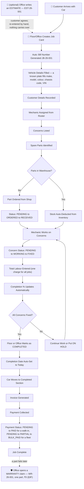

# 🔧 WorkshopOS (Titan) — OPERATIONAL BLUEPRINT
## How Every Feature Connects & Works Together

> This is the **workflow narrative** doc — how features connect, for a human
> reading top to bottom. For exact model/route/template tables see
> `MASTER_BLUEPRINT.md`; for roadmap and status see `TITAN_MASTER_HANDOVER.md`;
> for the rules behind these behaviours see `CLAUDE.md`.

---

## 1. THE COMPLETE CAR SERVICE LIFECYCLE

### Step-by-Step Flow



---

## 2. WHO DOES WHAT — STAFF ROLE CONNECTIONS

```
 OWNER
   Can do EVERYTHING below + these exclusive actions:
   - Access Owner Analysis & Reports: the **Profit** page (Turnover − Expenses = Profit, filtered by month/year/custom — what profit distribution is decided from) and, from it, the **Deep Analysis** page (mechanics, spare parts, inventory, vehicles, fleet, shops, cashbook, operations).
   - Delete a whole month's salary settlement (Office can create and correct one, only an Owner can un-record it)
   - View the Paid Bills Dashboard over ANY period (Office sees the last 7 days). Neither role sees a money total on it any more — the grand Total Collected was removed because it summed a fleet card's whole cumulative receipt on the day it happened to close; what replaced it is Cash Tracking on the Profit page. The row COUNT stays, since how many bills are in the list is a fact about the list
   - Set the **rent** in Deposit & Rent — what the premises cost per month, from a stated month onward. A rise agreed late can be dated back to the month it started, which re-prices those months; the other owner is told, and so is anyone reading the section. Office records the daily deposits but never decides the rent
   - Record **Owner Withdrawals** — cash taken out of the business for the owners. Owner-only end to end: Office and Floor cannot open the page or reach any of its three addresses. Not a business expense, so the profit figure never moves because of it
   - **WhatsApp a customer from the invoice** — a small icon beside Print, on a card carrying a real mobile number. It only opens that customer's chat; the owner attaches the saved PDF and presses Send. The same icon sits left of the customer's number on a **Car Profile**
   - Read the **About** page — the system map, and what every section does
   - View Financial Audits (High Discounts) — Owner only, since it reads as what the workshop settled for against what it billed
   - View **Change History** — three read-only tabs, one month at a time: **Deleted** (every permanent deletion, no restore), **Edited** (every edit that moved money, with what each figure was before) and **Back-dated** (money typed in on a later day than it moved)
   - Monitor all active login sessions, and remotely revoke any staff access
   - **The whole Control Hub (`/manage/`)** — create, delete and reset staff logins;
     unlock a locked account; add, edit and retire staff on the roster. Office cannot
     reach any of it, by URL or otherwise. Owner accounts are never managed *from*
     here: an owner changes their own password at `/change-password/` or recovers it
     by emailed code
   - Receive notifications in-app (nav bell): sign-ins, discounts over **₹3,500**, permanent deletions, archives, salary activity, and the account-security events (lockouts, resets, reset-code abuse, login created/deleted, staff password changed)
   - Change their own password, or recover it by emailed 6-digit code
   - **No** Django Admin access — `is_staff=False` on purpose; see `CLAUDE.md`

 OFFICE STAFF
   Everything Floor can do + these actions:
   - View full Job Card List with search
   - Delete job cards (permanent + logged; blocked if the card still holds spares, jobs, a labour charge, or a payment)
   - Deactivate / reactivate Spare Shops & Fleet Accounts; delete (reverse + log) Fleet/Shop payments
   - Undo a completion (marking one completed is Floor's too, since the mechanic is who knows the car is finished; undoing can put a second active card on the floor for one registration, so it stays here)
   - View and Generate Invoices
   - Update payment status and amounts
   - Manage Bulk Payers (create, transfer bills, process cascade payments)
   - View Pending Bills dashboard
   - Manage Spare Shops (create, edit, pay, view ledger, print) and edit or delete rows in the Unassigned Spares Hub
   - Move a part between a job card and the Unassigned Spares Hub, both ways (Move to Unassigned, Import from Unassigned) — Floor is offered neither, because an import carries the part's shop price and transport
   - Manage Master Lists (Brands, Models)
   - View Car Profiles (vehicle history)
   - Open a **warranty claim** — one failed part from an earlier bill — and work the Warranty page: what is still waiting on a shop, every warranty card, the warranty slip handed over with the car, and Cancel claim for one opened by mistake
   - Run Data Cleanup — the one screen for spare and concern names (rename, merge, delete duplicates)
   - Manage inventory Categories (add/list/edit) + create/edit products via Supplier Shops (Add Product); all supplier-shop management
   - Record and review Cashbook entries (income & expenses ledger). Typing a wage, an owner's name or anything to do with rent here asks first — each has its own section and would land wrong in the profit figure. It only asks
   - Record the daily **rent deposit** in Deposit & Rent — the cash handed to the collector who comes round each day, keyed off his own book. The page says what to pay today: whatever is left of the month's rent over the days left. Office may date an entry up to three days back; anything older is an owner's, and the other owner is told. A deposit keyed wrong is **edited or deleted from its ⋮** within 24 hours of keying it — quietly, like the Cashbook; after that it is an owner's, kept in Change History, and the other owner's phone is told. The list shows this month; any other opens from Month by month, with one "Back to this month" button


 FLOOR (Mechanics / Floor Manager)
   - View Dashboard (active cars on floor), including each car's live details — the same four lists (Customer Concerns, Job Performed, Inventory Items, Spare Parts) the read-only job card shows. **This is where Floor reads a card**: the Live Report and the read-only card view at `/jobcards/<pk>/` are both Office/Owner
   - Narrow that board to one mechanic from the chip row above the cards (`All 10 · Amlah 3 · Hijaz 3 · Unassigned 1`). Only names actually holding a car are listed, the counts always add up to All, and the choice rides in the URL so it survives a refresh. The "IN WORKSHOP" figure above it keeps counting the whole floor whatever is selected. **This is the only place Floor can see who is holding what** — the Live Report's own mechanic board is Office/Owner
   - Create new Job Cards. A plate the workshop has seen before fills the make, model, colour, chassis code and VIN; Floor's form has no customer boxes, and the lookup's answer carries no customer for Floor at all
   - Edit existing Job Cards (add concerns, spares, jobs done — but no prices: every money field on the card, the Total Labour included, is Office/Owner only and is enforced on the server)
   - Use Autocomplete (search brands, models, spares, concerns)
   - View Inventory (stock levels), Low Stock, and Stock History — all **read-only** (no stock editing, no supplier-shop access)
   - Put a car On Hold / take it off hold, and Mark it Completed
   - Work on a **warranty card** like any card — the complaint, the work done, the claimed part's dates — with no shop and no price. The board lists warranty cards in their own group under the job cards, and a **Warranty** chip narrows it to them. Opening a claim is Office's and an owner's
   - Record a purchase in the **Unassigned Spares Hub** — add only. No price box is shown and none is stored (the row is saved unpriced, and Office fills the figure in from the shop's bill); existing rows cannot be edited or deleted, and no price on the page is visible to Floor. Floor *can* fill in **Ordered For** — a free-text note saying which car the part is for ("BMW 320d"), because a part is usually ordered before there is a job card to attach it to. It is a note, not a link: it moves no money and joins nothing
```

---

## 3. JOB CARD — THE CENTRAL HUB

Everything in the system connects through the Job Card:

```
                    MECHANIC
                    (Roster)
                       |
                  assigned to
                       |
 MASTER LISTS -----> JOB CARD -------> INVOICE
 (Brands,Models,      |                |
  Spares,Concerns)    |                |
     ^                |             PAYMENT
     | auto-learn     |             STATUS
     |                |
     |     +----------+----------+
     |     |          |          |
     |  CONCERNS    SPARES    JOBS
     |  - Text      - Part     - Job Desc
     |  - Status:   - Qty      (description only —
     |   PENDING    - Shop $    no per-line amount)
     |   WORKING    - Cust $
     |   FIXED      - Shop FK
     |              - Status:
     |              PENDING
     |              ORDERED
     |              RECEIVED
     |                |
     |                | auto-sync (signals)
     |                v
     |          INVENTORY
     |          (Warehouse)
     |                |
     +------->  TOTAL BILL AMOUNT
           = Sum(Spare Customer Prices)
           + Total Labour        <- ONE figure on the job card
                                       (JobCard.labour_amount), typed
                                       once by Office for all the jobs
           (denormalized for performance)
```

**Vehicle Details carries two optional boxes under the plate** — the **chassis code**
(the platform, e.g. F30 or W205, which decides which part fits) and the **VIN** off the
RC book. Floor may fill both, since the mechanic reads them off the car. An empty one
wears the red hairline but never stops a save, and neither is printed on the bill, the
service history sheet or the quotation. Every search that finds a car finds it by either.

**A plate the workshop has seen before fills the card.** The make, model, colour, chassis
code and VIN fill in by themselves from that car's earlier visits, and anything typed by
hand is never overwritten. The last customer's name and number are only *offered* — greyed
in their own boxes with a **Use last visit** button, for Office and Owner — because the car
may have been sold since, and that number is the one a bill is sent to.

---

## 3B. ESTIMATES — THE QUOTE THAT COMES BEFORE ANY OF THIS

An **Estimate** is the piece of paper handed to a customer *before* the work is
agreed. It is the one section of WorkshopOS that is connected to nothing else.

```
Customer asks "what will this cost?"
        |
        v
Estimates -> New Estimate
   customer + vehicle (free text, same autocomplete AND the same colour
                       picker as a Job Card)
   jobs to be done   (descriptions; ONE Total Labour figure, as on a bill)
   parts needed      (name, qty, unit price, amount)
        |
        v
Save & Print  ->  EST-26-001 on the workshop's own letterhead
        |
        +--> customer says yes  ->  Office opens a NEW Job Card by hand
        +--> customer says no   ->  the estimate just sits in the history
```

**Nothing crosses that boundary automatically, and that is the design.** An
estimate creates no job card, moves no warehouse stock, touches no spare-shop or
fleet ledger, and never appears on the Profit page. Money on an estimate is a
*proposal*: a quote that entered a report would be the workshop counting work it
has not done and parts it has not fitted. Quoting "Castrol Edge 5W-30" does not
deduct the shelf, because nothing has physically been taken.

Two things carry over from the printed bill, deliberately:

* **The document.** `workshop/invoice.py` builds both, so the estimate and the
  invoice that follows it agree about an unpriced part and how labour is
  subtotalled. The sheet is the same letterhead and the same column grid.
* **The pricing rule.** Labour is one figure for the whole job, exactly as on a
  Job Card — the workshop quotes work whole, so the estimate does too.

And two things deliberately do NOT, because a bill records work that happened
while an estimate describes work that has not:

* **QTY prints only what was typed.** A blank stays blank, though it still
  counts as 1 in the arithmetic, and a typed 1 prints — somebody chose to put
  it in front of the customer. The bill hides a quantity of one altogether:
  on a bill, one is the figure this workshop never writes down.
* **UNIT PRICE prints only when a rate was entered.** It is never derived from
  the total, which would present the workshop's own arithmetic to the customer
  as a quoted rate.

One convenience, and it is only a convenience: when Office types a part name,
the **Unit Price box's placeholder** reads `avg: 1064` — what that part sold for
on average across its last five bills. It is grey suggestion text — never filled
in, never posted. A price on a document handed to a customer is a decision
somebody makes.

**Nothing on an estimate is required.** The screen is filled in with the
customer standing there, so a quote may be half a car and two parts, and it
saves that way. A row left blank is not saved; a row cleared out is deleted, not
argued with. The only two things refused are the ones that would print nonsense:
a figure typed into a **new** row with no part name beside it, and a negative
amount.

**Removing a line is clearing its name and saving.** There is no delete button
on a row, deliberately — a ✕ beside every line is a one-tap way to lose work on
a tablet, and a quote is typed in a hurry. Clearing the name removes the line
even when its figures are still there, because those are exactly the lines
people want to remove.

The car's **colour** is recorded with the same picker as a Job Card and shows as
a stripe down each row of the Estimates list, the same cue the dashboard's live
cards use — it is how staff find a car at a glance. It is deliberately not
printed: the customer knows what colour their own car is.

Estimates are Office/Owner. Deleting one is permanent and, unlike every
financial delete in the app, is **not** written to Deletion History — an
estimate is a draft expected to be rewritten and discarded, and a critical alert
that fires for housekeeping stops being read for the things that matter.

---

## 3C. PHOTOS — EVIDENCE, ATTACHED TO NOTHING

A photograph answers one question later: *what did this car look like when it came
in?* It is evidence in a pre-existing-damage argument, and nothing else in the system
depends on it.

### Where they are taken

| Surface | Who | What they can do |
|---|---|---|
| **Job card → car photos** | Floor, Office, Owner | take, view, delete (while the bill is open) |
| **Job card → a Spare Parts row** | Floor, Office, Owner | take, view, delete (while the bill is open) |
| **Spare Shop → Purchase History** | Office, Owner | **view only** |

The mechanic walking round the car with the tablet is who takes them, which is why
Floor has full access here even though Floor is shown no prices anywhere in the app —
a photo of a car says nothing about whose it is or what it cost.

### How it works

1. The person taps the box; the camera opens; **one tap takes the photo** — there is
   no shutter-then-confirm review step, because that doubles the taps on a ten-photo
   walk-around.
2. The browser asks the server to **sign** an upload URL. The server mints the photo's
   id and hands back a URL pointing straight at the storage bucket.
3. **The browser uploads to the bucket directly.** The bytes never pass through
   Django, so a slow upload on bad shop wifi never occupies a server worker.
4. Only once the bucket confirms does the browser tell the server to **commit** the
   row.

That ordering is the whole design. Writing the row first would mean a browser closed
mid-upload leaves a record pointing at a photo that does not exist — a broken image
nobody can explain or remove. This way **a row always means a real photograph**, and
the worst case is an unreferenced object in the bucket, which a housekeeping command
sweeps up.

Because the frame is held in memory until the server confirms, a failed upload
retries once by itself, and anything still broken becomes a **visible** failed item
plus a warning if you try to leave the page. **A photo never disappears silently.**

### The rules that matter operationally

- **Nothing in the business depends on a photo.** No job card column points at one, no
  money, no stock, no ledger, no report, and nothing on the printed bill. Settlement
  never asks for one — a card with no photographs is a perfectly ordinary card.
- **Limits: 10 per car, 4 per spare.** The count is only shown once the limit is hit;
  a permanent "3/10" badge just invites filling it.
- **Settling the bill freezes the photos.** Once a card is PAID or FLEET PAID its
  photographs can be looked at but not added to or deleted — money and evidence stop
  moving together, the same principle as the Financial Lock. The only delete there is
  removes a mis-shot from an open card.
- **A new job card, and a newly added spare row, offer no photo box** — there is no
  saved record yet to attach one to. The card says "save the job card first". This is
  the real workflow, not a workaround: nobody photographs a car while typing its
  registration.
- **Photos are kept for a year, then purged** — the owner's rule is that complaints
  stop after a year. `purge_old_photos` does it, and it **skips any bill still
  unpaid**, whatever its age: an unpaid bill is an open argument, and those
  photographs are the evidence in it.
- **The whole section is optional.** With no storage configured the box simply does
  not appear, and every other thing on the job card behaves identically.

---

## 3D. OLD BILLS — THE EXCEL YEARS, TYPED IN FOR HISTORY

Before WorkshopOS the workshop wrote every bill in **Excel** — about 800 of them.
**Old Bills** is where they are typed in, so each car's Profile, All Invoices and
Service History reach back to its first visit. Like an Estimate, an old bill is
**connected to nothing**: no profit, no cash, no stock, no shop or fleet ledger.

```
Drawer -> Legacy Data -> Old Bills -> + Add Old Bill
   DATE  [10] [apr] [26]          -> "Fri 10 Apr 2026" spelled out underneath
   # JB- [26] [097]                (the year fills itself from the date)
   REG NO / MAKE / MODEL / MILEAGE    (no customer name — not needed here)
   JOB PERFORMED  + SUBTOTAL          <- the paper's own order; one open row,
   PART NAME  qty  amount                the next opens as you type
   TOTAL ₹ 16,200.00   (worked out, nothing to type) -> "Verify this total with the XL bill"
        |
        v
Save & add next  ->  same month and year kept, cursor back on Day
```

**What it holds is what the paper shows.** One date, the bill number, the car, the
jobs with one labour subtotal, one mixed list of parts, and the total. There is **no
discount and no payment**: the Excel total was sent on WhatsApp and the final figure
was agreed at the counter and never written down, so an old bill's figure is what
was *billed*. Commas and ₹ may be typed in amounts exactly as the paper prints them.
The TOTAL is not typed: it is worked out as the amounts go in, and the typist checks
it against the XL bill — a total that disagrees means a line above was misread, and
that line is what gets fixed.

A plate typed before fills MAKE and MODEL, exactly as on a new job card, and both
offer the Job Card's own suggestions. JOB PERFORMED and PART NAME use the same
dropdown under the box, on a phone too. A job line offers the Job Card's own
lines ("Coolant replaced"); PART NAME offers the jobs already typed with their
verb taken off — "Coolant replaced" offers "Coolant" — then the inventory
category names ("Engine Oil", the way a bill prints it) and the spare parts list.
Nothing typed here is added to either list.

**Fill from PDF.** The owners kept every Excel bill as a PDF, so the Add page carries
a **Fill from PDF** button at the top. Choose the bill's PDF and the form comes back
filled — date, number, plate, make and model (in the master list's spelling, so
"Mercedes Benz" arrives as Mercedes-Benz), mileage, every job line, every part with
its qty and amount, and the labour subtotal. **Nothing is saved and the file is not
kept.** Under the TOTAL the form compares its worked-out figure with the TOTAL printed
on the PDF: "✓ Matches the PDF's total", or red naming the PDF's figure. The typist
checks the lines against the PDF and presses Save as usual. A number already in is
said the moment the form comes back; a PDF that cannot be read leaves the form empty
to type by hand. Bills of any number of pages are read.

**Enter never saves** — it moves to the next box, and on the empty part row it brings
the TOTAL into view. A bill with an amount that cannot be read, a
number already typed, or a number whose year does not match its date is refused,
with every problem named at the top and everything typed kept.

**One JB number sequence, paper and system together.** Excel numbered bills
JB-YY-NNN from 001 each January — the system's own shape. On go-live day the last
Excel number is set (`LAST_EXCEL_BILL_NUMBER`), and the system's own numbers start
after it; an old bill can never take a number after it.

**Splitting the pile between people.** The Old Bills page shows every month of every
year with its count. Excel never skipped a number, so once only a few are left the
page names the exact JB numbers not typed yet.

**Where they appear:**

| Screen | How |
|---|---|
| Car Profiles | a car known only from old bills is listed and searchable |
| Car Profile | a **yellow** Old bills section under the visits, numbered #1 (oldest) on its own; one line "Old bills: N · ₹X billed". The money tiles never include them |
| All Invoices | after the job-card bills, on the same printed sheet, with no PAID stamp |
| Service History | as **OLD BILL n**; counted in the car's history (first visit, serviced every, part life) but **not** in TOTAL BILLED / NET TOTAL |
| New job card | a plate from the Excel years fills its make and model, and offers the name |

Office and Owner; Floor never sees the section. Deleting an old bill is permanent
and, like an estimate, not written to Deletion History — it moves no money.

---

## 3E. LEGACY DATA — THE GO-LIVE STARTING POSITION

The system goes live in a **running** workshop: parts are already on the shelf and
money is already owed to every shop. Two Owner-only screens type that starting
position once, on go-live day, and the everyday workflow carries on from it.

The menu carries **one** Legacy Data row (in Records). It opens a page with the
three screens as the menu's own rows — Old Bills, Opening Stock, Opening
Balances; Office sees Old Bills alone — and each screen has a "Legacy Data" way
back.

```
Drawer -> Legacy Data -> Opening Stock
   every product:   On shelf [ 38 ]   Cost / unit [ 500 ]   (the last price paid)
   Save -> shelf = 38, cost ₹500 — NO shop balance is created

Drawer -> Legacy Data -> Opening Balances
   every shop:      [ 2,45,000 ]   what the shop's own book says, minus any
                                   unassigned spares already entered for it
   Save -> saved exactly as typed; the shop's balance includes it
```

**The shelf and the balances are separate on purpose** — on go-live day nobody can
say which goods an old debt paid for. After that:

| | |
|---|---|
| a part used from opening stock | costed at the typed cost, like any warehouse draw — even one used before the count was typed |
| the next Supplies Shop bill | blends with what is left (10 L at ₹500 + 20 L at ₹520 → ₹513.33) and is a normal debt |
| a payment to a shop | pays the opening balance first; the shop page says "Opening balance from before the system: ₹X left" until it reaches zero, then the line goes |
| the whole-ledger printed report | keeps an Opening Balance line for ever, so its totals add up |
| profit and cash | untouched — the old debt is not an expense; paying it is cash out on the day it is paid |

Go-live order and the two "never do" rules (never enter an old Supplies Shop bill;
never count a delivery and also bill it) are in `GO_LIVE_RUNBOOK.md` §3.5.

**At the end of go-live day an owner LOCKS both screens** — Legacy Data → Lock
Legacy Data, behind three red confirmations, the last one naming the figures
being frozen. From then on they show the figures the system started from, with no
boxes and no Save, and refuse any change for everyone, owners included; the page
says when it was locked and by whom. The lock is kept in the database, so a
backup restored anywhere, or the whole system moved, is still locked. Nothing
inside the app can unlock it — correcting a figure needs
`manage.py unlock_legacy_data --yes` on the server, and then pressing Lock again.
Old Bills stays open.
---

## 3F. WARRANTY — FREE WORK BECAUSE OF AN EARLIER BILL

A customer comes back: *"the coolant elbow you fitted has cracked — is it under
warranty?"*. A **warranty claim** is free work on the car because of an EARLIER
bill. It opens a **warranty card** — a job card underneath, numbered
**WR-26-001** in its own series — that the customer pays nothing for and that is
never settled.

```
Warranty page -> New claim -> pick the car        (or Car Profile -> Warranty)
   the car's warranty page: every finished bill, newest first
     JB-26-005 · 1 Sep 2026 · 1 month 7 days                      [Open]
       Coolant elbow
       Biljo · 01/09 – 03/09 · ₹1,450                            [Claim]
       Water pump                                Replaced · WR-26-012
   [Claim] -> "Claim this part?" -> Claim -> the warranty card opens
```

**One claim is one part.** Each part has its own Claim button. There is **no
claim for the work alone** — a clamp re-tightened or an alignment redone is done
without a card: nothing is ordered, nothing waits, nothing costs. Anything the
repair needs that was NOT on the earlier bill goes on an ordinary job card and
is billed.

**Whether it is still covered is the owner's call.** The page shows how long ago,
to the day ("1 month 7 days"), and the card shows the kilometres since; the
system never decides, and there is no expiry date anywhere.

What the page says about each part:

| | |
|---|---|
| **Claim** | it can be claimed — one question, then its card opens |
| **Being claimed · WR-…** | a claim is open on it; it cannot be claimed twice |
| **Replaced · WR-…** | a claim on it is finished: the part on the car now is the replacement, listed under that WR bill on the same page, and a second failure is claimed **there** — its button reads "2nd claim" |
| *Newer one on JB-…* | the same part was fitted again on a later bill — a quiet note, never a block |

Under each part: **how many, the shop, the ordered and received dates and the
shop price** — the facts in that shop's own ledger, so the owner finds the part
there in seconds. A part's stock items fold under "Stock items", since a part off
our own shelf is rarely claimed. A search box finds a part across every bill.

**The warranty clock runs from the FIRST bill, and a claim never restarts it.** A
part fitted on JB-26-005 and replaced on WR-26-018 is still under JB-26-005's
warranty, so a 2nd claim's age and kilometres are measured from JB-26-005 — the
part reads "First fitted JB-26-005 · 8 months 26 days" beside its button. The
date under every bill's number is that bill's own date, and a warranty card's
block (tinted) reads "20 Aug 2026 · 2nd claim · for WR-26-001". Every number in a
claim's chain jumps to that bill's block on the same page.

**The warranty card** is laid out exactly as a job card — same sections, same
boxes, same order — so nobody has a new screen to learn; only the section
headings are teal. Vehicle Details (today's date, mileage and mechanic), Workshop
Note & Photos, Customer Concerns, Job Performed, and last, where Spare Parts sits,
the **Claimed Part** — the job card's own spare row with no customer price. The
claimed part comes from the earlier bill:

| the failed part was | the card gets |
|---|---|
| a spare-shop part | the same part and shop, ordered today, **Shop Price blank — Waiting** |
| a stock part | a new draw of the same product off the shelf, at the shelf's cost |
| a line of an Excel bill | a spare-shop part with no shop yet — Office picks it |

The quantity may go down (one of four injectors failed), never above the bill's.

**The Shop Price is the shop's answer**: blank while it has not answered, **0**
when it replaced the part free, an amount when the workshop paid. The Warranty
page's **Waiting for shop price** lists every claimed part still blank, oldest
first, and is never filtered — a shop often answers after the car has gone.
The box itself reads **"0 if free"** while it is blank. Below it, the warranty
cards list in the app's own date-filter dropdown: This Year (default), Last Year
or All Time.

**Money.** The customer pays nothing: the card's bill is always ₹0, it is never
settled, it cannot go to a Fleet Account, and it is in no bill list (Pending
Bills, Paid Bills, All Invoices) and no average. What the shop charged, transport
and stock are real money out and reach the Profit page as any part does; the
Warranty page totals them. Its paper is the **warranty slip** — what was done and
fitted, with no prices anywhere, closing on WARRANTY.

**The board and the car.** Warranty cards sit in their own group under the job
cards, and a **Warranty** chip narrows the board to them. A car can have a job
card and a warranty card open at once — paid work and free work are two cards.
On a Car Profile the **Warranty** button sits at the end of the visit list's
heading; a warranty visit reads "No charge" with a Warranty badge, and a bill a
claim was made against carries a shield and that WR number beside its own.

**Cancel claim** (the card's ⋮, Office and Owner) removes a claim opened by
mistake while the card is open and no shop or transport has been paid; a stock
part goes back on the shelf. It is not written to Change History — no customer
money was ever on it.

**A claimed part stays put.** It cannot be deleted from its bill or moved to
Unassigned Spares, and an Excel bill's claimed line cannot be renamed or the bill
deleted — the claim points at it. Undo Completion on a warranty card is refused
when a later claim has taken its part.

---

## 4. BILLING & FINANCIAL FLOW

### Cost Accumulation

```
Spare Part Added (Customer Price) --+
                                    +--> Total Bill Auto-Calculated --> Invoice
Total Labour typed on the card --+     (denormalized)

The workshop quotes work as a WHOLE — a customer is told one figure for the
job — so the Jobs section lists what was done and carries no per-line price.
Office types the single Total Labour at the foot of that section, and the
invoice prints it as the JOB PERFORMED subtotal.
```

### Payment States

```
PENDING   = Nothing received yet
PARTIAL   = Some money received, balance remains
PAID      = Full amount received (discount auto-calculated if received < bill)
BULK_PAID = Paid via bulk/fleet payment system
```

### Payment Methods

```
CASH     = Cash payment
UPI      = UPI
CARD     = Card
TRANSFER = Bank Transfer
```

### Spare Part Pricing (Two-Price System)

```
Shop Price      = What the parts shop BILLED for the line — a line total, copied
                  off the shop's own bill, never multiplied by the quantity
Transport       = What it cost to BRING the part in, paid to anyone but the shop
                  (bus parcel, courier, auto) — optional, a line total too
Customer Price  = What the CUSTOMER pays for the line (with your markup)
Margin per line = Customer Price - Shop Price - Transport
```

A shop row's quantity moves no money; it describes what was bought and still prints
on the bill. A warehouse draw is the other way round: its cost is per unit — the
shelf's average — times the quantity, and it carries no Transport (its delivery was
on the Supplies Shop bill).

**Transport is never added to Shop Price.** Shop Price is what the shop's own bill
says; transport paid to somebody else is not owed to the shop, so it goes in its own
box. It never prints on the customer's bill as a line — it is recovered inside the
part's price — and on the Profit page it is its own expense line, **Parts
transport**. In Cash Tracking it is money out on the day the part arrived. One parcel
for several parts is split by whoever types it (600 over three parts as
200/200/200, or 300/200/100) — the shares must add up to what was paid, because the
boxes are the only record of it. Transport for a part that is not on any car yet is
typed on its Unassigned Spares row and travels with it onto the car. Transport that
has nothing to do with a part (an errand) is a Cashbook expense.

### Bulk/Fleet Payment (Cascade Algorithm)

> **UI note**: This feature is labeled **"Fleet Account"** in the interface. The underlying model, fields, and URLs are still named `BulkPayer` — same feature, cosmetic rename only.

```
Customer "XYZ" has 5 unpaid jobs, plus Rs.500 advance credit from a previous overpayment:

Job 1: Rs.3,000 balance (oldest)
Job 2: Rs.5,000 balance
Job 3: Rs.2,000 balance
Job 4: Rs.4,000 balance
Job 5: Rs.1,000 balance (newest)

Customer pays Rs.10,000 lump sum:

Available funds = Rs.10,000 (payment) + Rs.500 (existing advance) = Rs.10,500

Job 1: Rs.3,000 paid  (remaining: Rs.7,500)
Job 2: Rs.5,000 paid  (remaining: Rs.2,500)
Job 3: Rs.2,000 paid  (remaining: Rs.500)
Job 4: Rs.500 paid, Rs.3,500 still owed
Job 5: Rs.0 -- funds exhausted

Result: 3 jobs fully paid, 1 partially paid, 1 still pending, Rs.0 advance remaining
JSON snapshot saved for precise reversal if needed (also reverses any advance change)
```

If a payment fully covers every pending/partial job and money is left over, the surplus is stored as `advance_balance` (an account credit) rather than lost — it's automatically pooled into the next payment. This means `total_balance` can legitimately show as negative (in credit).

### Spare Shop Payment (Cascade Algorithm)

```
Same oldest-first cascade logic applies to shop payments.
Lump sum distributed across unpaid items chronologically.
Payment history is recorded; Office can reverse a payment within 24 hours of keying it, an owner any time.
```

**Each payment is dated by the day the money moved.** The shop's collector comes at
month end and the payment is often keyed the following week, so the form opens with a
small calendar box — today by default, turning amber and spelling the day out the
moment it is back-dated. That date, not the day it was typed, is what the shop page's
Today / Last Month / Last Year filters and its printed history read. A date in the
future is refused. The balance is never windowed: whichever filter is on, what the
shop is owed is every purchase against every payment.

### A Discount from a Shop (spare shops and Supplies Shops alike)

A shop sometimes lets the workshop off a little — "the balance is ₹22,150, just pay
₹22,000". That is a **₹22,000 payment and a ₹150 discount**, and the shop is settled.

```
Shop page → tag symbol (left of Payments / Restock Bills) → Record a Discount dialog
  Discount ₹ · date · note → Apply ₹150
```

- **A discount is a payment with no cash.** It comes off what is owed exactly like a
  payment, and the oldest items (or bills) are covered first. "Total Paid" stays the
  cash; the discount shows under it as "+ ₹150 discount" — on the shop page and
  on that shop's card in the shop list, only when there is one.
- **It is profit on the day it was given** — "Discounts from shops" on the Profit
  page's Turnover. It never moves Cash Tracking, and it never changes what a part or
  a stock item cost: a Supplies Shop's discount on one bill is recorded here too,
  with the bill entered at its full line prices.
- **It can never be more than is owed**, cannot be dated ahead, and Office can date
  it three days back at most — the payment rules.
- **Deleting one** is the payment's rule: from the ⋮ on its row in the payment
  history (discounts list first, under their own heading), Office within 24 hours of
  keying it, an owner after, with an optional reason, logged to Change History.
- It is **one small green tag symbol**, no caption, because it is rare and must not
  weigh the page; green because the workshop gains. It appears only while money is
  owed. A figure over what is owed is said inside the dialog and Apply greys out.

---

## 5. INVENTORY <-> JOB CARD AUTO-SYNC

### Two sections, because a part arrives by one of two routes
A Job Card records parts in **two separate sections**:

| | **Inventory Items** | **Spare Parts** |
|---|---|---|
| Where it came from | the workshop's own shelf | ordered from a spare shop for this job |
| Columns | Item, Qty, Cost / Unit, Unit Price, Total Price | Part Name, Qty, Photos, Shop, Status, Dates (Ordered / Received / Expected in, behind one chip), Shop Price, Transport, Customer Price |
| How the part is chosen | **picked** from stock (search, then select) | typed freely |
| Moves warehouse stock? | **yes** | never |
| Who supplied it | a Supplies Shop restock bill, earlier | the spare shop, per this job |

They were one section, which meant five of the eight columns were
permanently blank for a warehouse draw and staff were invited to fill boxes that
meant nothing. Worse, the system had to *guess* which route a row took, and guessed
differently in two places — so a shop-bought part that happened to share a name with
a stock product was deducted from the shelf *and* billed to the shop. Both sections
still write one table (`JobCardSpareItem`), told apart by a stored `source`.

**Prices are Office/Owner only in both sections.** Floor sees name and quantity.

**On an Inventory row, "Unit Price" is what the CUSTOMER pays per unit** — enter it
and Total Price fills in (× qty); or skip it, as staff usually do, and type the
total straight in. A typed total shows its unit price in **grey** in the Unit Price
box — the same figure the printed bill shows — but only the total is saved, because
a divided unit price would change the bill by a paisa or two (₹1,000 for 7 would
save as ₹1,000.02). Type a unit price yourself and it turns black and the total
follows it. What the part *cost* the workshop is never typed: it is taken from
stock automatically — a weighted average of what the shelf paid, worked out from the
supplier bills dated before that draw. A bill dated later cannot reach back and change
it. Only a bill back-dated to before the draw, or a correction to an earlier bill, moves
it, because that is the workshop learning what those goods really cost. Correcting a
draw to a different product takes that product's cost.

### Suggested prices and the markup badge
Office and Owner see a **suggested customer price** as they fill a row in:

| | they type or pick | the page fills |
|---|---|---|
| **Spare Parts** | Shop Price ₹1,000 (and any Transport, say ₹500) | Customer Price ₹1,400 — every spare at 40% — plus the transport at cost: ₹1,900 |
| **Inventory** | the product (its Cost / Unit shows, read-only) | Unit Price at that product's own markup, and the total from the quantity |

The filled price is an ordinary box: change it and the change stands. A small round
badge at the end of the row, after the total, says what markup the line really
carries — **green** from 20%,
**yellow** below 20%, **red** below cost. It is a **markup** (₹1,000 → ₹1,400 is 40%),
which is why the Deep Analysis "Margin %" for the same part reads lower. On a spare
part the badge measures the part with its transport taken back out, so ₹1,900 on
₹1,000 + ₹500 reads 40% — and a price saved before the transport was typed turns
**red** the moment it no longer covers it. A ₹0 Shop Price (a free warranty part)
suggests nothing: what the customer pays for it is decided by a person.

- A price is only suggested while someone is filling that row. Opening a card changes
  nothing; a part Floor recorded with no price is filled when Office taps its box.
- A price someone typed is never overwritten, and a saved price never follows a later
  change of shop price, product markup or supplier bill — only the badge moves.
- A settled (Paid or Fleet Paid) card is never filled, even after unlocking it.
- A product no Supplies Shop bill has costed yet shows a dash and gets no suggestion.
- Suggested prices are rounded **up** to the whole rupee.
- Each product's markup is set on **Add Product** (40 by default) and changed in
  **Edit Product**. Changing it affects the next suggestion, never a saved price.
- Floor sees none of this: no cost, no markup, no badge.

### Taking more than the shelf says you have
This is **allowed**, and the count may go **negative**. A job card records a part the
mechanic has *already physically taken* — refusing the record would not put the part
back, it would only stop a mechanic mid-shift and leave the system disagreeing with
reality. A negative figure is the signal that a Supplies Shop bill has not been
entered yet, and it heals itself when that bill arrives (−3, then a +10 receipt,
lands on 7). **Negative is not the same as Low Stock**: low means order more,
negative means a bill is missing.

The **Low Stock** screen keeps the two apart. Negatives appear in their own amber
"stock discrepancy" banner — naming the products, saying a Supplies Shop bill has
probably not been entered, and telling you *not* to reorder them — while the
"running low" and "out of stock" counts below cover only products at or above zero.
Everyone sees this, Floor included, so a mechanic who notices a negative can say so.
Individual rows carry a **CHECK BILL** chip rather than the ordinary red **OUT** one.

```
JOB CARD ACTION                      WAREHOUSE EFFECT
----------------------------------------------
Inventory: add "Oil Filter" x2  -->   Oil Filter: 10 to 8  (auto -2)
Change qty to 5                -->   Oil Filter: 8 to 5   (auto -3 delta)
Change to "Air Filter"         -->   Oil Filter: 5 to 10  (auto +5 restore)
                               -->   Air Filter: 7 to 2   (auto -5 deduct)
Delete the row                 -->   Air Filter: 2 to 7   (auto +5 restore)
Spare Parts: add anything      -->   (no effect, ever — it never left the shelf)
Delete a job card              -->   (guarded: a card holding spares can't be deleted —
                                      clear/unassign its spares first, so no stock moves)
```

Stock sync runs on **four signal groups** (13 handlers): warehouse draws (above — Inventory-section rows only), a whole-job-card soft-delete/restore reversal that is **now dormant** (job cards are hard-deleted and a card holding spares can't be deleted), supplier restock (§5B — 5 handlers there: 3 that move stock, plus a bill-level pair that re-costs when a bill's date or discount changes), and the go-live **Opening Stock** count (3 handlers — §3E), which raises the shelf exactly as a delivery does and creates no shop balance. All stock changes are signal-driven, never mutated directly in views — and there is **no manual stock-number editing anywhere** (Low Stock is read-only).

### Where inventory items come from
Items are created **only** via **Supplier → Add Product** (which requires an Average Stock — see below); there is no separate "add item" screen, and "Manage Database" is a read-only Category browser (add/list/edit/delete Category; drill in to see products + their shops). Category names can't be duplicated in any casing, and a category can only be deleted while it is **empty** — Delete simply isn't offered once it holds products. Product name and Average Stock are edited on the supplier catalog, where a product can also be **deactivated** (kept and listed, but excluded from restock bills — enforced when the bill is saved, not merely hidden from the picker).

Removing a product from a shop's catalog **deactivates instead of removing** in two cases: it has purchase history from that shop (removing would alter historical bill totals), or it still holds stock (stock is signal-only, so deleting the product would silently destroy a countable quantity — clear the stock first). Only a zero-stock product with no purchase history anywhere is actually deleted, and that deletion is written to the Owner-only **Deletion History** like every other permanent delete.

**Stock History** (Floor-visible) is a live log of every spare used on a car — item · qty · mechanic · car · reg — with a per-mechanic totals drill-down and a This/Last-week filter. Parts whose name matches no warehouse product are marked **"not from stock"**: nothing was deducted for them (bought outside, or the name doesn't match the product), so they must not be read as warehouse draws.

### Low Stock Alert System

**Average Stock** is *how many of a product the workshop normally keeps on hand* — the number Office types when adding the product. It is **not** an alert threshold: the Low Stock list fires well below it, at under a quarter. Keep the two ideas distinct in any UI copy.

```
Each item has:  Average Stock (how many you usually keep)
                Current Stock (actual count, signal-maintained)

Health = (Current / Average) x 100%

 Green  (50%+)      = Healthy stock
 Yellow (25-49%)    = Warning, reorder soon
 Red    (below 25%) = Critical — this is what the Low Stock list shows
```

---

## 5B. SUPPLIES SHOPS (INVENTORY SUPPLIERS)

```
SUPPLIES SHOP (Inventory Supplier)
   ├── Name, Phone, Active/Inactive Status
   ├── Catalog (linked inventory items this supplier stocks)
   │
   ├── Restock Bills:
   │     Each bill records a purchase from this supplier
   │     Bill → Line Items (inventory Item + qty + unit price)
   │     Stock auto-increases on bill creation (via signals)
   │     Stock auto-reverses on bill deletion
   │     No discount on a bill — it is the shop's own line prices, so every
   │     item costs what the paper bill says (2026-09-29)
   │
   ├── Financial Ledger:
   │     Total Billed = SUM(bill total_amount)
   │     Total Paid = SUM(payments where is_trashed=False)
   │     Pending Balance = Total Billed - Total Paid
   │
   ├── Payment Options:
   │     Quick payment form (amount + method + note)
   │     A payment is deleted permanently and logged (Office within 24 hours, an owner any time)
   │
   ├── Bill Status Tracking:
   │     Each bill shows Covered / Partial / Unpaid status
   │     Running waterfall: oldest bills covered first
   │
   └── AJAX Pagination:
         Bills and Payments tabs load via AJAX partials
         Independent search + date filtering
```

### Why supplier payments are a running balance, not per-bill settlement

This mirrors how the workshop actually trades, and should not be "corrected" into
invoice-by-invoice payment:

- Suppliers **restock at the workshop on credit** as parts are needed — there is no
  payment at the time of delivery.
- They **come round weekly or monthly to collect**, and are rarely paid in full.
  The workshop pays whatever cash is on hand that day — ₹3,000, ₹5,000, ₹8,000.
- So a payment is a **lump sum against the shop's whole outstanding balance**, not a
  settlement of a chosen bill. `SupplierPayment` carries no bill FK by design.
- The per-bill **Covered / Partial / Unpaid** labels are a *derived view*: payments are
  applied oldest-bill-first in a running waterfall so staff can see how far the money
  reached. Nothing stores a bill↔payment link.

The practical consequence: a shop normally sits at a non-zero pending balance, and that
is healthy, not an error state. A shop created for *cash* purchases (e.g. an urgent
outside buy under the workshop's own name) needs its payment recorded alongside the bill,
otherwise it will show an outstanding balance that isn't a real debt.

### How Supplies Shops Connect to Inventory

```
SUPPLIER ACTION                      WAREHOUSE EFFECT
----------------------------------------------
Create restock bill (5x Oil Filter)  →   Oil Filter: 10 to 15  (auto +5)
Edit bill qty to 8                   →   Oil Filter: 15 to 18  (auto +3 delta)
Delete bill entirely                 →   Oil Filter: 18 to 10  (auto -8 reverse)
```

**A Supplies Shop payment is dated the same way, on the same rule.** Record Payment
carries a Payment Date field — today by default, capped at today, turning amber and
spelling the day out the moment it is back-dated. This side matters more, not less:
the collector here comes round weekly or monthly, so a bill settled at month end is
routinely keyed the following week. That date is what the shop page's date filters
and its printed history read. Paying a supplier never touches the Profit page — it
settles a debt. The cost reached the Profit page when the parts were drawn onto a car;
the bill itself only filled the shelf.

The control is a full-width field rather than the spare shop's compact calendar
glyph, because Record Payment is its own page of stacked full-width boxes while the
spare-shop form is an inline row. Same rule, same behaviour, shape that matches the
page it is on.

### Supplies Shops vs Spare Shops

```
                    SUPPLIES SHOPS              SPARE SHOPS
                    (Inventory App)             (Workshop App)
Purpose:            Buy parts INTO warehouse    Buy parts FOR specific jobs
Linked To:          Inventory Items (FK)        Job Card Spare Items (FK)
Stock Effect:       Increases stock             N/A (tracked separately)
Bill Structure:     Restock Bills + Line Items  Per-job spare items
Payment System:     Running balance; delete     Cascade waterfall; delete
                    reverses + logs             reverses + logs
Access:             Office+ (all 23 views)      Office+ (a money delete older than
                                                24 hours is an owner's)
```

> **The two modules now agree, and they did not always.** Every Supplies-Shop view —
> the catalog, restock bills, payments, the AJAX partials, and both deletes — is
> `@office_required`. **Floor cannot reach any of it.** What Floor keeps in the
> Inventory app is the read-only side: the stock list, Low Stock, Stock History and
> the per-mechanic drill-down, five routes in all.
>
> This used to be an asymmetry worth flagging: the whole Inventory app was
> staff-level, so a mechanic could create *and delete* supplier bills and payments
> while the sibling Spare-Shop module already restricted destructive actions to
> Office. The decorators were tightened; the recorded fix is that **money-side
> screens are Office/Owner in both modules, and Floor's inventory access is
> read-only in both.**

---

## 6. AUTOCOMPLETE — SMART LEARNING SYSTEM

```
MASTER LISTS (Knowledge Base)          JOB CARD FORM
----------------------------          ---------------
CarBrand: Toyota, BMW, Audi      <->  Brand field (autocomplete)
CarModel: Corolla, 3 Series      <->  Model field (dependent on brand)
SparePart: Oil Filter, Brake     <->  Spare Part field (autocomplete)
ConcernSolution: Brake noise     <->  Concern field (autocomplete)
```

**AUTO-LEARN**: When you type a NEW spare part or concern that doesn't exist in the master list, the system AUTOMATICALLY adds it for future use (case-insensitive, whitespace-normalized).

**TWO SEARCHES, ONE PER ROUTE**: the Spare Parts section suggests master-list names only. Warehouse products have their own picker in the Inventory Items section, searchable by product or by category (typing "Engine Oil" lists the products inside it), and a product is *picked*, never typed. The two used to share one list with warehouse items highlighted yellow, which was the only hint that picking that name would deduct stock.

**A KNOWN PLATE**: typing a registration the workshop has seen before fills the make, model, colour, chassis code and VIN from that car's earlier visits — see §3.

---

## 7. SPARE SHOP MANAGEMENT

```
SPARE SHOP (Supplier)
   ├── Name, Phone, Address
   ├── Linked Spare Items (via FK on JobCardSpareItem)
   ├── Financial Ledger:
   │     Total Purchases = Sum(unit_price) for linked items — a shop line's
   │       price is the LINE TOTAL off the shop's bill; quantity moves no money
   │     Total Paid = Sum of all payments
   │     Balance = Total Purchases - Total Paid
   │
   ├── Payment Options:
   │     Pay Individual Item (Pay Now button)
   │     Lump Sum Cascade (oldest-first distribution)
   │
   ├── Payment History:
   │     Each payment is stored as a ledger record
   │     Office can reverse one within 24 hours, an owner any time (logged)
   │
   ├── Unassigned Spares Hub  (FLOOR can reach this one — add only):
   │     Add legacy stock/balances not linked to any job card
   │     Items can be moved from job cards to Unassigned (Office/Owner)
   │     Original vehicle info is preserved when unassigning
   │     Unassigned items can be imported onto job cards (Office/Owner;
   │       the shop price, transport and Received date come with them)
   │     Grouped by shop; an ARCHIVED shop's rows stay listed (badged) and
   │       keep their shop when edited — archiving hides a shop from the
   │       pickers, never what is owed to it
   │     A row with no price is "Not priced", not ₹0 — Office fills the
   │       figure in when the shop's bill is keyed
   │     Floor: no price column, no price box, no edit, no delete
   │
   └── Print/Export (shop ledger printable view)
```

---

## 8. CAR PROFILE — VEHICLE HISTORY TRACKING

```
Registration: KL-07-AB-1234
Chassis code: F30    VIN: WBA8E9C50GK123456    (each the latest recorded on any visit)

Total billed Rs.26,700  −  Discount Rs.1,500  =  Paid Rs.23,200  +  Still owed Rs.2,000
(completed visits only; a car on the floor gets its own tile, added to nothing)

#4  06 Feb 2026 · Same day                          Rs.2,000   UNPAID
#3  14 Sep 2025 · 2 days                           Rs.12,000
                                           −Rs.1,500 DISCOUNT
                                                Rs.10,500 PAID
#2  03 Apr 2025 · 1 day                             Rs.8,200   PAID
#1  11 Jan 2025 · Same day                          Rs.4,500   PAID

Type this plate into a new job card and the make, model, colour and both codes
fill in by themselves; the last customer is only offered.
```

### 8B. THE TWO DOCUMENTS A PROFILE HANDS OVER

Customers ask for two things, most often because they are **selling the car**,
and until now both meant opening every job card, printing it one at a time, and
sending them one at a time. Two buttons at the foot of the profile, side by
side on a laptop and a tablet, stacked on a phone.

**ALL INVOICES** is the simpler one: every bill for that car, newest first, one
per page, as a single PDF. It is the *same* bill the customer was handed on the
day — the same template and the same arithmetic, not a second layout that
resembles it.

**SERVICE HISTORY** is the one with the work in it. It answers what a stack of
invoices cannot:

```
Office presses Service History
  → a short page asks two things:

      WHAT TO INCLUDE     [x] Amount   [x] Work done   [x] What was reported
      CURRENT MILEAGE     [ 1,08,000+ ] km     (optional)

  → the sheet opens
```

The reading is the point of having a page at all. A customer rings up asking
for their record; the office asks **"what is it showing now?"**, types it in,
and every part currently on the car can then say how far it has run. Without
it, those figures stop at the last visit — the one reading the customer already
knows. ⚠ **It is never saved.** It is one person's word on one day, the
workshop did not measure it, and the sheet says *as told by the customer* on
the line itself.

The sheet opens on a block naming the car and summarising the record, then the
visits newest at the top, then the part-durability table:

```
   VEHICLE                          │  SERVICE RECORD
   NAME: Anwar Sadath               │  VISITS: 5
   MAKE: Audi                       │  OVER: 3 years 5 months
   MODEL: A4                        │  FIRST VISIT: 4 Jul 2022
   REG NO: KL 10 AA 1003            │  LATEST VISIT: 6 Dec 2025
   MILEAGE: 96,500 km               │  SERVICED EVERY: 12,075 km · 317 days
   TODAY: 1,08,000 km               │  DISTANCE: 41,300 km

   VISIT 5 · 6 Dec 2025 · JB-25-002                        96,500 km
   REPORTED       Brake pedal vibration while stopping
   WORK DONE                        │  PARTS FITTED
   Front brake pads and discs       │  Brake Pads - Front
   replaced                         │  Engine Oil
                                     AMOUNT   Rs 50,900.00
                    │
              12,400 km · 357 days          ← the gap, drawn between the cards
                    │
   VISIT 4 · 14 Dec 2024 · JB-24-003                       84,100 km
   ...
                          TOTAL BILLED   Rs 2,63,400.00
                          DISCOUNT      −Rs   12,400.00
                          NET TOTAL      Rs 2,51,000.00   ← TOTAL BILLED alone when no visit has a discount

– – – – – – – – – – – – – – – – – – – – – – – – – – – – – – – –  ← edge to edge

   PART LIFE                      MILEAGE    DISTANCE RUN      NOW
   Engine Oil                   AVG 12,075 km   due soon
      5  6 Dec 2025    96,500 km    11,500 km   ON THE CAR
      4  14 Dec 2024   84,100 km    12,400 km
     ...
```

**The record and PART LIFE are separated by a cut line, not by space alone.**
A light grey dashed line running the full width of the page — past the margin
on both sides, the only thing on the document that does — with 16.8mm of air
either side of it. Three widenings of the gap alone still left the durability
table reading as more of the visit record. The cutting feel is deliberate: a
line that runs off both edges tells a reader that what follows is a different
question. A heading over a column of figures is right-aligned with them —
MILEAGE and DISTANCE RUN — so the word sits over the numbers it names rather
than a third of a column away.

**One question, one place — the visit card and PART LIFE do not repeat each
other.** The card says what happened that day; PART LIFE says how long a part
lasts on this car; the record block at the top says how the car has been kept.
Until 2026-09-08 every fitting printed on its card with its distance and its
status *and* again in PART LIFE with the same two figures — about thirty
duplicated rows on a five-visit car. The copy on the card was also the
confusing one: how far a fitting RAN is a fact about its *future*, printed
against the visit that began it, so a March card carried a number covering the
two years after it.

⚠ **The two lists on the card are not zipped into rows**, and that is a
correctness rule rather than a layout one. Rows would band beautifully and row
2 would set "Brake pedal vibration" beside "Air filter replaced" — a pairing
the schema does not hold and nobody at this workshop agreed to. A concern
carries no link to the work that answered it, so the two sit in two cells and
each is read on its own.

Four things the office should know when a customer queries it:

- **Only completed visits appear.** A car on the floor has a total that is not
  final. If one is in the workshop that day the sheet says so out loud, so the
  customer is never left thinking the record stopped last month.
- **Each visit's amount is what the INVOICE said, and any discount prints
  under it** — the owners give every customer one on purpose and want it seen.
  The record closes on TOTAL BILLED, DISCOUNT and **NET TOTAL**; with no
  discount anywhere it closes on TOTAL BILLED alone. The closing figure says
  NET, never "paid", because it also counts completed visits nobody has paid
  for yet. The car's profile shows the same Total billed and Discount, and its
  Paid plus Still owed is NET TOTAL.
- **The part numbers are bare** — `5 4 3 2 1`, navy, beside their dates. 1 is
  the first fitting recorded here; the date beside each number says so, so the
  sheet carries no legend for them.
- **"Due soon" comes from this car's own history**, never a manufacturer
  schedule. The system holds no service intervals, so it only ever says what
  the last few changes on *this* car actually measured. It is printed on the
  chain's own heading row in PART LIFE, where a reader asking what is coming
  already is.
- **A part still on the car with nothing behind it prints nothing, not "0 km".**
  Every part fitted at the latest visit reads zero, because the newest reading
  the workshop holds *is* that visit's — so a well-serviced car used to open
  PART LIFE with a column of "0 km". A *completed* life of 0 km still prints:
  a part replaced at the reading it was fitted at failed immediately, and that
  is a measurement. Asking the customer for today's reading fills the column in.

**It is set from the invoice, not merely on the same letterhead.** Nothing on it
uses a type size, a weight or a colour the bill does not already use — the sheet
was audited element by element against the rendered bill in September 2026 and
had been set in **bold** where the bill is not (166 bold elements against the
bill's five), with eleven-point regular painted not once. The green that marked a
part as still fitted is now navy: **green means money** in this system, and this
document carries no payment state at all by design. Two stated exceptions, both
on the notes block at the foot, and both earned the same way — it is the only
block on the page that is not part of the RECORD.

The **Part life** tick beside Print drops the durability table from that copy —
useful when the customer wants the visit record alone. It is not remembered:
the next print starts from the full record.

---

## 9. SECURITY — COMPLETE PROTECTION CHAIN

```
SOMEONE TRIES TO SIGN IN — at /login/, the one door for every role
        |
        v
 LOCKOUT CHECKS
 This ACCOUNT: 5 failures --> locked 15 minutes (an owner can lift a staff lock)
 This NETWORK: 20 failures --> blocked (a backstop; every workshop device shares it)
        |
        | Passed
        v
 AUTHENTICATE
 Office / Floor: username + password
 Owner: EMAIL ADDRESS + password — never a username or a mobile number
        |
        | Success
        v
 SESSION CREATED
 (what each role may open is decided per page by the RBAC decorators;
  a signed-in user without the role gets 403, not a sign-in form)
 Track: Device, IP, Browser, Last Activity
 (updates on every request via SessionTrackingMiddleware)
        |
        v
 notify('LOGIN')       -> an OWNER signed in
 notify('STAFF_LOGIN') -> an OFFICE or FLOOR account signed in
   one Notification row per *other* owner, and BOTH are CRITICAL, so both
   also push to the owners' phones:

     body    "Sahad signed in"
     title   "Owner signed in"          (a staff one reads "Staff signed in")
     detail  "Google Chrome on Samsung Galaxy"
             (a staff one leads with the ROLE — "Office · Google Chrome …" —
              because that is what says whether the account can see money)

 The signer-in is never told about their own sign-in, so what arrives is always
 *somebody signed into the other account*, which with two owners is
 corroboration rather than a receipt.

 ⚠ NO IP ON EITHER. Every device in this workshop leaves through one
 connection, so on a routine sign-in the address is near-constant and carries
 almost no information, while the DEVICE is what would look wrong. It stays on
 all four SECURITY events — a lockout or a reset attack is the opposite case,
 where the address is the evidence. Control Hub -> Security lists both per
 session either way.

 ⚠ `LOGIN` was INFO until 2026-08-29 — bell only, no push — on the reasoning
 that an owner signing in is routine. What overruled it: an owner account is
 the highest-privilege thing in this system, and a sign-in on one with a stolen
 password reached no phone at all. Safe at CRITICAL because the session cookie
 lasts 40 days, so a signed-in phone stays signed in and this fires on a
 genuinely new session — roughly one or two a month across two owners.
```

### Forgot Password Flow

```
Owner enters username, email, or mobile
  --> resolved against the DATABASE (not .env)
  --> 6-digit code EMAILED to User.email, code in the subject line
      (10-minute expiry, single use, 60s resend, 3/hour — all per account)
  --> Owner enters code + New Password
      (5 attempts, then the code is dead)
  --> every existing session for that account is terminated
  --> Password updated, redirect to login
```

### Owner Dashboard (anytime)

```
- See all active sessions (who is logged in, from what device)
- Sessions auto-cleaned after 40 days of inactivity
- One click: REVOKE any session (logs them out instantly)
```

---

## 10. DATA CLEANUP — KEEPING THINGS CLEAN

```
PROBLEM: Over time, typos accumulate in master lists
         "Oil Filter", "oil filter", "Oil Filtr", "OIL FILTER"

CLEANUP TOOL:
  Spare: "Oil Filtr" (used in 3 job cards)
  [Rename to "Oil Filter"]  [Delete]
  --> Rename updates ALL 3 job cards too!
  --> If "Oil Filter" already exists: MERGE WARNING

Same for Concerns:
  "brake noise" + "Brake Noise" --> Merge into one
```

---

## 11. DELETION MODEL — DEACTIVATE vs DELETE + HISTORY

The old unified Trash-with-restore was replaced by a two-verb model. Safety comes
from the *structure*, so Office can fix its own mistakes without risking irreversible
damage.

```
ACCOUNTS (Spare Shops, Fleet Accounts, Supplier Shops, Mechanics)
  → DEACTIVATE (archive). Reversible, non-destructive; keeps all linked
    job-card & financial history. Reactivate from each module's "Archived" list.
    (Never hard-deleted — that would CASCADE-destroy their ledgers.)

TRANSACTIONS & RECORDS (Job Cards, Fleet/Shop/Supplier payments,
                        Restock bills, Cashbook entries, salary advances
                        and settlements, owner withdrawals, rent deposits
                        and rates, unassigned spares, master-list entries)
  → DELETE (permanent). Every delete first snapshots the record to the
    Owner-only DeletionLog, then hard-deletes. Financial deletes reverse
    their effect (restore balances/stock) first, atomically.
      • Job-card delete GUARD: blocked while the card holds spares, labour,
        or a received payment — clear/unassign them first.
      • NO RESTORE anywhere — reviving stale records corrupts running balances.

CHANGE HISTORY (/deletion-history/) — Owner only, READ-ONLY
  - Three tabs over one month at a time, each carrying its count; filter by type, step month by month.
  - DELETED: every permanent delete, filterable by type, tap a row to read the snapshot.
  - Also registered read-only in Django Admin — which nobody can enter, since no
    account carries is_staff (see CLAUDE.md).
  - Its EDITED tab (/deletion-history/edited/) is Edit History: every edit that
    moved money, one row each — which record, who, when, and each figure that
    moved as before → after. Five doors write it: a Cashbook edit, a rent
    deposit's edit, a Supplies Shop bill's edit page, an unlocked edit of a
    settled job card, and Settle Bill on an already-paid bill. A note or a
    spelling is not history; neither is a first settlement. Kept for good, and
    it outlives the record — a row edited and later deleted keeps its edits.
  - Its BACK-DATED tab (/deletion-history/back-dated/): money typed in on a
    later day than it moved, from the Cashbook, rent deposits, all three
    payment ledgers, both shop discounts, salary advances and owner
    withdrawals — one month of
    keystrokes at a time, with who typed it and how many days back. Red when
    past the three-day limit, which only an owner can do. Nothing is stored
    for it: every row already keeps both dates.

HOW OLD A RECORD MAY BE — Office corrects, an owner takes anything older
  Office may CHANGE OR DELETE a money record only within 24 HOURS of keying it
  (since 2026-09-22; it was seven days, deletes only). That covers a fleet
  payment, a spare-shop payment, a Supplies Shop payment, a shop discount on
  either kind of shop, a restock bill (its
  edit page — refused on the GET too — and its delete), a
  cashbook entry (edit and delete), a rent deposit (edit and delete) and a
  salary advance. A
  settled job card's Unlock and Settle Bill on an already-paid bill count from
  when it was SETTLED. Past the window the POST is refused and the message names
  the row, its age, the rule and who to ask; an owner is not limited, and every
  change is announced — the bell inside the window, the other owner's phone
  past it — and kept in Edit History.
    • THE CASHBOOK IS QUIET INSIDE THE WINDOW (2026-09-24, the owners' call).
      A worker is handed ₹2,000, comes back having spent ₹1,800, and Office
      corrects the row — or deletes and re-adds it — every day. So a Cashbook
      edit or delete inside 24 hours is neither kept nor announced; past it
      (owner only) it is kept and the other owner's phone is told. Back-dating
      a Cashbook entry is never quiet — on the add or on an edit that moves
      the date earlier, it reaches the bell like every other screen.
    • A RENT DEPOSIT FOLLOWS THE SAME RULE (2026-09-24, the owners' call): an
      edit or delete inside 24 hours is neither kept nor announced; past it,
      or a date moved past the three-day limit, only an owner can, and it is
      kept and reaches the other owner's phone.
    • Measured on when it was KEYED, never on the money date. Back-dating is
      normal here — a Supplies Shop keeps its own book and the bill is keyed at
      month end — so a money-date window would refuse Office permission to
      delete a typo they made thirty seconds earlier.
    • An escalation, not a wall. No approval queue and no second sign-off: the
      owners already hold the role and are already alerted within seconds.
    • The button is still OFFERED. Hiding it would say "you cannot" without
      saying why, and would additionally say something false — an owner can.

EVERY REASON BOX IS OPTIONAL, AND THAT IS DELIBERATE
  All the logged deletes take a free-text reason and none requires it. The
  compensating control is already stronger: the log stores who, when, what, how
  much and a full snapshot, and raises a CRITICAL alert to both owners' phones
  within seconds. In a workshop of six or seven, with two owners who deal with
  customers personally, ASKING them beats a required box that people defeat
  with "a" or "." — a log full of noise that looks like signal is worse than
  one with blanks in it.
```

---

## 11B. HOW THE APP ASKS A QUESTION

Every question the app asks is now asked in the app's own card. There is no
browser dialog anywhere: twenty-one native ones survived until 2026-09-05 —
sixteen `confirm()`, four `alert()` and one `prompt()` — and they opened with
**"127.0.0.1:8000 says"**, which is the browser talking rather than the app,
drawing the question, the reason and the way out as one flat grey block.

What that changes for the people using it:

- **A card is recognisable as its section's before a word of it is read** — a
  red bin for a delete, an amber calendar for a back-dated entry, a green tick
  for a handover, a red open padlock for the Financial Lock.
- **A card inherits the visibility rules of the screen it opens on.** Mark
  Completed is pressed mostly from the Floor tablet, by somebody who cannot
  settle a bill, cannot see one, and is shown no price on any other screen — so
  that card says what happens to the CAR and stops. Where a message has to
  point at a control, the copy is **role-aware**: Office and Owner are sent to
  the Unlock button, Floor is sent to a person, because that button is not
  rendered for Floor.
- **One press is one post.** A form already on its way refuses the second
  submit and its buttons stop taking taps. This was reported from the shop: on
  a slow connection the same control was tapped again and again and every tap
  was another POST — a shop payment deleted twice, an advance deleted twice.
- **Every dialog is centred on a phone.** Bootstrap centres one only from 576px
  up, so each of the 18 carrying its own width sat pinned left by however
  much the screen is wider than the box — 4px out at 360px and 56px out at
  412px, the width most of the workshop's handsets report.

---

## 12. DASHBOARD — WHAT EACH SCREEN SHOWS

```
MAIN DASHBOARD (home)
  Shows: All ACTIVE cars currently on the floor
  Cards: Reg, Brand/Model, Color dot, Mechanic, Completion %
  Actions: Create Job; the card's ⋮ is Mark Completed, then Put On Hold (all
           three are Floor's too). Neither asks first — a wrong Mark Completed
           is undone from the Completed list. No invoice row — Office opens the
           card and uses the job card's own Invoice button.
  Drawer:  Concerns / Jobs Performed / Inventory Items / Spare Parts, each
           capped at 25 rows with the remainder named ("+7 more on the job
           card"). The heading keeps the true count, so the two add back up.
           Floor is shown no shop name and no price in it.

JOB LIST (Office / Owner)
  Shows: ALL job cards (active + completed)
  Searchable, Paginated (45 per page), AJAX live search

LIVE REPORT — Office / Owner only, WHOLE PAGE
  Shows: The live state of the workshop, read on a phone, as one operations board.
         Floor gets none of it: every box on the page is supplier names,
         ordering state or a money-side gap, none of which Floor is shown
         anywhere else. Floor reads a card from the dashboard car card's own
         live-details drawer, which is these same four lists.

  Operations board — in this order down the page:

    BILLED BUT      Red, and it LEADS the page. Every other box here is work in
    NOT FILLED      progress, where an empty box is a task nobody has got to
                    yet. These cards have been BILLED: the money moved, the
                    card went PAID, any shortfall became a permanent discount,
                    and the Financial Lock now stands between the card and
                    anyone correcting it — so an empty box on one of these is a
                    hole in the books. Each car is its own card; the count is
                    in GAPS, not rows, so a spare missing four things is four
                    problems. Paginated rather than windowed by date: it is a
                    queue to be worked down, and nothing is hidden behind a
                    filter somebody would have to widen to find the oldest and
                    worst cards.

    WARRANTY        Teal, the warranty colour, SECOND, and only when there is
    NOT FILLED      one: COMPLETED warranty cards with an empty box — mileage,
                    mechanic, a concern not marked fixed, the part's shop, its
                    dates, its Shop Price. The same checker and the same gap
                    rows as "Billed but not filled", except a warranty card is
                    never asked for a labour charge. Tracking starts when the
                    card is completed. A part still on its way stays in "On the
                    way" (car gone or not) and is not counted here. Each row
                    opens the warranty card.

    ── Spares ──    Three boxes, green → amber → red: the lifecycle backwards,
                    most-finished first.

    RECEIVED        Green: shop parts that arrived in the last five days. The
    (LAST 5 DAYS)   one box on the page that is not a list of work — a part
                    that has arrived needs nothing done to it, and this exists
                    only for looking one up again afterwards. Newest first, the
                    only parts box ordered that way. ⚠ The window is
                    load-bearing rather than tidy: nearly every shop spare on a
                    live card is already received, so unwindowed this box would
                    be longer than the rest of the page put together.
    ON THE WAY      Amber: parts ordered from a spare shop and still
                    travelling. Part name, then car · registration · shop —
                    and on the right, how long since it was ordered over how
                    long is left ("2d" / "13 left"; "due today" in amber,
                    "2 late" in red). The second line appears only when
                    somebody typed the expected days: marking a part Ordered
                    on the job card asks in the app's question card: the
                    part, its shop under it (red "No shop" when none; Office
                    and Owner only), then "Expected in [ ] days" — Done or
                    Skip; Skip keeps the part Ordered (the date chip shows and
                    changes it later).
                    The only parts box with a clock on its rows.
    NOT ORDERED YET Red: parts nobody has ordered yet. Same shape.
                    All three are square, drawn alike, and their rows sit
                    directly on the box's colour rather than on white cards of
                    their own. They list SHOP purchases only — a warehouse draw
                    came off the shelf already fitted and has no ordering
                    workflow to wait on — and only for cars still in the
                    workshop, except a WARRANTY card's part, which stays until
                    it arrives even after the car has gone home.

    ── Still to do ──  The heading names the WORK; the box under it names its
                    ROWS, which are CARS.

    ON THE FLOOR    Mechanics as panels, TWO across from 800px and one below
                    it, with that person's cars beneath their name and a "Not
                    assigned" panel last, in red. A mechanic holding nothing is
                    not listed.

                    **Every car carries the concerns still open on it** — this
                    is where the next instruction is given, not just a list of
                    who is holding what. The owner's own workflow: finish this
                    car's vibration, then tell him the periodic service because
                    those parts are here, then move him to his second car.
                    UNFIXED concerns only, with the fixed ones counted ("3
                    done"); under way sorts above not started, because that is
                    the order the sentence is spoken in. An amber clock marks
                    under way and a red disc not started — the same two marks
                    the read-only job card uses, which is what every row here
                    opens. A car whose every concern is fixed says "All
                    concerns fixed", because nobody has closed the card; a car
                    with no concerns at all says nothing, since nobody writing
                    one down is a different fact.

                    It sits LAST because it is by far the longest block on the
                    page — one panel per mechanic, every open concern under
                    every car. Above the parts boxes it pushed all three off the
                    first screen, so the two lists that are *scanned* sat below
                    the one that is *read*.

  There is no "Live Jobs" list here any more: the home page's car cards, and
  the live details that open inside them, do that job and are where Floor
  already works. The page ignores every query parameter — it answers "what is
  the state of the workshop right now", and a half-filtered answer to that is
  worse than none.
  Rules in: workshop/views/dashboard.py — see CLAUDE.md "Deliberate decisions"

COMPLETED LIST
  Shows: Cars that have been picked up, NEWEST FIRST. `completed_date` is a
         DateField, so every car handed over today carries the same value and
         the order inside that day used to be whatever the database returned —
         which on the default Today filter is the whole page, so the car
         somebody opened the list to see could be anywhere in it. The tiebreaker
         is `-id`, never `-updated_at`: that is `auto_now` and would jump an old
         card to the top of today the moment it was edited for an unrelated
         reason, the same defect `paid_date` exists to keep off Paid Bills.
  Filters: the standard set in §13 — Today through Last Year, plus a custom range
  Actions: tapping a card opens its invoice; its ⋮ is Open Job Card, then Undo
           Completion (Office / Owner)

INVOICE (Office / Owner)
  Shows: The customer's bill, laid out to match the workshop's printed letterhead —
         one A4 sheet, on screen exactly as it prints (narrow screens scale it
         down rather than rearranging it).
  Sections: JOB PERFORMED — what was done, with ONE subtotal and no per-line
            amounts, because a job is quoted whole.
            PART NAME — spare-shop purchases and warehouse draws merged into a
            single list. A warehouse draw is billed under its CATEGORY
            ("Engine Oil"), never the branded product ("Castrol Edge 5W-30").
            The unit price shown is always the customer total ÷ quantity — the
            workshop's own cost never appears on the bill.
  Quantity: a blank QTY counts as one. A row of one prints NEITHER a quantity nor
            a unit price — the unit price IS the amount — while a row of more
            than one prints both, and they multiply back to the amount.
  Actions:  Print / Save PDF, Settle Bill (non-fleet only), Edit Job. All three
            are screen-only and sit outside the sheet, so nothing but the bill
            reaches paper. A fleet-billed job shows no Settle control at all —
            that money moves through the Fleet Account cascade.
            WhatsApp (Owners only, and only when the card carries a mobile
            number) opens that customer's chat, empty. The owner attaches the
            PDF saved with Print and presses Send — the app sends nothing.
  Rules in: workshop/invoice.py (all of the above; the view does no arithmetic)

ESTIMATES (Office / Owner)
  Shows: Every quotation ever written, newest first. Estimate no, date, reg +
         vehicle, customer, and what it came to — labelled "Quoted", never
         anything that could read as owed or earned.
  Filters: This Year (default) / All Time — only two, unlike every other list
           in the app. Those pages sort daily activity where Today and Last
           Month each answer something; quotes are written a handful of times a
           month and looked up months later, so six of the usual eight would
           show an empty page and read as broken.
  Search:  live, same as Completed and Paid Bills — reg no, car, customer or
           estimate number, as you type.
  Header:  title and the New Estimate button share one row at every width, with
           a one-line description under them; on a phone the title shrinks
           rather than the button dropping to a line of its own.
  Rows:    a colour stripe down the left edge (same cue as the dashboard's live
           cards), then the car (make + model, with the plate beside it), then the
           estimate number, date and customer underneath, then what it came to.
           Any of those may be blank, so the headline falls back to the
           registration, and then to the estimate number — there is always one
           clear line, and nothing missing is announced. An estimate with no
           figures yet reads "Not priced", never "₹0.00", which would state a
           price the workshop never quoted.
  Actions: New Estimate, Open & Print, Edit, Delete.
  The sheet: the same document as the invoice — same letterhead, bands, column
             grid and totals block — differing in the QTY and UNIT PRICE rules
             described in §3B, in the title (ESTIMATE), the
             jobs heading (JOB NEEDS TO BE PERFORMED, future tense) and the
             absence of any payment chip or settle control. An estimate has no
             payment state, and offering one would imply money can be taken
             against it.
  Deleting: permanent, and deliberately NOT recorded in Deletion History — see
            §3B and workshop/views/estimate.py.
  Rules in: workshop/invoice.py (build_estimate — shared with the bill)

OLD BILLS (Office / Owner)
  Shows: Year blocks of twelve month chips, each with its count, and the chosen
         month's bills in DATE and NUMBER order — the paper file's own order.
         Once 12 or fewer are left in a year, the JB numbers not typed yet are
         named. Once the last Excel bill number is set, one line says where
         the system's own numbers start.
  Search:  plate, bill number, name or car, across every month (paged 45).
  Rows:    yellow; bill number, car, plate, date, name, the billed total. A row
           opens the bill for editing.
  The form: see §3D — the paper's order, three date boxes, one open row at a time,
            the worked-out total, Enter never saves, Save & add next.
            Fill from PDF (Add page only) draws it filled from the bill's PDF;
            nothing is saved until Save.
  One bill: /old-bills/<pk>/ reprints it on the invoice's own sheet, with Edit.
  Rules in: workshop/old_bills.py; reading a PDF: workshop/old_bill_pdf.py

OPENING STOCK (Owner) — Legacy Data, go-live day
  Shows: every product, grouped by category, with two boxes — on shelf, and cost
         of one. "worth ₹X" under each counted product; the Save row at
         the end of the list carries "N of M counted · worth ₹X".
  Saving: all or nothing — one bad box and nothing is saved, every box coming
          back as typed with the reason under it. The cost is required. Enter
          moves to the next box and never saves. A round Save appears in the
          bottom-right corner at the first keystroke (the Job Card's own), and
          leaving the page with something unsaved asks first.
  Rules in: workshop/views/legacy.py

OPENING BALANCES (Owner) — Legacy Data, go-live day
  Shows: every active spare shop and Supplies Shop, one box each, "owed now"
         under the name, a total per list and overall.
  Saving: exactly as typed; an empty box is nothing owed; all or nothing.
  Rules in: workshop/views/legacy.py

PENDING BILLS
  Shows: Unpaid and part-paid jobs for cars that have been HANDED OVER — the
         list filters `completed=True`. A card is PENDING from the moment it is
         created, so every live car used to sit here burying the bills somebody
         is actually chasing: nothing about a car still on the floor is
         chaseable, no figure is final and no bill was handed to anybody. It is
         not stranded either — a live card is on the dashboard board the whole
         time it is on the floor, and joins this list the moment it is marked
         completed.
  Displays: Total outstanding. ⚠ Deliberately SMALLER than the Profit page's
         "Customers owe us", which counts every unsettled card including fleet
         and still-on-the-floor. The subtitle — "Handed over and not yet
         settled" — is what stops the total quietly meaning something new.
         Don't reconcile the two by widening either; they answer different
         questions.
  Linked to: Bulk Payer system

PAID BILLS (Office and Owner)
  Shows: All fully settled job cards (PAID and BULK_PAID), sorted and filtered
         on `paid_date` — never `updated_at`, which is `auto_now` and would
         resurface an old paid bill under "Today" the moment somebody edited it
         for an unrelated reason.
  Filters: the standard time ranges in §13, and Payment Methods
  Access: Office sees it with a **7-day window enforced in the view**, not by
         hiding the filter — `?filter=all` is one URL edit away. Office settles
         bills, so it needs to look one up.
  Displays: The row COUNT and per-card amounts. ⚠ There is **no grand total any
         more, for either role**: it summed `received_amount` over cards that
         reached settled status in the window, which is exact for a walk-in and
         wrong for a fleet three ways at once — a card closed this month carried
         its whole cumulative receipt, a PARTIAL card holding real cash appeared
         nowhere, and banked advance credit appeared nowhere. Cash Tracking on
         the Profit page replaced it.

BULK PAYERS ("Fleet Account" in UI)
  Shows: Fleet/repeat customer groups, including any advance credit balance
  Actions: 2-step UI to move bills, process lump-sum payments (cascade + advance pooling, with locking)
  History: Every payment recorded with precise reversal capability

SALARY & ADVANCE (Office and Owner)
  Shows: every active staff member with their monthly salary and advances taken
  Give an advance: recorded against a staff member on the day it happens
  Settle a month: one row per staff — salary, leave days deducted, advances
    already taken, any overtime, and the net cash to hand over. Overtime is a
    single amount per person per month, added to the net. Saving freezes it all.
  A month has THREE states, following the workshop's own rhythm — a month is
    settled in the first days of the next one and the cash handed over at once:
      open    — not yet settled
      locked  — settled and still the most recent. Correctable, but only via
                "Edit this settlement" in the ⋮ menu; a plain re-save is refused
      closed  — a newer month has since been settled. No edit, no delete, for
                anyone including owners
  Closure is a stored one-way flag, not "is this the latest?" — otherwise
    deleting the newest settlement would hand editability back to the one before
    it, and the whole history could be walked backwards one delete at a time.
  A later pay rise never rewrites a month already settled; the frozen line keeps
    the salary that was actually in effect. To settle a month at a different
    figure, delete the settlement and settle again.
  A month cannot be settled while someone who was handed an advance would get no
    settlement line, and an advance cannot be recorded into a settled month —
    both are refused at the moment of the mistake, not flagged afterwards.
  A settled month shows exactly the people it paid — not today's roster. Staff
    hired since simply do not appear on it, and re-saving cannot enrol them.
    To add somebody to a past month, delete the settlement and settle again.
  Deleting a whole settlement is Owner-only, goes through a confirmation page,
    and is written to Deletion History. Advances are NOT affected by it.
  Feeds: the Salary & Advance expense line on the Owner Profit page — wages come
    from here, never from the Cashbook.

CASHBOOK
  Shows: One chronological ledger of money out and money in — electricity, water,
    food, bus fares, courier charges on one side; scrap and black oil on the
    other. Roughly 98% of it is expenses, and the page is weighted for that.
    Rent is NOT one of them any more: it has its own expense line read from the
    rate in Deposit & Rent, so a rent row here is counted twice.
  Filters: Today / This Week / This Month / This Year / Last Week / Last Month / Last Year / Custom
  Displays: TWO figures — Money Out and Money In for the period. There is no Net
    card: the workshop does not work out a cashbook net, and a figure labelled
    "Net" beside an expense total invites being read as profit, which is the
    Profit page's job and a different calculation.
  Reading it: All / Out / In chips narrow the stream, one search box covers the
    name, the note, the method and an exact amount. The two totals follow the
    date window and the search but NOT the chip — a chip is a way of reading the
    period, not a different period.
  Dating: every entry carries the day the money moved, typed and editable, so a
    month-end expense keyed the following week still lands in the right month on
    the Profit page.
  Access: Office and Owner only

OWNER WITHDRAWALS (Owner only)
  Shows: cash the owners take out of the business for themselves — one card per
    owner for the chosen window, the form to record another, then every one of
    them in a list.
  THE ONE RULE: this is NOT a business expense, and the profit figure does not
    move because of it. Profit is what is available to take; taking it cannot
    make it smaller. It appears in exactly one figure in the whole system —
    money OUT on Cash Tracking, dated by the day the cash was taken.
  Why the section exists at all: the Cashbook is an expense ledger and its total
    feeds the profit equation, so an owner recording "50,000 — Owner" there
    quietly cut reported profit by 50,000. The likeliest place for that money to
    land was the one place that breaks the figure.
  The two totals are printed and never netted. What a gap between two owners
    means depends on the partnership split, and the system does not hold one.
  Filters: This Month / Last Month / This Year / Last Year / All Time / Custom —
    the Profit page's vocabulary, not the day-to-day lists'. Owner money is taken
    a handful of times a month, so Today and This Week would be empty nearly
    every time.
  No edit, deliberately: the section is Owner-only end to end, so delete is
    always available and re-adding is one line of the form. Every correction
    lands in Deletion History instead of silently overwriting what was there.
  Access: Owner only — Office and Floor cannot open the page or reach any of its
    three addresses.

OWNER ANALYSIS — PROFIT (Owner only)
  Shows: Total Turnover − Total Expenses = Profit for one date window, stated as an equation
  Turnover: Car Bills (bills less discounts) + Cashbook Income + Discounts from shops
    (what a spare shop or Supplies Shop let the workshop off, on the day it was given;
    shown only when there is some, and never in Cash Tracking — no money moved)
  Expenses: Spare Shops · Inventory Used · Salary & Advance · Cashbook Expense · Rent
    — all five are the cost of work DONE in the period. A part is charged when it is
    fitted to a car, whichever shelf it came off.
  Under Total Expenses, when there is some: "Includes warranty claims ₹X" — what free
    work under warranty cost (its parts and their transport). It is already inside the
    total, so it is grey and is never added to it.
  Rent: what the premises COST, read from the rate in Deposit & Rent, charged in whole
    months and capped at the month in progress. Never the daily deposits — those are
    cash and are reported under Cash Tracking, the same split a supplier payment and a
    stock draw already have. A Cashbook row named like rent is now the same money twice
    and the page says so.
  Then the SAME profit a second way — "What Earned The Profit": Labour + Spare Parts
    margin + Inventory margin + Cashbook Income (+ Discounts from shops, when there are
    any) = Gross Earnings, less salary, rent and
    cashbook expense = the same Profit, with no reconciling line in between
  Also: CASH TRACKING — money in and money out for the window, by the day each rupee
    actually moved, sitting ABOVE the equation and drawn as a different kind of object
    so the two can never be added together. It is never called a balance: there is no
    opening cash figure anywhere in the system, so what can honestly be reported is the
    CHANGE over the window. Owner withdrawals appear here and nowhere else.
  Also: month-by-month trend, and Position Right Now — read in two columns: what the
    workshop HOLDS or is owed on the left (green and blue), what it OWES on the right
    (red), which is the same left/right split Cash Tracking uses for money in and money
    out. So the supplies-shop debt can be read against the stock it bought, stated side
    by side and never netted. The rent still to deposit sits in the owed column — or
    "paid ahead" in the held one, said in words rather than as a minus sign. On a phone
    the two columns stack, held first.
  Dating: BOTH parts routes count on the job card's date. A Supplies Shop BILL is not an
    expense at all — it raises the shelf and the payable; a supplier PAYMENT moves the
    payable again. Neither touches profit. Rent is dated by the RENT MONTH, exactly as
    wages are dated by the salary month, and a month that has not begun is never
    charged — so "This Year" in September counts nine months of rent, not twelve.
  Filters: This Month / Last Month / This Year / Last Year / All Time / Custom
  Purpose: the figure the owners distribute profit from — kept deliberately plain

OWNER ANALYSIS — DEEP ANALYSIS (Owner only, reached from the Profit page)
  Sections (each loaded on demand): Mechanics · Spare Parts · Inventory · Vehicles · Fleet
    · Shops · Warranty · Cashbook · Operations
  Warranty: claims and what they cost for the chosen period, then — counted from the
    start — which parts come back ("2 of 11 fitted · 18%", with the cars they failed on)
    and which shops' parts come back, and how often each shop replaced free. A claim
    against an Excel bill is counted beside the rate, never in it.
  Note: a car is identified by its REGISTRATION NUMBER throughout. Customer name and
  contact are optional on a job card and usually blank, and no figure in Analysis
  depends on them either way.
  Shops carries two questions side by side: SPEND (what the parts cost — the figure the
  Profit page charges) and PAID (cash that left against the shops' ledgers). They are
  not meant to match, and neither touches profit.

SUPPLIES SHOPS (Inventory App — distinct from Spare Shops, see §5B)
  Shows: Supplier dashboard with per-supplier billed/paid/pending totals
  Drill-down: Bills, payments, and catalog per supplier, with AJAX pagination
  Actions: Create restock bills (auto stock increase), record payments, manage catalog

AUDITS (Owner only)
  High Discounts (/audits/high-discounts/) — the ONE audit view.
  Lists every card whose shortfall (bill - received) is at or over the flat
  ₹3,500 in JobCard.HIGH_DISCOUNT_AMOUNT, sorted by amount. It is the
  compensating control for the rule that books a walk-in's shortfall as a
  discount, so it reads as what the workshop settled for against what it
  billed — which is why it is Owner-only while Paid Bills is not.
  The same constant drives the HIGH_DISCOUNT alert and the settle dialog,
  so none of the three can disagree about where the line is.

SPARE SHOPS
  Shows: Supplier list with balances
  Drill-down: Full ledger per shop
  Actions: Pay individual items, lump-sum cascade, print ledger

DELETION HISTORY (Owner only, read-only)
  Shows: One unified list of every permanent deletion, filterable by entity
         type, click through to the JSON snapshot taken before the delete.
  Action: NONE. There is deliberately no restore anywhere in the system —
          reviving stale financial data corrupts running balances. Accounts
          that other records point at are ARCHIVED instead, and reactivate
          from their own per-module Archived list.
  (This replaced an older Trash screen that offered restore across five tabs.
   If you are looking for that, it is gone on purpose — see §11.)

CAR PROFILES
  Shows: One card per registration, the car with the most recent activity —
         admitted, completed or settled — first. The search finds a car by its
         plate, make, model, customer, chassis code or VIN.
  Drill-down: Every visit, newest first, and the money as one equation over
         completed visits: Total billed − Discount = Paid + Still owed. It also
         opens the two customer documents in §8B.

INVENTORY
  Stock list: All stock levels with health bars (Floor+, read-only)
  Manage Database: a READ-ONLY Category browser (Office/Owner) — add, rename
    and delete categories, and drill in to see the products in one. There is
    no "add item" screen here: a product is created only through
    Supplier -> Add Product, which is what makes Average Stock mandatory.
  Low Stock: below 25% of Average Stock (Floor+, read-only). Negative stock is
    reported separately as a "stock discrepancy" — it means a supplier bill is
    missing, not that anything needs reordering.
  Stock History: who used what, when (Floor+, live query, read-only)

MANAGEMENT DASHBOARD (Owner Control Hub, /manage/)
  Accounts: Create/delete/reset passwords for Office and Floor login accounts
  Staff Registration: Register/rename/re-role/toggle-active the staff roster
    (Mechanic, Assistant Mechanic, Office Staff, General Helper — same
    Mechanic model as before, just no longer limited to mechanics; see
    MASTER_BLUEPRINT.md §Models). Only Mechanic/Assistant Mechanic feed the
    Job Card mechanic picker. Changing someone's role never touches Job
    Cards already assigned to them — same underlying record, same FK.
  Security: View all devices, revoke sessions
  Cleanup: Fix typos, merge duplicates in master lists
```

---

## 13. STANDARD TIME FILTERS

Five sections share one calendar-aligned filter vocabulary, so switching between them feels consistent: **Paid Bills, Completed, Workshop Spare Shop, Supplier Shop (Inventory), Cashbook.**

```
Today | This Week | This Month | This Year | Last Week | Last Month | Last Year | Custom range
```

- All "today"/range math uses `timezone.localdate()` (IST), not server-local UTC — fixes a class of off-by-one-day bugs around midnight.
- Defaults differ by purpose: operational pages (Paid Bills, Completed, Cashbook) default to **Today**; ledger pages (Spare Shop, Supplier Shop) default to **This Year**, since balances are running totals rather than daily activity.
- Filter selection persists in the URL query string, so a refresh or shared link keeps the same view.
- Items with no relevant date recorded are shown under an explicit "No Date Recorded" grouping rather than silently folded into another date bucket.

---

## 14. COMPLETE CONNECTION SUMMARY

Every connection below is **verified line-by-line** against the actual codebase.

```mermaid
graph TD
    classDef hub fill:#2563eb,stroke:#1e40af,stroke-width:2px,color:#fff,rx:8px;
    classDef actor fill:#059669,stroke:#047857,stroke-width:2px,color:#fff,rx:20px;
    classDef intel fill:#8b5cf6,stroke:#6d28d9,stroke-width:2px,color:#fff;
    classDef finance fill:#ea580c,stroke:#c2410c,stroke-width:2px,color:#fff;
    classDef logistics fill:#0891b2,stroke:#0e7490,stroke-width:2px,color:#fff;
    classDef execution fill:#475569,stroke:#334155,stroke-width:2px,color:#fff;
    classDef security fill:#dc2626,stroke:#991b1b,stroke-width:2px,color:#fff;

    CUST(["🚘 CUSTOMER"]):::actor

    subgraph SYSTEM_INTELLIGENCE ["🧠 System Intelligence & Master Data"]
        ML["MASTER LISTS<br/>(Brands, Models, Spares, Concerns)"]:::intel
        API["AUTOCOMPLETE API<br/>(Brands, Models, Spares, Concerns)"]:::intel
        CAR["CAR PROFILES<br/>(Vehicle History by Registration)"]:::intel
        ANALYTICS["OWNER ANALYSIS<br/>(Profit + Deep Analysis)"]:::intel
    end

    subgraph CORE_WORKFLOW ["⚙️ Core Hub & Finance"]
        JC["📝 JOB CARD<br/>(The Central Hub)"]:::hub
        INV["🧾 INVOICE<br/>(Bill Display & Single Payment)"]:::hub
        PAY["💳 PAYMENT PROCESSING<br/>(Bulk Payer, Pending & Paid Ledgers)"]:::hub
    end

    subgraph JOB_EXECUTION ["🛠️ Job Execution"]
        CON["CONCERNS<br/>(Status: Pending → Working → Fixed)"]:::execution
        SPR["SPARES<br/>(Parts Usage & Shop Tracking)"]:::execution
        LAB["LABOUR<br/>(Work Done & Charges)"]:::execution
    end

    subgraph LOGISTICS_FINANCE ["📦 Logistics & External Finance"]
        INVENT["INVENTORY<br/>(Warehouse Stock Levels)"]:::logistics
        SS["SPARE SHOPS<br/>(Workshop App: Local Purchases)"]:::finance
        SUP["SUPPLIER SHOPS<br/>(Inventory App: Bulk Restock)"]:::finance
        CB["CASHBOOK<br/>(Daily Expense/Income Ledger)"]:::finance
        SAL["SALARY & ADVANCE<br/>(Wages, by salary month)"]:::finance
        RENT["DEPOSIT & RENT<br/>(Rate = cost · Deposits = cash)"]:::finance
        WD["OWNER WITHDRAWALS<br/>(Cash out, never an expense)"]:::finance
    end

    subgraph SECURITY ["🛡️ Security & Access Control"]
        STAFF["STAFF<br/>(Login: Owner/Office/Floor · Roster: Mechanic/Asst/Office/Helper — not logins)"]:::security
        SYS["SECURITY SYSTEM<br/>(Account + IP Lockout, Session Monitor, In-app Notifications)"]:::security
    end

    %% 1. Customer Flow
    CUST -->|"Brings Car"| JC

    %% 2. Intelligence & Master Data
    JC -->|"Auto-learns Concerns & Spares"| ML
    ML -->|"Feeds Search Data"| API
    INVENT -->|"Feeds Spare Names"| API
    API -->|"Powers Autocomplete"| JC
    JC -->|"Builds Vehicle History"| CAR

    %% 3. Core Workflow
    JC <-->|"Generates Bill & Records Payment"| INV
    JC <-->|"Pending Bills & Bulk Payments"| PAY

    %% 4. Job Execution
    JC -->|"Defines"| CON
    JC -->|"Requires"| SPR
    JC -->|"Requires"| LAB

    %% 5. Logistics & Sync
    SPR <-->|"Auto-Sync Stock Deduct/Restore"| INVENT
    SPR -->|"Purchased From"| SS
    INVENT <-->|"Restocked via Bills"| SUP

    %% 6. Analytics Feeds (One-way)
    JC -->|"Feeds Core Data"| ANALYTICS
    SPR -->|"Feeds Parts Data"| ANALYTICS
    LAB -->|"Feeds Labour Revenue"| ANALYTICS
    SS -->|"Feeds Vendor Data"| ANALYTICS
    SUP -->|"Feeds Supplier Data"| ANALYTICS
    CB -->|"Feeds Cashflow"| ANALYTICS
    SAL -->|"Feeds Wage Cost"| ANALYTICS
    RENT -->|"Feeds Rent Cost + Cash Out"| ANALYTICS
    WD -->|"Feeds Cash Out only"| ANALYTICS

    %% 7. Security
    STAFF -->|"Protected By"| SYS
    SYS -->|"Guards System Access"| JC

    %% 8. A known plate
    CAR -->|"Known Plate Fills the Car"| JC

    linkStyle 0 stroke:#10b981,stroke-width:2px;
    linkStyle 1 stroke:#8b5cf6,stroke-width:2px;
    linkStyle 2 stroke:#8b5cf6,stroke-width:2px;
    linkStyle 3 stroke:#8b5cf6,stroke-width:2px;
    linkStyle 4 stroke:#8b5cf6,stroke-width:2px;
    linkStyle 5 stroke:#8b5cf6,stroke-width:2px;
    linkStyle 6 stroke:#2563eb,stroke-width:2px;
    linkStyle 7 stroke:#2563eb,stroke-width:2px;
    linkStyle 8 stroke:#64748b,stroke-width:2px;
    linkStyle 9 stroke:#64748b,stroke-width:2px;
    linkStyle 10 stroke:#64748b,stroke-width:2px;
    linkStyle 11 stroke:#0ea5e9,stroke-width:2px;
    linkStyle 12 stroke:#0ea5e9,stroke-width:2px;
    linkStyle 13 stroke:#0ea5e9,stroke-width:2px;
    linkStyle 14 stroke:#db2777,stroke-width:2px;
    linkStyle 15 stroke:#db2777,stroke-width:2px;
    linkStyle 16 stroke:#db2777,stroke-width:2px;
    linkStyle 17 stroke:#db2777,stroke-width:2px;
    linkStyle 18 stroke:#db2777,stroke-width:2px;
    linkStyle 19 stroke:#db2777,stroke-width:2px;
    linkStyle 20 stroke:#db2777,stroke-width:2px;
    linkStyle 21 stroke:#db2777,stroke-width:2px;
    linkStyle 22 stroke:#db2777,stroke-width:2px;
    linkStyle 23 stroke:#ef4444,stroke-width:2px;
    linkStyle 24 stroke:#ef4444,stroke-width:2px;
    linkStyle 25 stroke:#8b5cf6,stroke-width:2px;
```



---

## 🛠️ OPERATIONAL TOOLING

- **Database backups** — `python manage.py backup_db` follows whichever database is
  active: `pg_dump` for PostgreSQL, a file copy for SQLite. It keeps the 14 most
  recent, and the file extension tells you how to restore it (`.dump` needs
  `pg_restore`, `.sql` needs `psql`, `.sqlite3` is a plain copy).
  ⚠ On Railway this writes to the container's **ephemeral** filesystem — see
  `RAILWAY_OPERATIONS.md` §6 for the procedure that actually persists.
- **Production static serving** — WhiteNoise serves static assets from the
  application layer, through `STORAGES` with a content-hashing manifest.
- **Before real books go in** — `purge_business_data --yes` clears every business
  table. It never touches logins, groups or the master lists.

---

## 🔜 COMING SOON

See `TITAN_MASTER_HANDOVER.md` § Roadmap for the authoritative, current list — kept in one place so it doesn't drift out of sync across docs.

---

> **In one sentence**: Customer arrives → Job card created → Concerns/Spares/Labour tracked → Inventory auto-syncs (both consumption and supplier restocking) → Car completed → Invoice generated → Payment collected → Everything searchable forever through Car Profiles.
